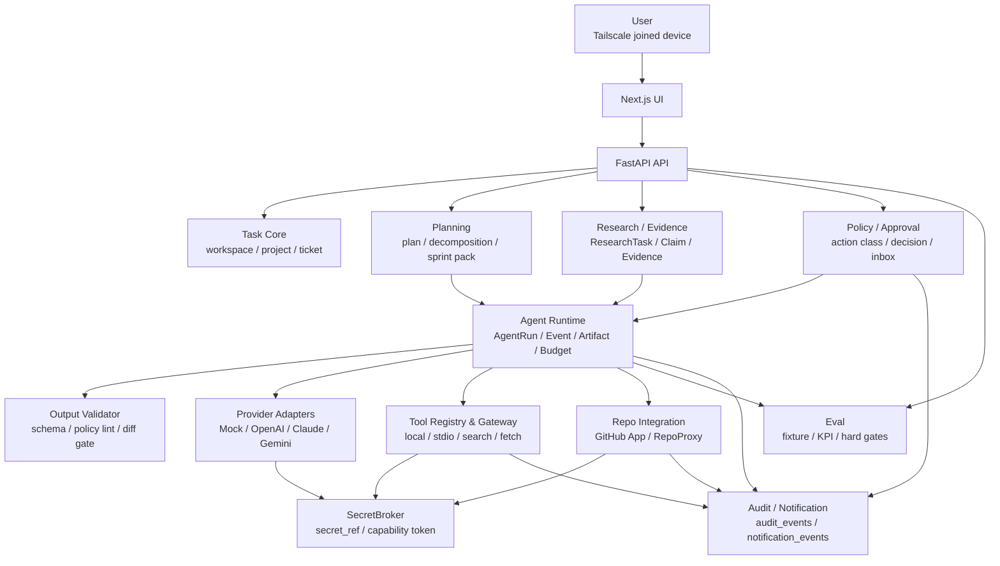
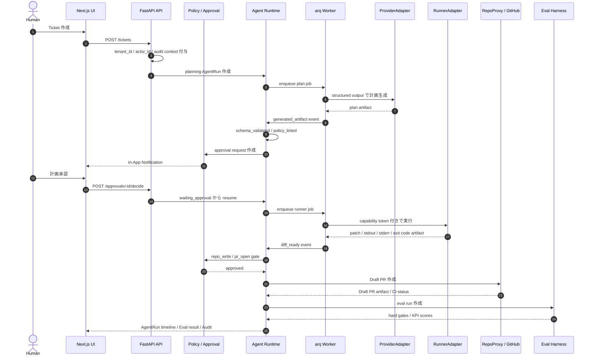

# 全体アーキテクチャ

## 1. 目的

本書は TaskManagedAI の P0 基本設計として、コンテキスト分離、レイヤ構造、技術スタック、サービス構成、主要データフロー、将来拡張点を定義する。

TaskManagedAI は、Deep Research から実装 PR までを、証拠、判断、承認、実行ログ、コスト、レビュー結果とともに管理する AI-native な開発タスク管理ツールである。

P0 は個人専用、Tailscale 閉域、単一 VPS、Docker Compose を前提にする。ただし、tenant 境界、adapter、policy、artifact、event、secret_ref、ContextSnapshot は、将来のチーム運用と商用化へ移行できる形で初期から持つ。

## 2. アーキテクチャ概観

### 2.1 Context Map

### 2.2 Context の責務

| Context | 責務 | P0 の境界 |
|---|---|---|
| Task Core | workspace、project、repository、ticket、ticket_relations、acceptance_criteria | 全主要テーブルに `tenant_id` invariant を持つ |
| Planning | task decomposition、実装計画、Sprint Pack、artifact 入出力 | AI 生成案は人間確認後に採用 |
| Agent Runtime | AgentRun、AgentRunEvent、ContextSnapshot、Artifact、Budget | append-only event と artifact を正本にする |
| Provider Adapters | Mock / OpenAI / Claude / Gemini の統一呼び出し | Structured Outputs と Compliance Gate 必須 |
| Repo Integration | GitHub App、RepoProxy、Draft PR flow、CI status | installation token は API 側のみ保持 |
| Tool Registry | tool_registry、tool_versions、tool_permissions、trust_tier | P0 は `local|stdio`、`search|fetch`、`network_access=false` |
| Output Validator | schema validation、policy lint、patch path validator | AI 出力を直接実行しない |
| Policy / Approval | action class、policy_rules、approval_requests、policy_decisions | `merge` / `deploy` は P0 常時 deny |
| Research / Evidence | ResearchTask、Claim、EvidenceSource、EvidenceItem、provenance_json | Claim / Evidence / Source を正規化 |
| Eval | Hard Gates、Quality KPIs、dataset version、fixture | public_regression / private_holdout / adversarial_new を分離 |

## 3. レイヤ構造

### 3.1 Layered Architecture

| Layer | 主な実装 | 役割 | 依存方向 |
|---|---|---|---|
| UI | Next.js | Ticket、Approval Inbox、Agent Runs、Audit Log、Project Settings、Eval Dashboard、In-App Notification | API のみ |
| API | FastAPI | REST API、request context、dev login、policy gate、RepoProxy、SecretBroker interface | Application Service |
| Application Service | Python service modules / arq jobs | Ticket workflow、AgentRun orchestration、BudgetGuard、approval flow、Eval 実行 | Domain + Infrastructure |
| Domain | Pydantic model / domain service | action class、AgentRun state、tenant invariant、artifact contract、adapter interface | Infrastructure に依存しない |
| Infrastructure | PostgreSQL、Redis、Docker runner、GitHub App、provider SDK、SOPS + age | 永続化、queue、外部 API、runner、secret_ref 解決 | Domain contract を実装 |

### 3.2 レイヤ原則

- UI は AI 実行や secret に直接触れず、API を通す。
- API は request context に `actor_id`、`tenant_id`、`workspace_id`、correlation id を注入する。
- Application Service は AgentRun の state transition と append-only event を同時に扱う。
- Domain は provider、repo、runner、tool、notification、secret の具象実装を知らない。
- Infrastructure は adapter contract を満たす形で差し替え可能にする。
- AI 出力は Domain artifact として扱い、直接 command、SQL、workflow、外部 tool 操作へ接続しない。

## 4. サービス構成

### 4.1 Docker Compose P0

P0 の Docker Compose は `api` / `worker` / `postgres` / `redis` の 4 service を基準線にする。

| Service | 役割 | 主な責務 |
|---|---|---|
| `api` | FastAPI | REST API、dev login、RepoProxy、SecretBroker module、policy gate、approval decision |
| `worker` | Python worker arq | AgentRun job、provider call、tool call orchestration、Eval job、cancel propagation |
| `postgres` | PostgreSQL | business data、append-only event、audit、artifact metadata、Eval result |
| `redis` | Redis | arq queue、job state、cancel pub/sub、short-lived coordination |

API と worker は同一 image / 同一 dependency を使い、起動コマンドだけを分ける。Python dependency は `uv`、frontend package 管理は `pnpm` を使う。

### 4.2 Tailscale Serve

P0 は Tailscale Serve 前提で閉域運用する。

- Funnel は使わない。
- backend は localhost / internal network で待ち受ける。
- Docker の public bind を避ける。
- machine 名は中立名にし、顧客名、案件名、機密プロダクト名を含めない。
- device approval を採用する。
- grants は deny-by-default とし、必要な TCP/443 のみ許可する。
- tsidp は P0 認証基盤に採用せず、将来検討に残す。

### 4.3 SecretBroker

P0 の SecretBroker は FastAPI 内 service module として実装する。

| 項目 | P0 方針 |
|---|---|
| deploy 形態 | `app.secrets.broker` の service module |
| interface | `get_capability_token(scope, ttl)` / `redeem_token(token, action)` |
| secret store | SOPS + age |
| DB 保存 | secret 値は保存せず `secret_ref` のみ保存 |
| runner 連携 | runner には secret 値や installation token を渡さない |
| 将来拡張 | Vault、HSM、KMS、tenant 別 secret store へ切替可能にする |

## 5. 技術スタック

| 領域 | 採用 | 理由 |
|---|---|---|
| Backend API | FastAPI | Python worker / provider SDK / Pydantic と揃えやすい |
| Frontend | Next.js | P0 UI、管理画面、将来の dashboard に適する |
| Database | PostgreSQL | 複合 FK、transaction、JSONB、audit、RLS 準備に適する |
| Queue / Coordination | Redis | arq queue、cancel pub/sub、short-lived job coordination |
| Worker | arq | FastAPI と同じ Python ランタイムで単純に運用できる |
| Frontend package | pnpm | Next.js workspace 運用の基準 |
| Python package | uv | API / worker の dependency を高速かつ再現可能に扱う |
| Runtime | Docker Compose | 単一 VPS の P0 に適する |
| Network | Tailscale Serve / SSH | public internet へ直接公開せず閉域運用する |
| Repo | GitHub App | short-lived installation token と fine-grained permission を使う |
| Secrets | SOPS + age + SecretBroker | secret_ref 抽象化と Vault 移行余地を両立する |

## 6. 主要データフロー

### 6.1 Ticket から Draft PR / Eval まで

### 6.2 データフロー上の安全境界

| 境界 | 安全条件 |
|---|---|
| UI → API | dev login session、actor context、tenant context |
| API → Provider | Provider Compliance Matrix、`payload_data_class <= allowed_data_class` 判定、payload_data_class 未設定は deny、Structured Outputs |
| API / Worker → Runner | capability token、許可パス、forbidden path、resource cap |
| Runner → Repo | runner は installation token を持たず、RepoProxy 経由 |
| AI output → DB | schema validation、policy lint、採否判定後に反映 |
| Tool output → Prompt | `untrusted_content` として扱い、入力側にも policy lint |
| Secret access | secret 値を AI / runner / DB に渡さず `secret_ref` と broker で仲介 |

## 7. 拡張ポイント

### 7.1 Provider / Agent 拡張

P0 の ProviderAdapter は Mock / OpenAI / Claude / Gemini を対象にする。将来、以下を adapter として追加できる構造にする。

| 拡張候補 | P0 での扱い | 追加時の前提 |
|---|---|---|
| Codex App Server | 設計余地のみ | ProviderAdapter または RunnerAdapter contract test |
| Claude Remote Control | 設計余地のみ | artifact orchestration と approval gate |
| GitHub agent | 設計余地のみ | RepoAdapter / GitHub lifecycle metrics との統合 |
| GitLab | P1 以降 | RepoAdapter contract と permission matrix |
| remote HTTP MCP | P1 以降 | OAuth 2.1、audience validation、SSRF 防御、token passthrough 禁止 |

### 7.2 Infrastructure 拡張

| 拡張候補 | P0 での扱い | 移行条件 |
|---|---|---|
| Vault | SOPS + age の後続候補 | SecretAdapter contract を維持し、`secret_ref` を壊さない |
| Temporal | DB state machine の後続候補 | workflow decision と event log を分離したまま移行 |
| Kubernetes | P0 対象外 | 単一 VPS / Compose の限界が明確になった時点 |
| RLS 有効化 | P1 以降 | P0 で `tenant_id`、複合 FK、negative test、policy 草案を準備 |
| Object storage | artifact URI 抽象化で準備 | artifact volume / backup / retention 設計が固まった時点 |

### 7.3 Operational Hardening (PRD-01 F-020-OPS / Sprint 11.5 へのトレース)

P0 Acceptance 直前に運用基盤を本格化する。詳細は DD-07（可観測性設計）/ DD-06（秘密管理設計）/ DD-05（ネットワーク境界設計）を参照。

| 領域 | Sprint 0 最小 | Sprint 11.5 本格化 | Sprint 12 P0 Acceptance |
|---|---|---|---|
| Observability | structured logs + correlation id + error taxonomy | OpenTelemetry + Prometheus + Loki + Grafana dashboard + alerting / SLO | Hard Gate / Quality KPI 計測の本番運用 |
| Backup / Restore | `pg_dump` 夜間スクリプト + age 暗号化 | WAL archiving + PITR の本番運用準備 | restore drill 実施（AC-HARD-04）、RPO ≤ 24h / RTO ≤ 4h |
| Private Staging CI/E2E | Playwright + pytest/httpx skeleton | Tailscale GitHub Action 経由の本運用接続 | E2E 経路の本番運用検証 |
| Secret rotation | `secret_ref` バージョニング設計 | rotation drill（SOPS version 切替 + capability token TTL 検証） | secret canary fixture 漏えい検知（AC-HARD-02） |
| Audit log export | DB に audit_events 蓄積 | JSON Lines 日次 export 実装 | export 内容を retention policy で検証 |

## 8. 関連資料リンク

- [計画(仮).md](../設計検討/計画(仮).md)
- [00_プロダクト要求定義.md](../要件定義/00_プロダクト要求定義.md)
- [01_P0要求定義.md](../要件定義/01_P0要求定義.md)
- [03_妥当性評価.md](../設計検討/03_妥当性評価.md)
- [task機能検討.md](../設計検討/task機能検討.md)
- [AGENTS.md](../../AGENTS.md)

