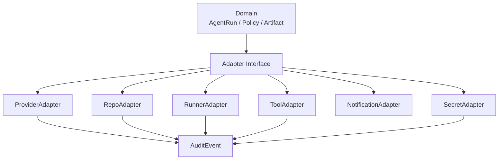

# 拡張境界とAdapter設計

## 1. 目的

本書は TaskManagedAI の adapter 境界を定義する。

対象は次の 6 種類である。

- ProviderAdapter
- RepoAdapter
- RunnerAdapter
- ToolAdapter
- NotificationAdapter
- SecretAdapter

P0 では実装を小さく保つが、provider 追加、repo 追加、remote MCP、外部 runner、Vault、外部通知、商用化への切替で domain model と API contract を壊さないことを目的にする。

## 2. Adapter 境界の原則

### 2.1 共通原則

| 原則 | 内容 |
|---|---|
| deny-by-default | adapter は明示許可された action / resource / data class だけを扱う |
| 最小権限 | provider key、repo token、secret、tool 権限は必要最小限にする |
| secret 非露出 | AI、runner、tool へ secret 値や installation token を直接渡さない |
| contract test 必須 | adapter ごとに成功系、拒否系、越境系、予算超過系を固定する |
| interface 安定性 | P0 の interface は P1 の実装追加で壊さない |
| structured boundary | 入出力は JSON Schema / Pydantic / typed artifact で扱う |
| audit 必須 | adapter 呼び出しは actor、run、resource、decision、cost を追跡する |
| human approval | write / pr_open / secret_access 以上は policy と approval を通す |

### 2.2 Adapter と Domain の関係

Domain は adapter の具象 SDK、CLI、token 形式、外部 API の細部を知らない。Application Service は adapter interface を呼び、adapter は結果を artifact、event、policy decision、audit event として返す。



## 3. ProviderAdapter

### 3.1 目的

ProviderAdapter は Mock / OpenAI / Claude / Gemini を統一 contract で扱う。P0 の AI 実行は、provider 固有のレスポンスを直接 DB に入れず、必ず structured artifact と AgentRun status に正規化する。

### 3.2 Interface 定義

```ts
type ProviderKind = "mock" | "openai" | "claude" | "gemini";

type ProviderTaskKind =
  | "plan"
  | "research"
  | "code"
  | "verify"
  | "review"
  | "evaluate"
  | "summarize";

type ProviderRequest = {
  run_id: string;
  provider: ProviderKind;
  task_kind: ProviderTaskKind;
  payload_data_class: "public" | "internal" | "confidential" | "pii"; // 送信 payload 側の機密度（必須、未設定は deny）
  structured_output_schema: object;
  trusted_instruction: object;
  untrusted_content: object[];
  context_snapshot_id: string;
  budget: {
    max_tokens: number;
    max_cost_usd: number;
    max_wall_clock_sec: number;
  };
};

type ProviderResult = {
  status:
    | "ok"
    | "refused"
    | "incomplete"
    | "unsupported_schema"
    | "max_token_truncation"
    | "budget_exceeded"
    | "policy_blocked"
    | "provider_error";
  artifact_ref?: string;
  usage?: {
    input_tokens: number;
    output_tokens: number;
    cost_usd: number;
  };
  provider_request_fingerprint: object;
  provider_continuation_ref?: object;
  error_code?: string;
  error_summary?: string;
};
```

### 3.3 P0 Provider

| Provider | P0 用途 | 備考 |
|---|---|---|
| Mock | contract test、golden prompts、offline fixture | すべての状態遷移を再現可能にする |
| OpenAI | planner / researcher / orchestrator | Structured Outputs、prompt caching、Compliance Gate を通す |
| Claude | coder / verifier | prompt caching、tool use、ZDR 条件は Matrix で管理 |
| Gemini | planning / evaluation / second opinion | P0 では補助・評価寄りに使う |

### 3.4 Structured Outputs 必須

ProviderAdapter は常に JSON Schema を受け取り、レスポンスを typed artifact として返す。

- schema が provider 非対応なら `unsupported_schema` とする。
- schema validation 失敗は `validation_failed` へ進め、repair retry の対象にする。
- repair retry を使い切った場合は `repair_exhausted` とする。
- Markdown だけの自由文を domain object として採用しない。
- provider 固有の refusal / incomplete / max token truncation は AgentRun status に正規化する。

### 3.5 状態マッピング

| Provider result | AgentRun status | blocked subcategory | terminal |
|---|---|---|---|
| `ok` | `generated_artifact` | - | no |
| schema valid | `schema_validated` | - | no |
| policy lint pass | `policy_linted` | - | no |
| diff ready | `diff_ready` | - | no |
| refusal | `provider_refused` | - | yes |
| incomplete | `provider_incomplete` | - | no |
| max token truncation | `provider_incomplete` | - | no |
| unsupported schema | `validation_failed` | - | no |
| validation retry exhausted | `repair_exhausted` | - | yes |
| budget exceeded | `blocked` | `budget_blocked` | no |
| `payload_data_class > allowed_data_class` 越境 | `blocked` | `policy_blocked` | no |
| `payload_data_class` 未設定 | `blocked` | `policy_blocked` | no |
| runtime error | `failed` | - | yes |

### 3.6 Compliance Gate middleware

ProviderAdapter は `execute()` の入り口で Compliance Gate を必ず実行する。

```ts
type ComplianceGateInput = {
  provider: ProviderKind;
  api_or_feature: string;
  allowed_data_class: "public" | "internal" | "confidential" | "pii"; // provider 上限（Compliance Matrix から）
  payload_data_class: "public" | "internal" | "confidential" | "pii"; // 送信 payload 側の機密度（必須）
  provider_compliance_matrix_version: string;
};

type ComplianceGateDecision =
  | { decision: "allow" }
  | { decision: "deny"; reason: "payload_data_class_exceeds_allowed" }
  | { decision: "deny"; reason: "payload_data_class_unset" }
  | { decision: "require_adr"; reason: "provider_not_verified" };
```

P0 の enforcement は Provider Adapter middleware で行う。**`payload_data_class > allowed_data_class` を満たす送信、および `payload_data_class` 未設定の送信は provider へ送る前に `policy_blocked` として停止する**。未確認 provider への機密コード送信は禁止する。

### 3.7 prompt cache 最適化

Prompt cache は性能最適化であり、再現性の代替ではない。

P0 では次を安定化する。

- Project Context
- Coding Rules
- Repository Summary
- Prompt Schema
- policy pack
- tool manifest
- evidence set hash

これらは安定した順序で prompt 前方に配置し、ContextSnapshot に `prompt_pack_version` と `prompt_pack_lock` を保存する。

## 4. RepoAdapter

### 4.1 目的

RepoAdapter は GitHub P0、GitLab P1 以降の repo 操作を分離する。

P0 の GitHub 操作は API 側 RepoProxy が installation token を保持し、runner / AI には token を渡さない。

### 4.2 Interface 定義

```ts
type RepoAdapter = {
  clone(request: RepoCloneRequest): Promise<RepoCloneResult>;
  createBranch(request: CreateBranchRequest): Promise<CreateBranchResult>;
  push(request: PushRequest): Promise<PushResult>;
  createDraftPr(request: CreateDraftPrRequest): Promise<DraftPrResult>;
  getCiStatus(request: CiStatusRequest): Promise<CiStatusResult>;
};
```

### 4.3 P0 GitHub 方針

| 項目 | 方針 |
|---|---|
| token 管理 | API 側 RepoProxy が installation token を発行・保持 |
| runner 権限 | runner は capability token のみ持つ |
| token TTL | installation token は短命、操作完了で破棄 |
| Draft PR | P0 で作成する |
| merge | P0 常時 deny |
| deploy | P0 常時 deny |
| `.github/workflows/**` | P0 書込禁止 |
| private key | `secret_ref` 経由で SOPS 管理 |
| CI | Actions / Checks / status は read 中心 |

### 4.4 GitHub App Permission Matrix P0

| Permission | Level | P0 理由 |
|---|---|---|
| Metadata | read | repo metadata |
| Contents | read/write | branch push 限定 |
| Pull requests | read/write | Draft PR 作成・更新 |
| Actions | read | workflow run / status / log read |
| Checks | read | check_run / check_suite read |
| Webhooks | none / read | repo hook 管理は P0 対象外 |

### 4.5 capability token

RepoProxy は操作単位で capability token を発行する。

```ts
type RepoCapabilityToken = {
  scope: "repo.clone" | "repo.push" | "repo.pr_open" | "repo.ci_read";
  repository_id: string;
  branch?: string;
  expires_at: string;
  actor_id: string;
  run_id: string;
};
```

capability token は repo token ではない。RepoProxy が token を redeem し、内部で installation token を使って GitHub API を呼ぶ。

## 5. RunnerAdapter

### 5.1 目的

RunnerAdapter は AI / CLI agent / tool 実行を Docker isolated runner に閉じ込める。

P0 は Docker isolated runner を実装し、外部 agent runner、Codex App Server、Claude Remote Control は後続候補にする。

### 5.2 Interface 定義

```ts
type RunnerAdapter = {
  prepareWorkspace(request: PrepareWorkspaceRequest): Promise<WorkspaceRef>;
  runCommand(request: RunnerCommandRequest): Promise<RunnerCommandResult>;
  collectArtifacts(request: CollectArtifactsRequest): Promise<ArtifactRef[]>;
  cancel(request: CancelRunnerRequest): Promise<void>;
};
```

### 5.3 P0 制約

| 制約 | 内容 |
|---|---|
| run ごとの workdir | AgentRun ごとに分離 |
| timeout | max wall-clock を BudgetGuard と同期 |
| forbidden path | `.env`、`.git/config`、secrets、migrations、`.github/workflows/**` を policy で拒否 |
| resource cap | CPU / memory / disk / process / tool calls |
| network | P0 は必要最小限。ToolAdapter は `network_access=false` |
| secret | secret 値を注入しない |
| repo token | installation token を注入しない |
| command | allowlist / denylist / dangerous command block |
| `runner_mutation_gateway` | Sprint 7 で完成（runner sandbox 内の patch 適用経路） |

### 5.4 runner_mutation_gateway

Runner の書き込みは直接 DB / repo / secret store へ到達しない。これは F-015 の `runner_mutation_gateway` であり、F-011 の `tool_mutating_gateway_stub`（MCP / 外部 tool 書込系、P0 では deny）とは別概念。

- patch は artifact として出す。
- API 側が schema validation と patch path validation を行う。
- Policy Engine が action class を判定する。
- approval が必要なら Approval Inbox へ送る。
- forbidden path / resource cap / policy decision / approval を通過した patch のみ適用。
- RepoProxy が許可済み操作だけを実行する。

## 6. ToolAdapter

### 6.1 目的

ToolAdapter は local / stdio tool を Tool Registry 経由で管理する。P0 は read-only search / fetch 中心に限定する。

### 6.2 Interface 定義

```ts
type ToolAdapter = {
  discover(request: ToolDiscoverRequest): Promise<ToolManifest>;
  invoke(request: ToolInvokeRequest): Promise<ToolResultArtifact>;
};
```

### 6.3 P0 Tool 制約

| 項目 | P0 値 |
|---|---|
| `transport` | `local` または `stdio` |
| `auth_mode` | `none` または `env_ref` |
| `network_access` | `false` |
| `allowed_actions` | `search` / `fetch` |
| remote HTTP MCP | P1 まで deny |
| mutating tool / 書込系 MCP | `tool_mutating_gateway_stub` のみ。P0 では deny。本実装は P1 以降（F-015 の `runner_mutation_gateway` とは別概念。Sprint 7 で完成するのは runner 側） |
| output | `untrusted_content` として Input Trust Layer に渡す |

### 6.4 trust_tier 機械判定

| trust_tier | 判定条件 |
|---|---|
| `official` | publisher_domain_allowlisted AND manifest_signature_valid AND package_digest_pinned |
| `self_hosted` | origin_owned_by_workspace AND served_from_tailnet AND digest_pinned |
| `third_party` | signature_valid AND publisher_not_owned |
| `experimental` | 上記を満たさない default |

### 6.5 read-only gateway

P0 の read-only gateway は次を保証する。

- tool call を audit event に残す。
- どの AI が、どの tool を、何のために呼んだかを保存する。
- tool output は trusted instruction として扱わない。
- tool output に含まれる命令文は `instruction_effect=none` として扱う。
- search / fetch の schema 互換性を contract test で固定する。

## 7. NotificationAdapter

### 7.1 目的

NotificationAdapter は P0 の In-App Notification と P1 以降の外部通知を分離する。

### 7.2 Interface 定義

```ts
type NotificationAdapter = {
  publish(event: NotificationEvent): Promise<void>;
  markRead(request: MarkNotificationReadRequest): Promise<void>;
};
```

### 7.3 P0 In-App Notification

P0 は `notification_events` と UI badge を実装する。

| event_type | 発火条件 |
|---|---|
| `approval_pending` | approval request 作成 |
| `run_failed` | AgentRun failed / repair_exhausted |
| `budget_exceeded` | BudgetGuard hard / soft limit |
| `policy_blocked` | policy decision deny |
| `pr_opened` | Draft PR 作成 |

外部通知は P1 以降に defer する。Slack、Email、Discord、mobile push は P0 対象外である。

## 8. SecretAdapter

### 8.1 目的

SecretAdapter は SecretBroker + secret backend (local: Phase 0 default / sops: D-4、ADR-00058) を抽象化し、将来 Vault へ切り替えられる境界を提供する。

### 8.2 Interface 定義

```ts
type SecretAdapter = {
  issueCapabilityToken(request: SecretCapabilityRequest): Promise<CapabilityToken>;
  redeemCapabilityToken(request: RedeemCapabilityRequest): Promise<SecretOperationResult>;
  resolveSecretRef(request: ResolveSecretRefRequest): Promise<SecretHandle>;
};
```

### 8.3 secret_ref URI

P0 の形式は次を基準にする (backend=`local`|`sops`、ADR-00058、Phase 0 default=`local`、SOPS は D-4 移行先、未知 backend fail-closed)。

```text
secret://<backend>/<scope>/<name>#<version>
```

`secret://sops/...` は `sops` backend の後方互換例。regex は単一定数 `SECRET_URI_PATTERN` 集約 (5+source 整合)。DB にはこの URI (backend metadata) のみ保存する。secret 値、provider key、GitHub App private key、installation token は DB、AI prompt、runner environment、CLI subprocess env/argv、artifact export に保存しない。

### 8.4 Vault 移行余地

SecretAdapter を通すことで、次の移行を domain へ波及させない。

| P0 | P1 以降 |
|---|---|
| LocalSecretStore / SOPS + age | Vault |
| FastAPI 内 SecretBroker | 独立 microservice |
| single tenant secret scope | tenant 別 secret store |
| capability token | broker-issued short-lived token |
| local age key 運用 | HSM / KMS |

## 9. contract test 戦略

### 9.1 Provider contract

| Test | 目的 |
|---|---|
| provider 横断 golden prompts | 同一 schema に対する互換性を確認 |
| Structured Outputs | JSON Schema に従うことを確認 |
| refusal mapping | refusal が `provider_refused` になることを確認 |
| incomplete mapping | truncation / incomplete が `provider_incomplete` になることを確認 |
| unsupported schema | `validation_failed` または adapter error を正規化 |
| budget exceeded | `blocked` + `budget_blocked` を確認 |
| `payload_data_class > allowed_data_class` 越境 | 送信前に `blocked` + `policy_blocked` を確認 |
| `payload_data_class` 未設定 | 送信前に `blocked` + `policy_blocked` を確認 |
| provider_request_fingerprint | model alias 変更を検知可能にする |

### 9.2 Repo / Runner / Tool contract

| Test | 目的 |
|---|---|
| `.github/workflows/**` 書込拒否 | forbidden path block |
| installation token 非露出 | runner / AI / artifact に token が出ない |
| Draft PR 作成 | RepoProxy 経由のみ成功 |
| dangerous command block | `rm -rf /`、`curl | sh`、`chmod 777`、fork bomb を拒否 |
| tool availability matrix | tool_registry の許可・拒否を検証 |
| read-only gateway | search / fetch 以外を拒否 |
| trust_tier 判定 | official / self_hosted / third_party / experimental を機械判定 |
| `tool_mutating_gateway_stub` (Sprint 4.5) | 書込系 MCP / 外部 tool が P0 で deny されることを確認 |
| `runner_mutation_gateway` (Sprint 7) | runner sandbox 内の patch 適用が policy / approval / forbidden path 通過後のみ実行されることを確認 |

### 9.3 Handoff / Eval contract

- Planner から Coder への handoff artifact を schema validation する。
- Research から Ticket への変換で Acceptance Criteria、Test Plan、Docs Update、Rollback Plan を確認する。
- AgentRun event ordering、idempotency、cancel、resume を contract test に含める。
- Gold Task Seed v0 を Sprint 5 以降の contract test 入力に使う。
- private gold task 30-50 件は Sprint 11 / 12 で拡張する。

## 10. 関連資料リンク

- [計画(仮).md](../設計検討/計画(仮).md)
- [00_プロダクト要求定義.md](../要件定義/00_プロダクト要求定義.md)
- [01_P0要求定義.md](../要件定義/01_P0要求定義.md)
- [03_妥当性評価.md](../設計検討/03_妥当性評価.md)
- [task機能検討.md](../設計検討/task機能検討.md)
- [AGENTS.md](../../AGENTS.md)

