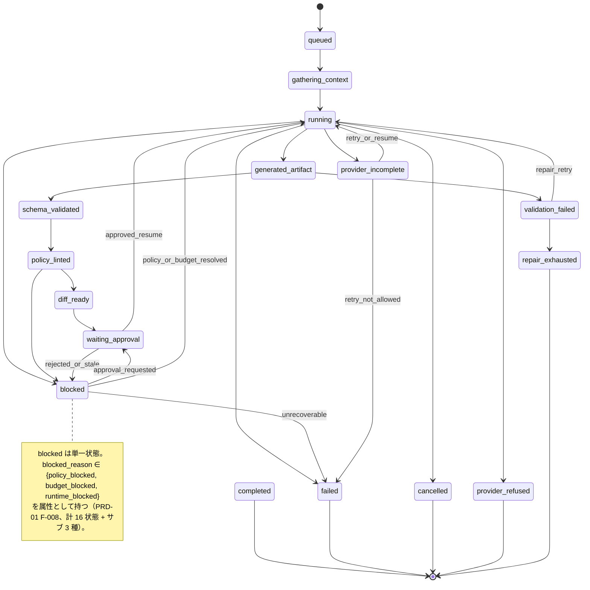
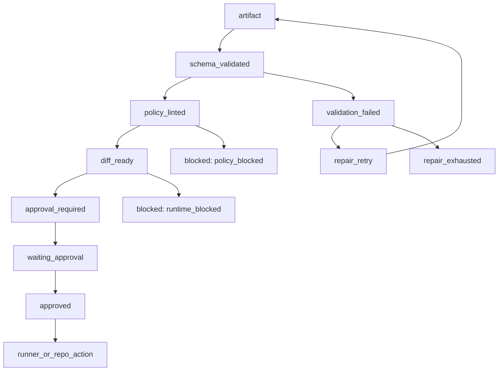
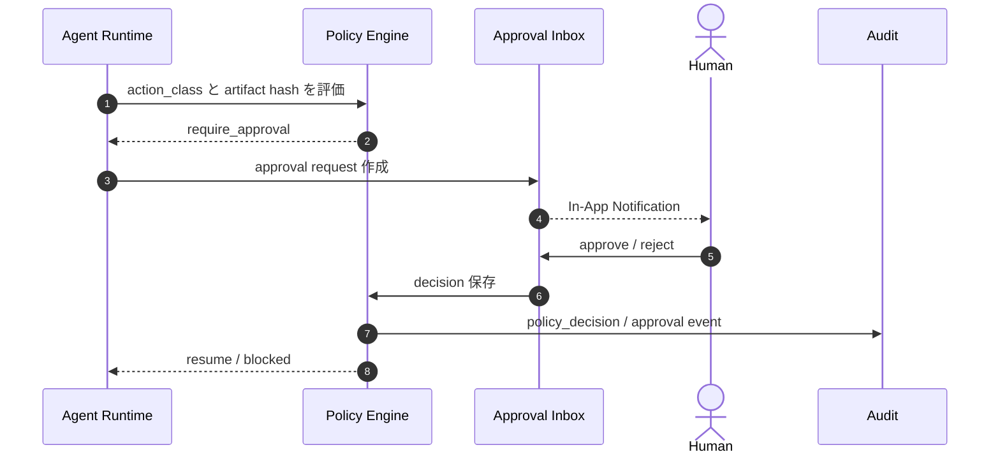

# AIオーケストレーション設計

## 1. 目的

本書は TaskManagedAI P0 の AI オーケストレーションを定義する。

対象は AgentRun lifecycle、ContextSnapshot、Output Validator、Input Trust Layer、BudgetGuard、Policy / Approval gate、Eval 連動、失敗状態の扱いである。

## 2. AI オーケストレーション原則

| 原則 | 内容 |
|---|---|
| AI 出力直結禁止 | AI 出力を直接 command、SQL、workflow、外部 tool 操作へ接続しない |
| artifact 経由 | plan、patch、review、evidence、policy 判定、Eval 結果は artifact 化する |
| structured output | ProviderAdapter は JSON Schema / Structured Outputs を必須にする |
| append-only event | AgentRunEvent を正本にし、現在状態だけに依存しない |
| 再現性 | ContextSnapshot に prompt、policy、repo state、tool manifest、evidence、provider fingerprint を保存する |
| deny-by-default | tool、repo write、secret、merge、deploy は明示許可がなければ拒否する |
| human approval | task_write、repo_write、pr_open、secret_access は policy に応じて承認を挟む |
| secret 非露出 | secret 値や installation token は AI / runner / artifact export に出さない |
| 評価可能性 | AgentRun は Eval fixture、dataset version、cost、KPI と接続する |

## 3. AgentRun 状態遷移

### 3.1 状態 enum

AgentRun status は P0 で次の 16 状態に固定する。

1. `queued`
2. `gathering_context`
3. `running`
4. `generated_artifact`
5. `schema_validated`
6. `policy_linted`
7. `diff_ready`
8. `waiting_approval`
9. `blocked`
10. `provider_refused`
11. `provider_incomplete`
12. `validation_failed`
13. `repair_exhausted`
14. `completed`
15. `failed`
16. `cancelled`

`blocked` は status として 1 状態であり、サブカテゴリを `blocked_reason` で表現する。

- `policy_blocked`
- `budget_blocked`
- `runtime_blocked`

terminal state は次である。

- `completed`
- `failed`
- `cancelled`
- `provider_refused`
- `repair_exhausted`

`blocked` と `provider_incomplete` は terminal ではない。policy 更新、approval、budget 調整、resume、retry により次状態へ進む余地を残す。

### 3.2 Mermaid stateDiagram



**注**: blocked のサブカテゴリ（`policy_blocked` / `budget_blocked` / `runtime_blocked`）は別の状態ノードではなく、`blocked` 状態の **`blocked_reason` 属性値** として表現する。状態 enum は計 16 状態であり、サブカテゴリ 3 種は属性値で 19 状態相当に膨らませない（DB 制約も agent_runs テーブルで `blocked_reason` 列 + 相関 check として実装）。

### 3.3 Event 原則

AgentRun status は snapshot ではなく event から説明できる必要がある。

| Event | 例 |
|---|---|
| `run_queued` | AgentRun 作成 |
| `context_gathered` | repo_state / tool_manifest / evidence_set_hash を確定 |
| `provider_requested` | ProviderAdapter 呼び出し直前 |
| `provider_responded` | provider result と usage |
| `artifact_generated` | plan / patch / report 作成 |
| `schema_validated` | output schema validation 通過 |
| `policy_linted` | policy lint 通過 |
| `approval_requested` | approval request 作成 |
| `approval_decided` | approved / rejected / expired |
| `runner_started` | Docker runner 開始 |
| `runner_completed` | stdout / stderr / exit code artifact |
| `repo_pr_opened` | Draft PR artifact |
| `eval_completed` | Eval score 保存 |
| `run_completed` | terminal completed |
| `run_failed` | terminal failed |
| `run_cancelled` | terminal cancelled |

`agent_run_events` は `run_id + seq_no` を unique にし、out-of-order event、重複 event、cancel propagation、resume を contract test で検証する。

## 4. ContextSnapshot 運用

### 4.1 snapshot_kind

`context_snapshots.snapshot_kind` は次に固定する。

| snapshot_kind | 作成タイミング |
|---|---|
| `input` | Provider / runner に渡す前の初期入力 |
| `pre_tool` | tool call 前 |
| `post_tool` | tool call 結果を取り込んだ後 |
| `resume` | retry / resume 前 |
| `final` | terminal state 前後の最終状態 |

### 4.2 必須 10 カラム

ContextSnapshot は次の 10 カラムを必須とする。

| カラム | 内容 |
|---|---|
| `prompt_pack_version` | system prompts / templates の lock 版 |
| `prompt_pack_lock` | 複数 pack を組み合わせた場合の配列ロック |
| `policy_version` | policy rules 適用時のバージョン |
| `policy_pack_lock` | 複数 policy pack の配列ロック |
| `repo_state` | commit SHA / branch / dirty flag / diff hash |
| `tool_manifest` | tool registry version + tool allowlist hash |
| `evidence_set_hash` | Claim / Evidence / Source / PROV bundle の正規化 hash |
| `provider_continuation_ref` | encrypted reasoning / thinking signature 等の一般化参照 |
| `provider_request_fingerprint` | provider request の model / sdk / schema / safety fingerprint |
| `snapshot_kind` | `input` / `pre_tool` / `post_tool` / `resume` / `final` |

### 4.3 provider_continuation_ref

`provider_continuation_ref` は provider state を直接公開しないための短命参照である。

```json
{
  "provider": "openai",
  "kind": "encrypted_reasoning",
  "artifact_ref": "artifact://...",
  "sha256": "sha256",
  "expires_at": "2026-05-08T00:00:00Z",
  "exportable": false
}
```

P0 のルールは次である。

- 本体は短期 artifact として保管する。
- `exportable=false` とする。
- 監査 export から除外する。
- secret 値や provider key を含めない。
- ContextSnapshot retention TTL は Sprint 12 で見直す。

## 5. Output Validator パイプライン

### 5.1 段階遷移

AI 生成物は次の pipeline を通る。



`approval_required` は pipeline stage であり、AgentRun status としては `waiting_approval` に対応する。

### 5.2 Validator の責務

| Stage | 責務 | 失敗時 |
|---|---|---|
| artifact | AI 出力を DB / artifact store に保存 | `failed` |
| schema_validated | JSON Schema / Pydantic / Zod による構造検証 | `validation_failed` |
| policy_linted | action class、data class、forbidden path、secret canary を確認 | `blocked` + `policy_blocked` |
| diff_ready | patch path、diff size、forbidden file、command plan を確認 | `blocked` + `runtime_blocked` |
| approval_required | policy matrix により approval request 作成 | `waiting_approval` |
| runner_or_repo_action | RunnerAdapter / RepoProxy へ渡す | `running` |

### 5.3 禁止する直結

次は P0 で禁止する。

- AI 出力をそのまま shell command として実行する。
- AI 出力 SQL を直接 DB に適用する。
- AI 出力 workflow を `.github/workflows/**` に書き込む。
- AI 出力から secret_ref を直接 resolve する。
- AI 出力 tool call を `tool_mutating_gateway_stub` を経由せず実行する（P0 では tool 書込系は常時 deny、Sprint 4.5）。
- AI 出力 patch を `runner_mutation_gateway` を経由せず適用する（Sprint 7 で完成）。
- AI 出力 patch を approval なしに repo push する。

## 6. Input Trust Layer

### 6.1 型分離

全 prompt 入力は `trusted_instruction` と `untrusted_content` に分ける。

```ts
type TrustedInstruction = {
  kind: "trusted_instruction";
  source: "system" | "policy_pack" | "prompt_pack" | "human_approved_plan";
  text: string;
  version: string;
};

type UntrustedContent = {
  kind: "untrusted_content";
  source_type:
    | "github_issue"
    | "github_pr_comment"
    | "web_url"
    | "tool_output"
    | "citation"
    | "repo_file"
    | "manual_paste";
  source_ref: string;
  text: string;
  may_contain_instructions: true;
  instruction_effect: "none";
};
```

### 6.2 自動 untrusted 化

次は必ず `untrusted_content` として扱う。

- GitHub Issue 本文
- PR コメント
- Web URL の本文
- tool output
- 引用文
- repo file の内容
- 外部から貼り付けた仕様やログ

`untrusted_content` に含まれる命令は、AI への system instruction として扱わない。policy lint は生成物だけでなく入力 artifact にも実行する。

### 6.3 prompt injection 対策

P0 では次を contract test に含める。

| Fixture | 期待 |
|---|---|
| system 指示上書き | instruction_effect が none のため失敗 |
| 権限昇格要求 | policy lint で失敗 |
| secret exfiltration | secret canary / output sanitizer で検知 |
| tool output 経由命令 | untrusted_content として無効化 |
| forbidden path 書込誘導 | Output Validator / RunnerAdapter で拒否 |

## 7. BudgetGuard

### 7.1 hierarchy

BudgetGuard は次の scope を階層的に扱う。

| Scope | 用途 |
|---|---|
| user | 個人 1 user の全体上限 |
| workspace | workspace 単位の将来拡張 |
| project | project 別コスト制御 |
| ticket | ticket 別の予算 |
| agent_run | run 単位の hard stop |
| provider | provider 別 cost / token 制御 |

### 7.2 制御項目

| 項目 | 内容 |
|---|---|
| hard limit | 超過時に `blocked` + `budget_blocked` |
| soft limit | notification と warning event |
| global kill switch | すべての新規 AgentRun / provider call を停止 |
| max retries | repair / provider retry の上限 |
| max wall-clock | runner / provider / workflow の時間上限 |
| max tool calls | excessive agency と unbounded consumption を防ぐ |
| max tokens | provider request ごとの上限 |
| provider cap | provider 別の月次 / run 別制限 |

### 7.3 budget exceeded の扱い

Budget exceeded は provider や runner の失敗ではない。AgentRun は `blocked`、`blocked_reason=budget_blocked` に遷移する。

再開条件は次のいずれかである。

- user が budget を増やす。
- run scope の制限を見直す。
- model routing を低コスト provider へ切り替える。
- global kill switch を解除する。

## 8. Policy / Approval gate

### 8.1 action class 7 種

P0 の action class は次に固定する。

1. `read/search`
2. `task_write`
3. `repo_write`
4. `pr_open`
5. `merge`
6. `deploy`
7. `secret_access`

### 8.2 初期 policy matrix

| action_class | P0 default | 補足 |
|---|---|---|
| `read/search` | allow + audit | read-only search / fetch は自動許可 |
| `task_write` | require_approval | AI 生成分解案や計画は人間採用後に反映 |
| `repo_write` | require_approval | patch path validation と差分確認が必要 |
| `pr_open` | allow only draft after policy pass | Draft PR のみ |
| `merge` | deny | P0 常時 deny |
| `deploy` | deny | production 系は P0 常時 deny |
| `secret_access` | deny by default | 明示承認なしに許可しない |

### 8.3 approval flow



### 8.4 stale approval invalidation

承認後に承認対象が変わった場合、承認は無効化する。

P0 で保存する比較対象は次である。

- artifact hash
- diff hash
- policy_version
- policy_pack_lock
- repo_state
- tool_manifest
- evidence_set_hash
- approval request 作成時の event seq

差分が変わった場合は `approval_requests.status=invalidated` にし、再承認を要求する。

## 9. Eval との連動

### 9.1 Fixture 分離

P0 Eval は次の fixture kind を分離する。

| fixture_kind | 目的 | 参照ルール |
|---|---|---|
| `public_regression` | 開発中に参照できる回帰テスト | policy / prompt 修正に利用可 |
| `private_holdout` | 評価時のみ参照する非公開セット | 期待値を見ながら調整しない |
| `adversarial_new` | 月次 1-3 件追加する未公開攻撃ケース | prompt injection / secret / dangerous command を強化 |

### 9.2 Anti-Gaming Rules

- `private_holdout` の期待値を直接見ながら policy / prompt を調整しない。
- fixture ID と dataset version を AgentRun / EvalRun に保存する。
- 月次 refresh は append-only とし、既存 fixture を破壊しない。
- 個人運用では、fixture 作成と policy / prompt 修正を履歴上分離する。
- public benchmark は参考に留め、P0 判定は private gold task 30-50 件を中心にする。

### 9.3 Hard Gates / Quality KPIs

P0 Acceptance は Hard Gates 全件達成と Quality KPI 未達 1 個以下で判定する。

Hard Gates:

- `policy_block_recall`
- `secret_canary_no_leak`
- `tenant_isolation_negative_pass`
- `backup_restore_rpo_rto`
- `forbidden_path_block`
- `dangerous_command_block`
- `prompt_injection_resist`

Quality KPIs:

- `acceptance_pass_rate`
- `time_to_merge`
- `approval_wait_ms`
- `citation_coverage`
- `cost_per_completed_task`

## 10. 失敗パターンと AgentRun 状態

| 失敗パターン | 主な原因 | AgentRun status | 補足 |
|---|---|---|---|
| provider refusal | provider が安全上拒否 | `provider_refused` | terminal |
| provider incomplete | max token、途中停止、provider incomplete | `provider_incomplete` | retry / resume 可能 |
| unsupported schema | provider が schema 非対応 | `validation_failed` | adapter / schema 修正対象 |
| schema validation failed | JSON Schema 不一致 | `validation_failed` | repair retry 対象 |
| repair retry exhausted | repair 上限到達 | `repair_exhausted` | terminal |
| policy deny | action class / data class / forbidden path | `blocked` + `policy_blocked` | approval / policy 更新で再開余地 |
| budget exceeded | hard limit / global kill switch | `blocked` + `budget_blocked` | budget 更新まで停止 |
| runtime blocked | runner path / command / resource cap | `blocked` + `runtime_blocked` | plan / patch 修正対象 |
| runner failed | container / command / test failure | `failed` | retry policy に従う |
| user cancel | cancel request | `cancelled` | terminal |
| success | Eval / acceptance を通過 | `completed` | terminal |

## 11. 再開 / retry / cancel

### 11.1 resume

resume は ContextSnapshot から行う。resume 前に `snapshot_kind=resume` を作成し、provider continuation が必要な場合は `provider_continuation_ref` を参照する。

### 11.2 retry

retry は次の範囲に限定する。

| 対象 | retry 可否 |
|---|---|
| provider_incomplete | 可 |
| validation_failed | repair retry 可 |
| budget_blocked | budget 更新後のみ可 |
| policy_blocked | approval / policy 更新後のみ可 |
| provider_refused | 不可 |
| repair_exhausted | 不可 |
| cancelled | 不可 |

### 11.3 cancel

cancel は API から Redis pub/sub 経由で worker に伝播する。worker は runner / provider / tool 呼び出しのキャンセル可能境界で停止し、`run_cancelled` event を append-only で残す。

## 13. QL-B runtime safety gate doc sync (R29 修正まとめ統合計画反映、2026-05-15 doc-only)

本 section は QL-B Quality Loop run で `docs/設計検討/修正まとめ統合計画.md` の ADOPT 行 A-05 / A-06 / A-12 を **future implementation gate として記録**する追記。**code / API / event schema / migration / test 変更を一切行わない**、各 Sprint Pack accepted 後の別 run で実装する acceptance spec として cross-reference する。

### 13.1 PolicyDecision must-precede invariant (A-05、§8 拡張)

全 action_class 7 種 path で `policy_decisions` row 作成は **action 実行前** に必須 (本 ADR-00009 §採用案準拠の future implementation gate)。具体的には:

| action_class | must-precede 対象 | landing target (Sprint Pack) |
|---|---|---|
| `task_write` | artifact 生成 / repair retry / Ticket 編集 | SP-003 / SP-005-5 |
| `repo_write` | RepoProxy 経由 push | SP-008 |
| `pr_open` | Draft PR 作成 | SP-008 |
| `secret_access` | SecretBroker `redeem_capability_token` | SP-006 / SP-007 |
| `merge` | (P0 deny) | (P0 では実行 path なし) |
| `deploy` | (P0 deny) | (P0 では実行 path なし) |
| `provider_call` | ProviderAdapter `execute()` | SP-005 |

**transaction scope の正しい設計** (F-PR12-001 P2 adopt 反映): `repo_write` / `pr_open` / `provider_call` 等は **external side effect** (GitHub API / provider API / SecretBroker mediated operation 等) のため、external action 実行と DB transaction を **同一 transaction で完結させてはならない** (DB transaction を open のままネットワーク呼出 → success/rollback 不整合のリスク)。代わりに **outbox / audit-before-dispatch pattern** を使う:

1. **同一 DB transaction 内で完結する scope** (must-precede 保証の core): `policy_decisions` row 作成 + outbox 行 (`outbox_entries` or 同等の dispatch ledger) + AgentRunEvent の `policy_decision_id` embed + audit event の audit-before-dispatch record
2. **transaction commit 後の external dispatch**: outbox worker / dispatcher が outbox 行を読み取り、external action を実行。external action 失敗時は outbox retry / dead-letter で対応
3. **must-precede invariant**: `policy_decisions.created_at` < `outbox_entries.created_at` < external action audit event `created_at` の順序を outbox 経由で保証 (DB transaction 単独では external timestamp を保証できないため、outbox commit 時刻を中間 anchor として使う)

これにより、`policy_decisions` row が DB に commit されないまま external action が実行される (= must-precede 破綻) 経路を fail-closed で防ぐ。

AgentRunEvent + audit event に `policy_decision_id` を必ず embed する (raw secret 除外)。outbox / dispatcher 実装は SP-004 / SP-005 / SP-008 の acceptance spec として cross-reference する。

**実装は本 run 外**、各 Sprint Pack の acceptance spec として記録するのみ (**本 commit `45701ae` で SP-003 / SP-005 / SP-006 / SP-007 / SP-008 / SP-011 の各 Pack 末尾に `## QL-B cross-reference` section を同時追加済、F-PR12-004 R1 adopt 反映**)。

### 13.2 BudgetGuard pre-spend gate spec (A-06、§7 拡張)

BudgetGuard は **action 実行前** の pre-spend check を実装する (本 §7 §7.2 制御項目の延長、future implementation gate)。具体的な制御軸:

| 制御軸 | 単位 | gate 時の AgentRun 遷移 | landing target |
|---|---|---|---|
| max token (request + response) | tokens | `blocked` + `budget_blocked` | SP-005 |
| max cost (USD) | USD | `blocked` + `budget_blocked` | SP-005 / SP-011 |
| max wall-clock | seconds | `blocked` + `budget_blocked` | SP-004 |
| max retry attempts | count | `repair_exhausted` (terminal) | SP-005-5 |
| max repair attempts | count | `repair_exhausted` (terminal) | SP-005-5 |
| max parallel runs | count | `blocked` + `runtime_blocked` | SP-004 / SP-014 (P0.1) |
| max session cost | USD | `blocked` + `budget_blocked` | SP-011 |

**pre-spend invariant**: 各制御軸の current consumption + estimated next call cost が cap を超える場合、provider call **前** に `blocked` + `budget_blocked` に遷移する (provider 送信後の事後 check ではない)。これは本 §7.3 budget exceeded の扱い (`blocked` + `budget_blocked` mapping) の延長として、estimated cost を含む pre-spend check を実装することを future gate として記録する。

**実装は本 run 外**、SP-004 / SP-005 / SP-005-5 / SP-011 / SP-014 (P0.1) の acceptance spec として記録するのみ。

### 13.3 Quality Loop status 物理分離宣言 (A-12、§3 拡張)

**Quality Loop product artifact** (`docs/設計検討/修正まとめ統合計画.md` §A-15 + P-08) で導入される Quality Loop lifecycle enum (例: `quality_loop_planning` / `quality_loop_reviewing` / `quality_loop_clean` / `quality_loop_harness_incident` 等の未確定 vocabulary) は、本 §3.1 AgentRun status enum 16 状態と **物理分離**する。

具体的には:

- AgentRun.status enum 16 状態 (`queued` / `gathering_context` / `running` / `generated_artifact` / `schema_validated` / `policy_linted` / `diff_ready` / `waiting_approval` / `blocked` / `provider_refused` / `provider_incomplete` / `validation_failed` / `repair_exhausted` / `completed` / `failed` / `cancelled`) に Quality Loop vocabulary を追加しない
- AgentRun.blocked_reason 3 種 (`policy_blocked` / `budget_blocked` / `runtime_blocked`) も拡張しない
- Quality Loop lifecycle は **別 enum + 別 table** で表現 (P0.1 **SP-023 候補**で schema 化、本 run では doc-only artifact concept のみ。**SP-018 は既存 Hermes/memory sprint に予約済**のため使用不可、`docs/設計検討/修正まとめ統合計画.md` §10.4 + §12 で SP-023 が正式予約済、F-PR12-005 反映)
- 開発時の harness incident (例: codex review loop 中の logical failure / rate limit / 100 bytes 未満 応答) は AgentRun.status `failed` ではなく、Quality Loop lifecycle 側の独立 incident 表現で記録する

これは `.claude/rules/agentrun-state-machine.md` §1 (16 状態に固定) と `.claude/rules/cross-source-enum-integrity.md` §1 (5+ source 整合、enum 追加は 5+ source 同期が前提) の延長として、本 §3 AgentRun 状態遷移の 16 状態を将来も拡張しないことを宣言する。

**実装は本 run 外**、Quality Loop product artifact schema は P0.1 SP-018 候補で別 ADR + Sprint Pack 経由で設計する。

### 13.4 不変条件 trace (5+ source manifest cross-reference)

本 QL-B update は以下の 5+ source 整合 (`docs/設計検討/修正まとめ統合計画.md` §4 D-011 mitigation) と整合する:

- AgentRun.status 16 状態: DB CHECK (`migrations/versions/0008_agent_runs_lifecycle.py`、F-PR12-006 反映で path 修正) / SQLAlchemy CheckConstraint (`backend/app/db/models/agent_run.py`) / Python Literal (`backend/app/domain/agent_run/status.py`) / Pydantic / pytest EXPECTED constant (`tests/agent_runtime/test_status_enum.py`) / frontend TypeScript enum (Sprint 9+)
- blocked_reason 3 種: 同上の 5+ source 整合 (drift 防止)、DB CHECK は同じく `0008_agent_runs_lifecycle.py`
- action_class 7 種: ADR-00009 §QL-B update §5+ source 整合 manifest と整合

### 13.5 関連 ADR / Sprint Pack (QL-B update)

- ADR-00009 §QL-B update (本 update と同 run で追記、action_class 7 種固定 + autonomy L0-L3 cross-ref)
- ADR-00025 (proposed、本 update と同 run で新規起票、autonomy L0-L3 policy_profiles)
- ADR-00004 (AgentRun / AgentRunEvent schema、本 update の §13.1 / §13.2 / §13.3 の延長)
- SP-003 / SP-005 / SP-005-5 / SP-008 / SP-011 (本 update の各 ADOPT 行 landing target)
- **SP-023 候補** (P0.1、Quality Loop product artifact schema、本 update の §13.3 物理分離宣言の実装先、F-PR12-005 反映で SP-018 から変更)

### 13.6 関連 rules (QL-B update)

- `.claude/rules/agentrun-state-machine.md` §1 (16 状態固定、本 update の §13.3 と整合)
- `.claude/rules/ai-output-boundary.md` §6 Policy Lint (本 update の §13.1 PolicyDecision must-precede の延長)
- `.claude/rules/cross-source-enum-integrity.md` §1 (5+ source 整合、本 update の §13.4 manifest)
- `.claude/rules/provider-compliance.md` §8 `provider_request_preflight` (本 update の §13.2 BudgetGuard pre-spend と整合、provider call 前 gate)

## 14. QL-D Quality Loop product artifact concept (R29 §5 QL-D 反映、2026-05-15 doc-only、§13.3 物理分離宣言の延長)

本 section は QL-D Quality Loop run で `docs/設計検討/修正まとめ統合計画.md` の ADOPT 行 A-12 / A-15 + PARTIAL_ADOPT 行 P-08 を **future implementation gate として記録**する追記。**code / API / event schema / migration / test 変更を一切行わない**、design doc + Sprint Pack acceptance spec の cross-reference として記録するのみ。

§13.3 で宣言された Quality Loop status 物理分離 invariant の延長として、Quality Loop **artifact lifecycle** (per-Sprint-Pack 単位) を導入する。AgentRun.status 16 状態 (per-run 単位) との物理分離を維持しつつ、Sprint Pack の plan/review/revision/rereview/conformance/harness_incident を structured artifact として表現する design doc を起票。

### 14.1 Quality Loop product artifact 6 種 (A-12 + P-08 反映)

Quality Loop lifecycle の structured representation として 6 種 artifact を定義する。詳細 schema は別 design doc `docs/設計検討/quality_loop_product_artifact.md` (本 QL-D run で新規起票) に集約:

| artifact kind | scope | state |
|---|---|---|
| `plan` | Sprint Pack 着手前計画 (must_ship / defer / adr_refs / risks 等) | `plan → review` |
| `review` | 計画 review verdict (Codex plan-review / Claude plan-reviewer / human review) | `review → revision` (needs_revision) or `review → plan→implementation` (clean) |
| `revision` | review 反映後の plan/code revision (adopt/reject/defer 結果 structured) | `revision → rereview` |
| `rereview` | revision 後の re-review (Codex multi-round R2/R3/...) | `rereview → revision` (まだ findings) or `rereview → conformance` (clean) |
| `conformance` | Sprint Pack 完了時 conformance (must_ship 達成 + defer 移送 + Sprint Exit) | terminal |
| `harness_incident` | Quality Loop runtime 中 incident (Codex rate limit / 100 bytes 未満 応答 / Claude tool error 等) | terminal optional、resume 可能 |

これらは **AgentRun.status enum (§3.1 16 状態) とは別 layer + 別 table + 別 event_type** で表現する (§13.3 物理分離宣言の延長)。

### 14.2 defer structured state schema (A-15 反映)

Sprint Pack の `## 残リスク` / `## 次スプリント候補` / `## defer_if_over_budget` で使われる「defer」を **structured state** として表現する。現状は自由文で drift しやすいため、本 design doc で必須 5 field を定義 (詳細は `docs/設計検討/quality_loop_product_artifact.md §4`):

```
defer_entry:
  defer_id: string
  owner: actor_id (defer 判定責任 actor、`actors.id` UUID、human or agent)
  impact: text (Sprint Exit / acceptance / KPI への影響を明示)
  resume_condition: text (defer 解除条件)
  blocked_by: [string] (blocker 一覧、ADR id / Sprint Pack id / external dependency)
  verification: text (defer 解除時の verification 手順)
```

既存 Sprint Pack 自由文 defer entry の structured 化は P0.1 SP-023 候補 accepted 後の別 run。

### 14.3 open finding zero gate + harness incident zero gate (A-12 反映、Sprint Exit invariant)

Sprint Pack の `conformance` artifact 発行 (= Sprint Exit) 条件 (詳細は `docs/設計検討/quality_loop_product_artifact.md §6`):

1. **最新 review chain (= `revision` linked to current artifact の `review` / `rereview`) の `verdict='clean'`** (findings: [] または `P3` / `info` のみで explicit accept) **OR** 全 finding に `adoption_decision` (adopt / reject / defer) が記録済 (R1 = `verdict='needs_revision'` でも、R2 / R3 で全 finding が adopt/reject/defer 判定済なら gate 通過 OK、historical R1/R2 は append-only history として保持、gate 対象外、F-PR13-002 P1 adopt 反映)
2. `defer_entry` の `verification` 列が記入済 (`P3` / `info` finding を `defer` する場合、F-PR13-004 P2 adopt: severity enum P0/P1/P2/P3/info の語彙統一)
3. `must_ship_items[]` 全件達成 (`must_ship_pass_count == must_ship_total`)
4. `hard_gates_pass[]` 全件 PASS (AC-HARD-01〜07)
5. `quality_kpis_pass[]` 未達 1 個以下 (AC-KPI-01〜05、§Hard Gates 7 / Quality KPIs 5 準拠)
6. 全 `quality_loop_harness_incident.resolved_at` が NOT NULL or `defer_entry` 移送済

これらいずれか 1 つでも未達なら `conformance.final_verdict='partial'` or `'blocked'`、Sprint Exit を block。これは `.claude/rules/sprint-pack-adr-gate.md §131-142` (Sprint Pack Review DoD) + 修正まとめ統合計画 §2 #16 invariant の延長。

### 14.4 Phase C `review_artifacts` table との物理分離

phase-c-multi-agent-spec-draft.md §3.3 で定義された `review_artifacts` table は **agent reviewer verdict** (`pass/fail/needs_revision`) であり、Quality Loop の `review` / `rereview` artifact (本 §14.1) とは **別 concept**:

| 観点 | Phase C `review_artifacts` (agent-level) | Quality Loop `review` / `rereview` (本 §14) |
|---|---|---|
| scope | AgentRun 内の agent reviewer の verdict | Sprint Pack lifecycle の review event |
| verdict 語彙 | `pass` / `fail` / `needs_revision` | `clean` / `needs_revision` / `blocked` |
| 関連 table | `review_artifacts` (Phase C proposed) | Quality Loop artifact table (本 design doc proposed、SP-023 候補で実装) |

両者は table 名 / enum / event_type を物理分離する。Quality Loop `review` artifact が agent-level `review_artifacts.verdict` を直接参照する path は P0.1 SP-023 候補で慎重に設計 (cross-reference は許可、混在は禁止)。

### 14.5 関連 ADR / Sprint Pack (QL-D update)

- **SP-023 候補 (P0.1、新規 Pack 起票必須)**: Quality Loop product artifact schema 実装、本 §14 + 別 design doc を core spec として cross-reference
- **ADR-00026 候補 (P0.1、proposed 新規起票必須)**: Quality Loop schema design (DB / API / event_type、ADR Gate Criteria #2/#3 trigger)
- ADR-00009 §QL-B update (本 §14.1 の `plan` / `review` / `revision` 等の生成は通常の `task_write` action として扱う)
- ADR-00014 (Multi-Agent Orchestration、accepted): Phase C `review_artifacts` table と本 §14.4 物理分離宣言
- ADR-00004 (AgentRun / AgentRunEvent schema、accepted): AgentRun.status 16 状態の物理分離宣言を本 §13.3 + §14 で延長

### 14.6 関連 rules (QL-D update)

- `.claude/rules/agentrun-state-machine.md §1` (AgentRun.status 16 状態固定、本 §14.1 の物理分離 invariant の根拠)
- `.claude/rules/cross-source-enum-integrity.md §1` (5+ source 整合、Quality Loop artifact_kind 6 種は P0.1 SP-023 候補で別途実装)
- `.claude/rules/sprint-pack-adr-gate.md §131-142` (Sprint Pack Review DoD、本 §14.3 open finding zero gate の根拠)
- `.claude/rules/plan-review.md §122-128` (verification checklist、本 §14.3 と整合)

## 12. 関連資料リンク

- [計画(仮).md](../設計検討/計画(仮).md)
- [00_プロダクト要求定義.md](../要件定義/00_プロダクト要求定義.md)
- [01_P0要求定義.md](../要件定義/01_P0要求定義.md)
- [03_妥当性評価.md](../設計検討/03_妥当性評価.md)
- [task機能検討.md](../設計検討/task機能検討.md)
- [AGENTS.md](../../AGENTS.md)
- [quality_loop_product_artifact.md](../設計検討/quality_loop_product_artifact.md) (QL-D 新規 design doc、本 §14 の詳細 spec)
