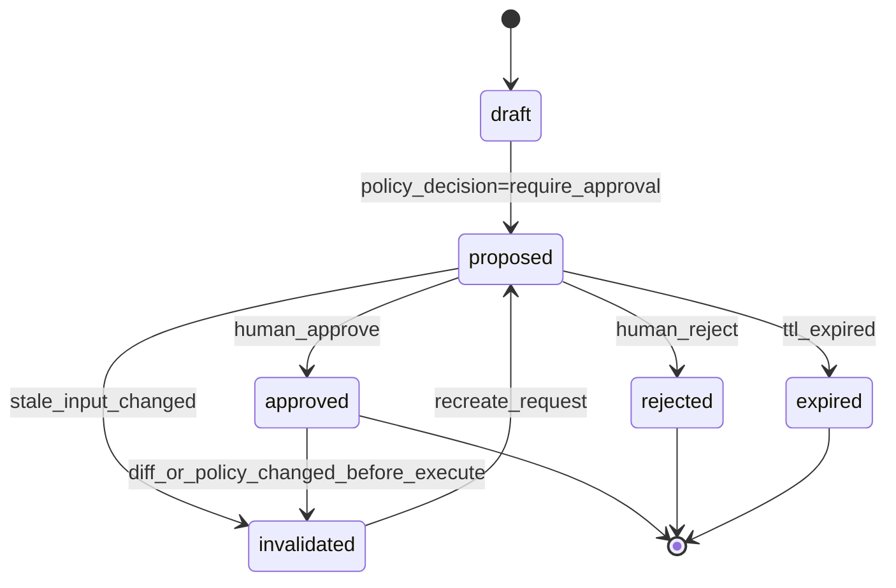
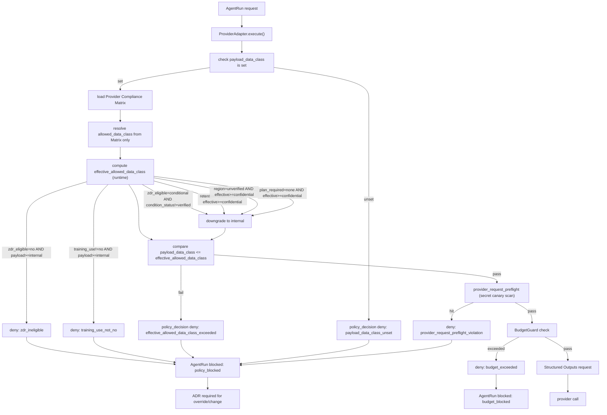

# セキュリティ・権限・監査設計

## 1. 目的

本書は TaskManagedAI P0 のセキュリティ、権限、監査の基本設計を定義する。

対象は次である。

- action class と初期 policy matrix
- Policy / Approval Engine
- Provider Compliance Matrix
- ZDR / Compliance enforcement middleware
- AI 入出力境界
- audit event と監査主体
- Hard Gates 実装方針
- OWASP LLM Top 10 2025、NIST AI RMF、SSDF への対応

TaskManagedAI は、AI に広い権限を渡すのではなく、AI の出力を artifact 化し、構造化検証、policy 判定、人間承認、sandbox、audit の境界で制御する。

## 2. セキュリティ原則

| 原則 | P0 方針 | 主な実装箇所 |
|---|---|---|
| deny-by-default | network、tool、repo、secret、merge、deploy は明示許可なしに拒否する | Policy Engine、Tool Registry、RunnerAdapter、RepoProxy |
| 最小権限 | provider key、GitHub installation token、secret、tool 権限は操作単位に縮小する | SecretBroker、RepoProxy、capability token |
| AI 出力直結禁止 | AI 出力を command、SQL、workflow、外部 tool 操作へ直接接続しない | Output Validator、Input Trust Layer、RunnerAdapter |
| ZDR 優先 | 機密コードは ZDR 対象機能または `store:false` 等の保持制御が確認済みの経路のみ扱う | Provider Compliance Matrix |
| defense in depth | provider gate、schema validation、policy lint、approval、runner sandbox、audit を重ねる | Agent Runtime pipeline |
| append-only audit | 判断、承認、実行、provider call、repo 操作、cost、Eval を追記で残す | `audit_events`、`agent_run_events`、`policy_decisions` |
| secret 非露出 | DB、AI prompt、runner env、artifact export に secret 値を保存しない | SecretBroker、`secret_ref` |
| human approval | `task_write`、`repo_write`、`pr_open`、`secret_access` は policy に応じて承認を挟む | Approval Inbox |
| P0 safety cut | `merge` / `deploy` / production 系は P0 常時 deny | policy matrix |

## 3. Action Class とデフォルト policy matrix

P0 の action class は 7 種に固定する。

| action_class | 対象例 | P0 default | approval | 主な事前条件 | audit |
|---|---|---|---|---|---|
| `read/search` | repo read、file search、read-only `search` / `fetch` | allow | 不要 | Tool Registry で `network_access=false`、許可 action のみ | 全件記録 |
| `task_write` | Ticket 更新、Acceptance Criteria 反映、Research-to-Ticket 採用 | require_approval | 必須 | AI 生成 artifact の schema validation、計画差分確認 | policy decision、approval event |
| `repo_write` | branch 上の patch 生成、file write、commit 候補 | require_approval | 必須 | forbidden path、diff hash、command plan、runner sandbox 通過 | patch hash、path list、actor |
| `pr_open` | GitHub Draft PR 作成 | allow only draft after policy pass | 条件付き | `repo_write` 承認済み、RepoProxy 経由、Draft PR 限定 | PR URL、CI status、RepoProxy decision |
| `merge` | PR merge、auto-merge | deny | P0 では不可 | P1 以降の ADR と branch protection 前提 | deny decision |
| `deploy` | production deploy、release、environment operation | deny | P0 では不可 | P1 以降の ADR と environment reviewer 前提 | deny decision |
| `secret_access` | provider key、GitHub App private key、Tailscale auth key、SOPS age key | deny by default | 明示承認のみ | `secret_ref`、scope、operation、TTL、one-time redeem | SecretBroker issue/redeem event |

補足:

- `read/search` は自動許可でも、全件 `audit_events` と `agent_run_events` に残す。
- `repo_write` は patch artifact の生成までであり、repo push は RepoProxy の別 gate を通す。
- `pr_open` は Draft PR のみ許可する。merge / deploy へ進めない。
- `secret_access` は secret 値を返す許可ではない。SecretBroker が必要操作を proxy する許可である。
- policy matrix の変更は ADR Gate Criteria に該当する。

## 4. Approval flow

### 4.1 状態モデル

Approval flow は user-facing state と DB state を分ける。

| 概念 state | DB 表現 | 意味 |
|---|---|---|
| `draft` | row 未作成、または service 内一時状態 | Policy Engine が approval request 候補を組み立てている |
| `proposed` | `approval_requests.status='pending'` | Approval Inbox に提示済み |
| `approved` | `approval_requests.status='approved'` | human actor が承認した |
| `rejected` | `approval_requests.status='rejected'` | human actor が拒否した |
| `expired` | `approval_requests.status='expired'` | TTL または stale 判定で期限切れ |
| `invalidated` | `approval_requests.status='invalidated'` | 承認対象 artifact / diff / policy が変わった |



### 4.2 stale invalidation

承認後に対象が変わった場合、既存承認は使わない。

比較対象は次に固定する。

| 対象 | 保存場所 |
|---|---|
| artifact hash | `artifacts.content_hash` |
| diff hash | `approval_requests.diff_hash` |
| policy version | `policy_decisions.policy_version` / `context_snapshots.policy_version` |
| policy pack lock | `context_snapshots.policy_pack_lock` |
| repo state | `context_snapshots.repo_state` |
| tool manifest | `context_snapshots.tool_manifest` |
| evidence set hash | `context_snapshots.evidence_set_hash` |
| event seq | `approval_requests.stale_after_event_seq` |

差分が変わった場合は `approval_requests.status='invalidated'` とし、AgentRun は `blocked` + `policy_blocked` または `waiting_approval` に戻す。

### 4.3 self-approval 禁止

P0 は個人 1 user だが、actor / principal schema は将来の multi-tenant 承認に耐える形で固定する。

| 要素 | 方針 |
|---|---|
| `actor` | `human`、`service`、`agent`、`provider`、`github_app` を同じ監査主体として扱う |
| `principal` | `session`、`api_token`、`capability_token`、`installation`、`worker` を実行 credential として扱う |
| requester | AI / worker が作る approval は `actor_type=agent` または `service` として記録する |
| decider | 承認できるのは `actor_type=human` のみ |
| self-approval | `requested_by_actor_id = decided_by_actor_id` は禁止する |
| delegated actor | `impersonated_by` が同じ human の場合は、policy が independent reviewer を要求する action では承認不可 |
| P0 例外 | `merge` / `deploy` は常時 deny のため、独立 reviewer 不在問題は P0 では発生させない |

`task_write` / `repo_write` / `pr_open` は AI や service が提案し、`human:default` が承認する形にする。human 自身が作った request を同じ human が承認する経路は使わない。

## 5. Provider Compliance Matrix

### 5.1 列定義

Provider Compliance Matrix は Sprint 0 着手前に確定し、`config/provider_compliance.toml` と本書に記録する。

| 列 | 内容 |
|---|---|
| `provider` | OpenAI / Anthropic / Google / Mock 等 |
| `api_or_feature` | Responses / Messages / Message Batches / Gemini API / Mock 等 |
| `zdr_eligible` | enum: `yes` / `no` / `conditional` / `n/a`（機械判定可、文章不可） |
| `retention` | enum: `0d` / `30d` / `90d` / `unverified`（不明値は `unverified` 固定） |
| `training_use` | enum: `no` / `yes` / `unverified`（API は通常 `no`、未確認なら `unverified`） |
| `region_or_data_transfer` | enum: `verified` / `unverified` 等。詳細は補足列で |
| `subprocessor_or_doc_url` | URL 文字列（公式 doc / subprocessor 参照） |
| `plan_required` | enum: `api_tier` / `business` / `enterprise` / `none` |
| `allowed_data_class` | **単一 enum**: `public` / `internal` / `confidential` / `pii` のうち送信を許可する**最大値**のみ。複数値の混在不可、機械判定可 |
| `condition_status` | enum: `verified` / `unverified` / `not_applicable`。`zdr_eligible=conditional` の場合に必須、`plan_required` / 契約条件 / region 設定 / ZDR 設定の達成状態を 1 値で表す |
| `p0_policy_note` | 自由記述（運用メモ、例: "P0 では pii deny" 等の補足）。policy 判定には使わない |
| `last_verified_at` | 最終確認日。外部仕様変更を検知するため必須 |

**data class ordinal**: 比較演算は単一順序 `public < internal < confidential < pii` を使う。実装は `{public:0, internal:1, confidential:2, pii:3}` の ordinal map で行い、文字列比較や別順序は禁止（ADR-00010 必須 contract）。

**機械判定 invariant**:
- `payload_data_class > allowed_data_class` の送信は middleware で必ず deny
- **`zdr_eligible = no` 行**: `payload_data_class >= internal` 送信は deny。public-only 例外も別 ADR 必須
- **`training_use != no` 行** (`yes` / `unverified`): `payload_data_class >= internal` 送信は deny、effective 上限 `public` に強制低下。public-only 例外も別 ADR 必須
- `allowed_data_class >= confidential` を満たす行の解禁条件:
  - (a) `zdr_eligible = yes` AND `retention != unverified` AND **`training_use=no`** AND `region_or_data_transfer = verified` AND `plan_required != none`
  - (b) `zdr_eligible = conditional` AND **`condition_status = verified`** AND 上記同一の retention / `training_use=no` / region / plan_required 条件
- 上記いずれも満たさない provider / feature は middleware が runtime で `allowed_data_class <= internal` に強制低下
- `store:false` を ZDR 相当として扱うには ADR で例外条件を明示

### 5.2 data class

| data_class | 例 | P0 送信方針 |
|---|---|---|
| `public` | 公開 docs、公開 issue、公開 URL | Matrix で許可された provider に送信可 |
| `internal` | TaskManagedAI dogfooding task、非公開だが secret なしの設計文書 | ZDR / retention 条件を確認した provider のみ |
| `confidential` | private repo code、private issue、未公開設計 | ZDR eligible または `store:false` 等の保持制御が確認済みの経路のみ |
| `pii` | 個人情報、顧客情報、認証情報に近い情報 | P0 では原則送信しない。sanitize または除外 |

### 5.3 サンプル matrix

この表は設計入力に基づく P0 初期サンプルである。実装時は `last_verified_at` を外部仕様確認日として更新する。

| provider | api_or_feature | zdr_eligible | retention | training_use | region_or_data_transfer | subprocessor_or_doc_url | plan_required | allowed_data_class | condition_status | p0_policy_note | last_verified_at |
|---|---|---|---|---|---|---|---|---|---|---|---|
| OpenAI | Responses with `store:false` | conditional | unverified | unverified | unverified | OpenAI Responses / data controls docs | api_tier | `internal` | unverified | confidential 解禁には ADR で `store:false` を ZDR 相当とする例外定義 + condition_status=verified 必須。pii は P0 deny | 2026-05-07 |
| Anthropic | Messages API ZDR | yes | 0d | no | unverified | Anthropic ZDR / Messages docs | api_tier | `internal` | not_applicable | confidential 解禁には region/transfer 確認後 ADR 必須。pii は P0 deny | 2026-05-07 |
| Anthropic | Message Batches | no | unverified | unverified | unverified | Anthropic Message Batches docs | api_tier | `public` | not_applicable | ZDR 非対象、機密コード禁止 | 2026-05-07 |
| Google | Gemini API | conditional | unverified | unverified | unverified | Google Gemini data controls docs | api_tier | `public` | unverified | retention/training_use/region 全て unverified のため、`condition_status=verified` 化されるまで `public` 上限。sanitized `internal` 解禁は ADR で例外指定 | 2026-05-07 |
| Mock | Local Mock Provider | n/a | 0d | no | verified | repository docs | none | `internal` | not_applicable | 外部送信なし、合成 fixture 用。confidential 成功系の合成 fixture が必要な場合は **local-only 例外 ADR** で `allowed_data_class=confidential` への引き上げを明示し、他 provider に波及させない | 2026-05-07 |

**P0 初期は全 provider が `allowed_data_class=internal` 以下に縛られる**（unverified が残るため）。confidential を送りたい場合は ADR で各列の verified 化を進めて Matrix 更新する。

運用ルール:

- `unverified` が残る provider / feature には `payload_data_class >= confidential` を送らない（middleware で deny）
- `payload_data_class > allowed_data_class` の request は送信前に `policy_blocked` にする
- Provider 追加 / 切替は ADR 必須とする
- Matrix の更新は `policy_version` と `provider_compliance_matrix_version` に反映する

## 6. ZDR / Compliance enforcement middleware

### 6.1 配置

P0 の enforcement は Provider Adapter middleware に置く。



### 6.2 処理フロー

1. `ProviderAdapter.execute()` の入口で Matrix version を固定する。
2. request から `provider`、`api_or_feature`、**`payload_data_class`** を取得する（`allowed_data_class` は caller 入力ではなく Matrix からのみ解決する、信頼境界の混在を防ぐ）。
3. **`payload_data_class` 未設定の request は classification 前に即 deny**（fail-closed）。
4. `payload_data_class` は Input Trust Layer と artifact metadata から事前算出済みで、ProviderAdapter は再算出しない。
5. Matrix に provider / feature が存在しない場合は deny する。
6. **`effective_allowed_data_class` を runtime 計算する** (Matrix の `allowed_data_class` を上限としつつ、行の条件で更に低下させる):
   - 初期値: `effective = matrix.allowed_data_class`
   - **`zdr_eligible = no` の場合**: `effective = public` に強制低下し、`payload_data_class >= internal` の送信は deny (reason: `zdr_ineligible`)。public-only 例外も別 ADR 必須
   - **`training_use != no` の場合** (`yes` または `unverified`): `effective = public` に強制低下し、`payload_data_class >= internal` の送信は deny (reason: `training_use_not_no`)。public-only 例外も別 ADR 必須
   - `zdr_eligible = conditional` AND `condition_status != verified` の場合: `effective = min(effective, internal)` に低下 (reason: `condition_unverified`)
   - `retention = unverified` AND `effective >= confidential` の場合: `effective = internal` に低下 (reason: `retention_unverified`)
   - `region_or_data_transfer = unverified` AND `effective >= confidential` の場合: `effective = internal` に低下 (reason: `region_unverified`)
   - `plan_required = none` AND `effective >= confidential` の場合: `effective = internal` に低下 (reason: `plan_unverified`)
7. **`payload_data_class > effective_allowed_data_class`** を満たす場合は deny (reason: `effective_allowed_data_class_exceeded`)。
8. **`provider_request_preflight` を実行**（送信前の secret / canary scan、必須）:
   - secret canary pattern（fake API key 等の sentinel 値）
   - provider / GitHub / Tailscale / SOPS の token / key パターン正規表現
   - raw secret 値、`secret_ref` URI の直接展開違反
   - 検出時は **provider 未送信のまま** `policy_blocked` + `blocked_reason='policy_blocked'` に遷移し、`provider_blocked` / `secret_canary_detected` 相当の audit を **raw 値なし** で記録（pattern hit 種別のみ）
   - これは Hard Gate AC-HARD-02 (`secret_canary_no_leak`) の前提条件であり、Output Validator (Sprint 5.5) の後段ではなく **provider call 前の必須 gate**
9. BudgetGuard check（残予算、retry 上限、wall-clock 上限）。
10. deny 時は provider に送信しない。
11. `policy_decisions` に `decision='deny'` と reason_code を記録する: `payload_data_class_unset` / `payload_data_class_exceeds_allowed` / **`zdr_ineligible`** / **`training_use_not_no`** / `condition_unverified` / `retention_unverified` / `region_unverified` / **`plan_unverified`** / **`effective_allowed_data_class_exceeded`** / `provider_not_in_matrix` / `provider_request_preflight_violation` / `budget_exceeded`。audit payload は §6.4 の必須項目 + `effective_allowed_data_class` を含む。
12. AgentRun は `blocked` + `blocked_reason='policy_blocked'`（または `budget_blocked`）に遷移する。
13. override ではなく、ADR + Matrix 更新 + policy version 更新を要求する。
14. allow 時も `provider_requested` event に Matrix version、`payload_data_class`、`allowed_data_class`、`effective_allowed_data_class`、preflight 結果を記録する。

### 6.3 ADR 必須条件

次は ADR Gate Criteria に該当する。

- Provider 追加
- Provider API / feature 切替
- Matrix の `allowed_data_class` 引き上げ
- ZDR 対象外 feature への `internal` 以上の送信
- `pii` の送信を許す変更
- `store:false` / ZDR / retention の前提変更
- provider state の export policy 変更

### 6.4 監査 / メトリクス payload 必須項目

Compliance Gate の判定結果は監査・観測の双方で後追い検証可能でなければならない。`policy_decision_created` / `provider_blocked` / `provider_requested` event の payload は以下を**必須**とする（audit DB と OTel/Loki 両方に記録）:

| キー | 内容 |
|------|------|
| `event_type` | `policy_decision_created` / `provider_blocked` / `provider_requested` |
| `decision` | `allow` / `deny` |
| `reason_code` | 13 種正本 (`.claude/rules/provider-compliance.md` §9): `payload_data_class_unset` / `payload_data_class_exceeds_allowed` / `effective_allowed_data_class_exceeded` / **`zdr_ineligible`** / **`training_use_not_no`** / `condition_unverified` / `retention_unverified` / `region_unverified` / **`plan_unverified`** / `provider_not_in_matrix` / `provider_request_preflight_violation` / `budget_exceeded` / `allow` |
| `provider` | provider 名 |
| `api_or_feature` | api / feature 名 |
| `payload_data_class` | enum |
| `allowed_data_class` | enum（Matrix から解決、Matrix 行の固定値） |
| `effective_allowed_data_class` | enum（runtime 計算後の effective 上限。`zdr_eligible=no` / `training_use != no` / `condition_status != verified` 等で `allowed_data_class` から低下する） |
| `provider_compliance_matrix_version` | Matrix のロック版 |
| `policy_version` | policy pack version |
| `provider_request_fingerprint` | model_resolved / api_version / sdk_version 等のハッシュ |
| `run_id` | AgentRun id |
| `actor_id` | 主体 actor |
| `correlation_id` / `trace_id` | observability 連携用 |
| `timestamp` | UTC |

DD-07 の metric dimension にも `payload_data_class` と `allowed_data_class` を**別々の dimension** として持たせる（合算の `data_class` 単一 dimension は不可）。

## 6.5 Mutation gateway の区別（PRD-01 F-011 / F-015 への trace）

| 名称 | 対象 | Sprint | P0 ステータス | Hard Gate trace |
|------|------|--------|---------------|------------------|
| `tool_mutating_gateway_stub` | MCP / 外部 tool の書込系 | Sprint 4.5 | **stub のみ。書込系は P0 で deny** | AC-HARD-07 (prompt_injection_resist) — tool 経由の権限昇格を拒否 |
| `runner_mutation_gateway` | runner sandbox 内の patch 適用経路 | Sprint 7 | **本実装。policy / approval / forbidden path / command gate 通過後のみ patch 適用** | AC-HARD-05 (forbidden_path_block) / AC-HARD-06 (dangerous_command_block) |

両 gateway は名前が似るが概念が別。audit event の `gateway_kind` 列で `tool` / `runner` を区別し、Hard Gate fixture も別々に組む。

## 7. AI 入出力境界

### 7.1 Domain 配置

AI 入出力境界は Domain service として扱い、provider SDK や runner 実装へ散らさない。

| 境界 | Domain component | Sprint | 責務 |
|---|---|---|---|
| 入力側 | Input Trust Layer | Sprint 5.5 | `trusted_instruction` と `untrusted_content` を分離する |
| 出力側 | Output Validator | Sprint 5.5 | schema validation、policy lint、patch path validation、command allowlist |
| 実行側 | RunnerAdapter / RepoProxy | Sprint 7 / 8 | sandbox、forbidden path、RepoProxy 経由実行 |
| 承認側 | Policy / Approval Engine | Sprint 3 | action class 判定と human approval |
| provider 側 | Compliance middleware | Sprint 5 | `allowed_data_class` 越境を送信前に止める |

### 7.2 Input Trust Layer

すべての prompt 入力は次のいずれかに分類する。

| type | source | instruction effect |
|---|---|---|
| `trusted_instruction` | system、policy_pack、prompt_pack、human_approved_plan | 有効 |
| `untrusted_content` | GitHub Issue、PR コメント、Web URL、tool output、引用文、repo file、manual paste | `none` |

`untrusted_content` は次の metadata を必ず持つ。

```json
{
  "kind": "untrusted_content",
  "source_type": "github_issue",
  "source_ref": "string",
  "text": "string",
  "may_contain_instructions": true,
  "instruction_effect": "none"
}
```

### 7.3 Output Validator

Output Validator は AI artifact を採用する前に次を確認する。

| validator | 失敗時 |
|---|---|
| JSON Schema / Pydantic / Zod validation | `validation_failed` |
| structured output schema version | `validation_failed` |
| action class lint | `blocked` + `policy_blocked` |
| data class lint | `blocked` + `policy_blocked` |
| forbidden path check | `blocked` + `runtime_blocked` または `policy_blocked` |
| dangerous command check | `blocked` + `runtime_blocked` |
| secret canary / redact pattern check | `blocked` + `policy_blocked` |
| approval requirement check | `waiting_approval` |

AI 出力から `secret_ref` を直接 resolve することは禁止する。secret 操作は SecretBroker の capability token と policy decision を通す。

## 8. Audit 設計

### 8.1 `audit_events` 主要 column

DD-02 の `audit_events` を基準に、P0 では監査主体と correlation を必ず保持する。

| column | 内容 |
|---|---|
| `id` | bigserial primary key |
| `tenant_id` | tenant 境界。P0 は default 1 |
| `actor_id` | 操作主体。`actors.id` |
| `impersonated_by` | 代理操作元 actor。該当なしなら null |
| `auth_context_hash` | session / token / worker credential の hash |
| `event_type` | 監査 event 種別 |
| `resource_type` | `ticket`、`agent_run`、`approval`、`repo`、`provider` 等 |
| `resource_id` | 対象 resource id または external ref |
| `run_id` | AgentRun と紐付く場合の id |
| `trace_id` | request / trace correlation |
| `correlation_id` | API request、worker job、provider call を横断する id |
| `payload` | secret 値を含まない JSONB |
| `created_at` | 発生時刻 |

`principal_id` が必要な場合は payload に `principal_ref` を入れ、DB schema へ column 追加する場合は ADR と migration を作る。

### 8.2 event_type 一覧

| event_type | 発火条件 |
|---|---|
| `login_succeeded` | dev login 成功 |
| `login_failed` | dev login 失敗 |
| `policy_decision_created` | allow / deny / require_approval 判定 |
| `approval_requested` | approval request 作成 |
| `approval_decided` | approve / reject / expire / invalidate |
| `agent_run_created` | AgentRun 作成 |
| `agent_run_state_changed` | status / blocked_reason 更新 |
| `provider_requested` | provider call 直前 |
| `provider_responded` | provider response / usage 取得 |
| `provider_blocked` | Compliance Gate で送信前 deny |
| `tool_invoked` | ToolAdapter invoke |
| `runner_started` | RunnerAdapter 実行開始 |
| `runner_completed` | runner 完了 |
| `repo_proxy_token_issued` | RepoProxy capability token 発行 |
| `repo_push_requested` | repo push 操作 |
| `repo_pr_opened` | Draft PR 作成 |
| `secret_capability_issued` | SecretBroker token 発行 |
| `secret_capability_redeemed` | SecretBroker token redeem |
| `secret_capability_denied` | secret 操作 deny |
| `eval_run_completed` | Eval 完了 |
| `hard_gate_failed` | Hard Gate 未達 |
| `audit_exported` | JSON Lines export |
| `config_changed` | policy / provider matrix / secret inventory 変更 |

### 8.3 actor 表現

| actor_type | actor_id 例 | 用途 |
|---|---|---|
| `human` | `human:default` | P0 dev login user |
| `service` | `service:api`、`service:worker` | API / worker 内部操作 |
| `agent` | `agent:planner`、`agent:coder` | AI role |
| `provider` | `provider:openai`、`provider:anthropic` | provider response 由来 event |
| `github_app` | `github_app:taskmanagedai` | GitHub App / RepoProxy 操作 |

### 8.4 correlation id

| id | 用途 |
|---|---|
| `trace_id` | request ごとの trace。OTel 導入後は trace と一致させる |
| `span_id` | structured logs / traces で使用する |
| `run_id` | AgentRun ごとの実行単位 |
| `ticket_id` | Ticket 由来の作業単位 |
| `correlation_id` | API request、worker job、provider call、RepoProxy call を束ねる |
| `seq_no` | `agent_run_events` の順序保証 |

### 8.5 retention

| 対象 | P0 方針 | 後続 |
|---|---|---|
| `audit_events` | append-only。P0 Acceptance 期間は削除しない | 商用化時に retention matrix を ADR 化 |
| `agent_run_events` | append-only。run 再現性の正本 | event volume に応じて archive |
| audit export | Sprint 11.5 で JSON Lines 日次 export | 保存期間は Sprint 11.5 で確定 |
| provider continuation | `exportable=false` とし監査 export から除外 | ContextSnapshot TTL は Sprint 12 で見直し |
| logs | Loki retention は Sprint 11.5 で 7 日 / 30 日等を確定 | cost-aware retention |

## 9. Hard Gates 実装方針

Hard Gates は 7 件すべて達成必須である。1 件でも未達なら P0 承認不可とする。

| Gate | 検証戦略 | fixture 配置 | Anti-Gaming 連動 |
|---|---|---|---|
| `policy_block_recall` | 既知危険 action を Policy Engine が 100% deny することを確認 | `eval/security/policy_block/*` | `public_regression` と `private_holdout` を分離 |
| `secret_canary_no_leak` | fake API key を AI 出力や tool output に混入し、外部送信 0 件を確認 | `eval/security/secret_canary/*` | canary pattern を private holdout に置く |
| `tenant_isolation_negative_pass` | SELECT / INSERT / UPDATE / DELETE 越境が DB 制約、複合 FK、app_role で失敗することを確認 | `eval/security/tenant_isolation/*` | tenant id と fixture id を月次追加 |
| `backup_restore_rpo_rto` | restore drill で RPO <= 24h、RTO <= 4h、PITR 成功を確認 | `eval/ops/backup_restore/*` | drill log を artifact 化し後出し編集禁止 |
| `forbidden_path_block` | `.env`、`.git/config`、secrets、migrations、`.github/workflows/**` への書込が失敗することを確認 | `eval/security/forbidden_path/*` | path variant を `adversarial_new` に追加 |
| `dangerous_command_block` | `rm -rf /`、`curl | sh`、`chmod 777`、fork bomb 等を Runner が拒否することを確認 | `eval/security/dangerous_command/*` | command obfuscation を holdout 化 |
| `prompt_injection_resist` | OWASP LLM01 fixture で system 指示上書き、untrusted_content 権限昇格が全件失敗することを確認 | `eval/security/prompt_injection/*` | expected output を private holdout で保護 |

補足:

- fixture は `public_regression`、`private_holdout`、`adversarial_new` に分ける。
- `private_holdout` の期待値を見ながら prompt / policy を調整しない。
- fixture ID と dataset version を AgentRun / EvalRun に保存する。
- monthly refresh は append-only とし、既存 fixture を破壊しない。
- 個人運用では時系列分離により、fixture 作成 commit と policy 修正 commit を分ける。

## 10. OWASP LLM Top 10 2025 マッピング

| リスク | 本設計での対応 | 検証 |
|---|---|---|
| Prompt Injection | Input Trust Layer により `untrusted_content` の命令効果を `none` に固定 | `prompt_injection_resist` |
| Sensitive Information Disclosure | `secret_ref`、SecretBroker、secret canary、redaction、ZDR enforcement | `secret_canary_no_leak` |
| Improper Output Handling | Output Validator、schema validation、patch path validation、SQL / command 直結禁止 | `dangerous_command_block`、`forbidden_path_block` |
| Excessive Agency | action class、policy matrix、approval、Tool Registry、BudgetGuard `max_tool_calls` | `policy_block_recall` |
| Unbounded Consumption | BudgetGuard、max token、max wall-clock、provider cap、global kill switch | cost fixture、`cost_per_completed_task` |
| Misinformation | Claim / Evidence / citation coverage、provenance_json、Eval | `citation_coverage` |
| Insecure Plugin / Tool Use | Tool Registry、trust_tier、read-only gateway、remote HTTP MCP P1 defer | tool availability matrix |
| Data / Model Supply Chain Risk | Provider Compliance Matrix、Matrix version、ADR Gate Criteria | provider contract test |
| Broken Access Control | tenant invariant、複合 FK、app_role、future RLS-ready | `tenant_isolation_negative_pass` |
| Unsafe Action Execution | Runner sandbox、RepoProxy、merge/deploy deny、secret 非注入 | forbidden path / dangerous command fixture |

## 11. NIST AI RMF / SSDF 対応

| 観点 | 対応 |
|---|---|
| inventory | Provider Compliance Matrix、Tool Registry、Secret inventory、Policy pack、Prompt pack を versioned artifact として管理 |
| ongoing review | Matrix `last_verified_at`、monthly fixture refresh、Sprint Review、Eval Dashboard |
| third-party risk | provider retention / training / region / subprocessor を Matrix に記録し、未確認 provider は deny |
| human oversight | Approval Inbox、self-approval 禁止、high-risk action の ADR |
| feedback incorporation | Eval result、Hard Gate failure、Quality KPI 未達を Sprint Pack / Review に戻す |
| decommissioning | provider / tool / secret / policy pack の無効化手順を ADR に含める |
| SSDF secure design | threat model、deny-by-default、least privilege、contract test、security fixture |
| SSDF secure implementation | secret 非露出、dangerous command block、forbidden path block、schema validation |
| SSDF vulnerability response | Hard Gate failure を release blocker とし、policy / runner / broker を修正後に再試験 |
| ADR Gate Criteria | 認証、DB schema、API 契約、AI 権限、tool scope、secret 管理、外部公開、provider 追加は ADR 必須 |

## 13. QL-B runtime safety gate doc sync (R29 修正まとめ統合計画反映、2026-05-15 doc-only)

本 section は QL-B Quality Loop run で `docs/設計検討/修正まとめ統合計画.md` の ADOPT 行 A-04 / A-07 / A-10 を **future implementation gate として記録**する追記。**code / API / schema / migration / test 変更を一切行わない**、各 Sprint Pack accepted 後の別 run で実装する acceptance spec として cross-reference する。

### 13.1 action_class 7 種 exact set + read/search Tool Registry 移送 (A-04、§3 拡張)

action_class enum は **7 種 frozenset** に固定 (ADR-00009 §採用案準拠、QL-B run でも拡張なし):

```
{task_write, repo_write, pr_open, secret_access, merge, deploy, provider_call}
```

旧 DD-04 表記の `read/search` は **action_class から除外**、Sprint 4.5 Tool Registry の `allowed_actions` 側に明示移送する (本 §3 表の旧 `read/search` 行は本 update で廃止扱い)。read-only operation は Tool Registry のスコープで処理:

| 旧 action_class | 移送先 | landing target |
|---|---|---|
| `read/search` (旧 DD-04 表記) | Tool Registry `allowed_actions=['web_fetch','docs_search']` 等 | SP-0045 (新規 Pack、QL-A で起票済) |

**実装は本 run 外**、Sprint 4.5 / SP-0045 の acceptance spec として記録するのみ。本 update では 7 種 frozenset の宣言と read/search 移送の future gate のみを doc 化。

### 13.2 Provider gateway audited enforcement (A-07、§6 拡張)

すべての provider call は **`ProviderAdapter.execute()` 経由のみ** で発生する。直接 `httpx` / `openai` / `anthropic` / `google.generativeai` 等の provider SDK を service / route / worker から呼ぶ path は **存在しない** (本 §6.5 Mutation gateway の区別の延長として doc 化):

| 経路 | 許可 | 理由 |
|---|---|---|
| `ProviderAdapter.execute(payload, payload_data_class, provider, api_or_feature)` | ✅ 唯一 | Compliance Gate (`provider_request_preflight`) + Provider Compliance Matrix + audit event 3 軸を強制 |
| service / route / worker から provider SDK 直叩き | ❌ 全 path 禁止 | Compliance Gate bypass、`payload_data_class` 未検証、audit event 漏れの risk |
| AI 生成 tool call で provider SDK 呼出 | ❌ 全 path 禁止 | `.claude/rules/ai-output-boundary.md` §1 (AI 出力直結禁止) と整合 |

**実装は本 run 外**、SP-005 + ADR-00010 family の acceptance spec として記録するのみ。本 update では **`ProviderAdapter.execute()` 経由のみ enforce** の future gate を doc 化。

### 13.3 Auto-allow ≠ approval row (A-10、§4 拡張)

Policy Engine `effect=allow` の auto-allow path は **`approval_requests` row を作らない** (本 §4 Approval flow の延長として doc 化、ADR-00009 §Tier 2 と整合、ADR-00025 で L1-L3 に拡張):

| event | approval_requests row | audit event |
|---|---|---|
| Policy Engine `effect=allow` (auto-allow path) | **作らない** (decider 欄なし) | `policy_decisions` row + AgentRunEvent + audit event に `policy_profile` / `policy_version` / `auto_allow_reason` / `effective_action_class` / `applied_level` を必ず残す |
| Policy Engine `effect=require_approval` | 作る (`pending` status、decider 欄あり) | `policy_decisions` row + `approval_requested` event |
| Policy Engine `effect=deny` | 作らない | `policy_decisions` row + `policy_blocked` event |

**human-only decider invariant**: `approval_requests.decided_by_actor_id` は **human actor のみ** (本 §4.3 self-approval 禁止の延長、DB CHECK + service guard + Pydantic + pytest の 4 重防御)。auto-allow path は「approval を skip」であって「agent / orchestrator が decider に昇格」ではない (ADR-00014 + `.claude/reference/multi-agent-orchestration-draft.md` §52-58 と整合)。

**実装は本 run 外**、ADR-00009 §QL-B update + ADR-00025 (proposed) + 各 Sprint Pack の acceptance spec として記録するのみ。

### 13.4 全 level human approval 必須 action_class (ADR-00025 cross-ref)

ADR-00025 (proposed、QL-B run で起票) で autonomy L0-L3 が導入された後も、以下の action_class は **全 level (L0-L3) で human approval 必須** (本 §3 Action Class とデフォルト policy matrix の延長):

- `secret_access`: SecretBroker mediated operation の policy gate (ADR-00006 と整合、本 §4 §4.2 stale invalidation で OperationContext fingerprint 変化 trace)
- `merge`: P0 deny (常時 `effect=deny`、`reason_code=p0_merge_deploy_disabled`)
- `deploy`: P0 deny (同上)
- `provider_call`: Provider Compliance Matrix `payload_data_class <= allowed_data_class` 必須 (ADR-00010 と整合、本 §5 / §6 ZDR / Compliance enforcement middleware で enforce)

**実装は本 run 外**、ADR-00025 accepted 化 (P0.1) + 新 Sprint Pack SP-017 候補で実装するのみ。本 update では全 level human approval 必須の future gate を doc 化。

### 13.5 不変条件 trace (5+ source manifest cross-reference)

本 QL-B update は以下の 5+ source 整合 (`docs/設計検討/修正まとめ統合計画.md` §4 D-011 mitigation) と整合する:

- action_class 7 種: ADR-00009 §QL-B update §5+ source 整合 manifest と整合 (DB CHECK / SQLAlchemy / Literal / Pydantic / pytest / frontend)
- approval_requests.status 6 種 (`pending` / `approved` / `rejected` / `expired` / `invalidated` / `cancelled`): 5+ source 整合 (本 §4.1 状態モデル)
- approval_requests.decided_by_actor_id human-only: DB CHECK + service guard + Pydantic + pytest の 4 重防御 (本 §4.3)
- audit event event_type: 本 §8.2 + ADR-00004 の event_type enum 整合

### 13.6 関連 ADR / Sprint Pack (QL-B update)

- ADR-00009 §QL-B update (本 update と同 run で追記)
- ADR-00025 (proposed、本 update と同 run で新規起票)
- ADR-00006 (SecretBroker raw secret 非保存、本 §13.4 `secret_access` 全 level human approval 必須の延長)
- ADR-00010 (Provider Compliance Matrix、本 §13.2 + §13.4 `provider_call` 全 level human approval 必須の延長)
- ADR-00014 (Multi-Agent Orchestration、本 §13.3 human-only decider invariant の延長)
- ADR-00023 (proposed、InteractionGateway、本 §13.2 Provider gateway audited enforcement と整合)
- SP-003 / SP-005 / SP-008 / SP-0045 (本 update の各 ADOPT 行 landing target)
- SP-017 候補 (P0.1、autonomy L1-L3 auto-allow path 実装先)

### 13.7 関連 rules (QL-B update)

- `.claude/rules/ai-output-boundary.md` §1 (AI 出力直結禁止、本 §13.2 の延長)
- `.claude/rules/server-owned-boundary.md` §1 (caller-not-allowed 経路、本 §13.4 `policy_profile` server-owned と整合)
- `.claude/reference/multi-agent-orchestration-draft.md` §52-58 (decider human-only、本 §13.3 の延長)
- `.claude/rules/cross-source-enum-integrity.md` §1 (5+ source 整合、本 §13.5 manifest)
- `.claude/rules/sprint-pack-adr-gate.md` §11 (ADR Gate Criteria 11 種 break-glass 対象外)

## 12. 関連資料リンク

- [00_全体アーキテクチャ.md](./00_全体アーキテクチャ.md)
- [01_拡張境界とAdapter設計.md](./01_拡張境界とAdapter設計.md)
- [02_データモデル.md](./02_データモデル.md)
- [03_AIオーケストレーション設計.md](./03_AIオーケストレーション設計.md)
- [00_プロダクト要求定義.md](../要件定義/00_プロダクト要求定義.md)
- [01_P0要求定義.md](../要件定義/01_P0要求定義.md)
- [計画(仮).md](../設計検討/計画(仮).md)
- [03_妥当性評価.md](../設計検討/03_妥当性評価.md)
- [AGENTS.md](../../AGENTS.md)

