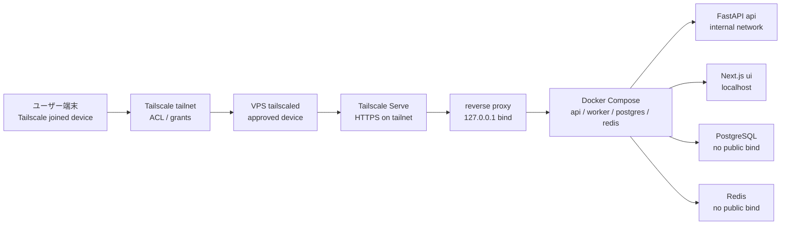

# ネットワーク境界設計

## 1. 目的

本書は TaskManagedAI P0 の network boundary を定義する。

P0 は個人専用、単一 VPS、Docker Compose、Tailscale Serve / SSH を前提に、public internet へ直接公開しない閉域運用を採る。Funnel、Cloudflare 公開、Tailnet Lock 本格運用、Tailscale Business / Enterprise 前提運用は P0 対象外とする。

## 2. ネットワーク境界原則

| 原則 | P0 方針 |
|---|---|
| Tailscale 閉域 | ユーザー端末と VPS は tailnet 内通信に限定する |
| Funnel 不使用 | Tailscale Funnel は使わない |
| localhost bind | backend と Docker `ports:` は `127.0.0.1` bind を基本にする |
| UFW 迂回回避 | Docker public bind による UFW bypass を避ける |
| deny-by-default | grants で必要な identity → tagged resource → TCP/443 のみ許可する |
| 中立命名 | machine 名、tailnet DNS 名に顧客名、案件名、機密プロダクト名を含めない |
| device approval | P0 は device approval を採用する |
| Tailnet Lock defer | Tailnet Lock は複数 signing node と disablement secrets escrow 整備後の P1 に送る |
| tsidp defer | tsidp は experimental のため P0 認証基盤に採用しない |
| 商用化 gate | Tailscale Personal は non-commercial 前提のため商用化時に plan と tailnet を再評価する |

## 3. ネットワーク構成図



P0 の公開面は tailnet 内の Tailscale Serve に限定する。Docker service は public interface に直接 bind しない。

## 4. 通信経路

| 経路 | 方針 |
|---|---|
| User → Tailscale | approved device のみ |
| Tailscale → VPS | tailnet 内通信。Funnel 不使用 |
| Tailscale Serve → reverse proxy | localhost backend を proxy |
| reverse proxy → Docker | `127.0.0.1` または Docker internal network |
| API → worker | Redis / arq queue、internal network |
| API / worker → provider | Provider Compliance Matrix と SecretBroker 経由 |
| API / worker → GitHub | RepoProxy 経由 |
| GitHub Actions → private staging | Sprint 11.5 で Tailscale GitHub Action による一時接続 |

## 5. Tailscale 設定

### 5.1 device approval

P0 は device approval を採用する。

| 項目 | 方針 |
|---|---|
| 新規 device | owner が明示承認するまで TaskManagedAI に到達不可 |
| 退役 device | tailnet から削除し、必要なら session / token を rotate |
| 紛失 device | 即時 disable、audit event に記録 |
| P0 acceptance | 不承認 device から接続できないことを smoke test で確認 |

### 5.2 tagged resources

TaskManagedAI host は中立名の machine とし、tag を使って resource を識別する。

| 項目 | 値 |
|---|---|
| machine name | `app-<env>-<role>-<NN>` |
| P0 example | `app-p0-vps-01` |
| tag | `tag:taskhub` |
| exposed port | TCP/443 |
| user identity | 自分の tailnet identity のみ |

### 5.3 grants 例

実 identity はここに書かない。実装時は自分の tailnet identity に置換する。Sprint 11.5 の private staging CI/E2E（PRD-01 F-020-OPS）対応のため、CI 専用 tag (`tag:taskhub-ci`) も同時に定義する。

```json
{
  "tagOwners": {
    "tag:taskhub": ["<your-tailnet-identity>"],
    "tag:taskhub-ci": ["<your-tailnet-identity>"]
  },
  "grants": [
    {
      "src": ["<your-tailnet-identity>"],
      "dst": ["tag:taskhub"],
      "ip": ["tcp:443"]
    },
    {
      "src": ["tag:taskhub-ci"],
      "dst": ["tag:taskhub"],
      "ip": ["tcp:443"]
    }
  ]
}
```

この grants は次の 2 経路を許可する：
1. `src=自分の identity` → `dst=tag:taskhub` TCP/443（個人端末からの通常アクセス）
2. `src=tag:taskhub-ci` → `dst=tag:taskhub` TCP/443（GitHub Actions が Tailscale GitHub Action で `tag:taskhub-ci` として一時参加し、private staging へ E2E 接続）

その他は deny-by-default。CI 用 auth key の運用ルール:

- **ephemeral key** を必ず使う（job 終了後に device が自動削除）
- **reusable key を使わない**（流出時の影響を最小化）
- key は SOPS で暗号化、GitHub Actions secrets に直接置かない
- job ごとに `tailscale up` → 処理 → `tailscale logout` を CI step で明示
- log は token / key 値を mask（GitHub Actions の `::add-mask::`）
- CI 経由の到達ログは Loki に集約し、誤接続を監視

### 5.4 Funnel disable

P0 では Funnel を使わない。

| 操作 | 方針 |
|---|---|
| Tailscale Serve | tailnet 内 HTTPS として使用 |
| Tailscale Funnel | 設定しない |
| 外部公開変更 | ADR 必須 |
| Cloudflare 代替 | P0 対象外。商用化または Tailscale 不可端末の検討時に再評価 |

### 5.5 Tailscale SSH

P0 の SSH は Tailscale SSH を基本にする。

| 項目 | 方針 |
|---|---|
| SSH 到達 | tailnet 内のみ |
| public SSH | 原則閉じる |
| access | 自分の identity のみ |
| audit | SSH 操作は OS log と運用メモで追跡し、アプリ内操作は `audit_events` へ残す |
| break-glass | 紛失時の復旧手順は Sprint Pack または ADR に残す |

## 6. CT log 対策

Tailscale HTTPS を有効化すると、machine 名や tailnet DNS 名が public ledger に載りうる。P0 は情報露出を最小化する。

### 6.1 machine naming rule

| rule | 内容 |
|---|---|
| format | `app-<env>-<role>-<NN>` |
| allowed env | `p0`、`stg`、`prod` |
| allowed role | `vps`、`web`、`worker`、`ci` |
| example | `app-p0-vps-01` |
| forbidden | 顧客名、個人名、repo 名、製品名、秘密 project 名、用途が推測できる語 |

### 6.2 HTTPS 有効化前の固定

HTTPS を有効化する前に、machine 名を中立名へ固定する。

手順:

1. machine 名候補を `app-<env>-<role>-<NN>` で決める。
2. 顧客名、案件名、repo 名、機密語が含まれないことを確認する。
3. tailnet DNS 名に不要な識別子が含まれないことを確認する。
4. Tailscale HTTPS / Serve を有効化する。
5. 以後、名前変更で履歴が残る前提で扱う。

### 6.3 tailnet DNS 名のサニタイズ

| 対象 | 方針 |
|---|---|
| tailnet name | 個人名、組織名、project 名が露出しない名前を優先 |
| MagicDNS name | public ledger に出ても意味が薄い命名にする |
| docs / screenshot | tailnet DNS を貼る場合は必要に応じて redact |
| CI logs | private staging URL を log に出す場合は mask する |

## 7. Tailnet Lock vs device approval

### 7.1 P0 判断

P0 は device approval を採用し、Tailnet Lock は P1 に defer する。

| 項目 | device approval | Tailnet Lock |
|---|---|---|
| P0 採否 | 採用 | 不採用 |
| 理由 | 個人運用で導入が軽く、P0 の閉域要件を満たせる | signing key 管理と復旧事故リスクが増える |
| 必要条件 | owner による device 承認 | 複数 signing node、disablement secrets escrow |
| P0 リスク | control plane compromise への追加耐性は限定的 | 運用ミスで tailnet recovery 不能になりうる |
| 将来 | P1 で再評価 | P1 以降 |

### 7.2 Tailnet Lock を P1 に送る条件

Tailnet Lock を採用する場合は、最低限次を満たす。

- signing node を 2 台以上持つ。
- disablement secrets を escrow する。
- key loss 時の復旧手順を ADR に書く。
- device replacement 手順を作る。
- CI / staging 接続と衝突しないことを確認する。
- P0 device approval からの移行手順を作る。

## 8. Docker / UFW

### 8.1 Docker bind 原則

Docker は UFW を迂回しうるため、public bind を禁止する。

```yaml
services:
  api:
    ports:
      - "127.0.0.1:8000:8000"

  web:
    ports:
      - "127.0.0.1:3000:3000"

  postgres:
    expose:
      - "5432"

  redis:
    expose:
      - "6379"
```

禁止例:

```yaml
services:
  api:
    ports:
      - "8000:8000"
```

`0.0.0.0` bind や host public interface bind は P0 では使わない。

### 8.2 UFW 方針

| 項目 | 方針 |
|---|---|
| default incoming | deny |
| default outgoing | allow。ただし runner egress は別途 allowlist |
| Tailscale interface | tailnet traffic のみ許可 |
| public ports | 原則なし |
| SSH | public SSH を閉じ、Tailscale SSH を使う |
| Docker | public bind 禁止により UFW bypass を設計上回避 |

確認観点:

- `ss -lntp` で `0.0.0.0:3000` / `0.0.0.0:8000` がないこと。
- `docker ps` の ports が `127.0.0.1` であること。
- public IP から app port へ接続できないこと。
- tailnet 内から TCP/443 のみ到達できること。

### 8.3 reverse proxy

P0 では reverse proxy は localhost backend だけを proxy する。

| item | 方針 |
|---|---|
| listen | `127.0.0.1` または Tailscale Serve の backend |
| upstream | `127.0.0.1:3000` / `127.0.0.1:8000` |
| TLS | Tailscale Serve の HTTPS を優先 |
| headers | identity headers を信用する場合も backend は localhost bind |
| logs | `trace_id` / `correlation_id` を付与できる構成にする |

## 9. Private Staging CI/E2E 経路

### 9.1 段階計画

| Sprint | 方針 |
|---|---|
| Sprint 0 | E2E framework skeleton。Playwright + pytest/httpx のサンプル 1 件で起動確認 |
| Sprint 11.5 | Tailscale GitHub Action を使って private staging へ一時接続し、本運用化 |
| Sprint 12 | P0 Acceptance Test で private staging CI/E2E 経路を検証 |

### 9.2 Sprint 0 skeleton

Sprint 0 では本運用接続を作り込まない。

実施すること:

- E2E framework を選定する。
- local docker compose に対する smoke test を 1 件作る。
- CI では lint、typecheck、unit test、最小 smoke を走らせる。
- private staging 本運用は Sprint 11.5 に送る。
- secrets を必要とする test は skip ではなく mock / fixture 化する。

### 9.3 Sprint 11.5 本運用

Sprint 11.5 で Tailscale GitHub Action を本運用する。

| 項目 | 方針 |
|---|---|
| 接続 | GitHub Actions job が tailnet に一時参加（`tag:taskhub-ci` として） |
| auth key | **§5.3 と DD-06 に従い SOPS で暗号化、`secret://sops/p0/tailscale-auth-key#v1` の `secret_ref` で管理**。GitHub Actions runtime には **ephemeral / one-time** auth key として API 経由で短命注入し、reusable key は禁止。job 終了後に device cleanup と CI log mask を実施 |
| scope | private staging の `tag:taskhub` へ必要 port (TCP/443) のみ |
| logs | Loki に集約。CI log は `::add-mask::` で auth key / token / tailnet DNS を必ず mask |
| retention | Loki retention は Sprint 11.5 で確定 |
| failure reproduction | worktree + docker compose down/up + fixture id で再現 |
| cleanup | job 終了後に一時 device / session を破棄、key を再利用しない |

### 9.4 失敗時再現手順

private staging E2E が失敗した場合は次を artifact 化する。

1. commit SHA
2. docker image digest
3. fixture id / dataset version
4. `trace_id` / `correlation_id`
5. CI job id
6. redacted structured logs
7. `docker compose` 起動条件
8. 失敗 screenshot または response excerpt
9. 再実行コマンド
10. network reachability check 結果

secret 値、Tailscale auth key、provider key、GitHub installation token は artifact に含めない。

## 10. tsidp 採否

P0 では tsidp を認証基盤に採用しない。

| 項目 | 方針 |
|---|---|
| P0 auth | dev login。Cookie + secret token |
| tsidp | experimental のため P0 対象外 |
| 理由 | P0 では private auth より evaluation / approval / network boundary を先に固める |
| 再評価 | 商用化時または P1 の external IdP 検討時 |
| 代替 | OIDC 移行時は cookie 中身を IdP token に置換し actor schema は維持 |

## 11. 商用化時の切替計画

Tailscale Personal は non-commercial 前提であるため、商用化検討時は gate を設ける。

| 項目 | Personal P0 | 商用化時 |
|---|---|---|
| plan | Personal | Business / Enterprise を再評価 |
| tailnet | 個人 tailnet | 業務 tailnet へ分離 |
| auth | dev login | external auth / OIDC / IdP |
| support access | なし | support access の RBAC と audit |
| billing | なし | billing / tenant onboarding |
| device policy | device approval | org policy、MDM、SCIM 等を検討 |
| Tailnet Lock | P1 defer | signing node / escrow 整備後に採否 |
| secret store | SOPS + age | Vault / KMS / tenant 別 store |
| network exposure | Tailscale Serve | Funnel / Cloudflare / public ingress は ADR 必須 |

切替時の原則:

- 個人 tailnet から業務 tailnet へ直接混在させない。
- external auth 導入時も actor / principal schema を壊さない。
- support access はすべて audit event に残す。
- public ingress へ移る場合は threat model、rollback、incident response を ADR に含める。

## 12. 関連資料リンク

- [00_全体アーキテクチャ.md](./00_全体アーキテクチャ.md)
- [04_セキュリティ_権限_監査設計.md](./04_セキュリティ_権限_監査設計.md)
- [00_プロダクト要求定義.md](../要件定義/00_プロダクト要求定義.md)
- [01_P0要求定義.md](../要件定義/01_P0要求定義.md)
- [計画(仮).md](../設計検討/計画(仮).md)
- [03_妥当性評価.md](../設計検討/03_妥当性評価.md)
- [自作タスクツールを無料で安全に自分専用運用するための最適構成.md](../設計検討/自作タスクツールを無料で安全に自分専用運用するための最適構成.md)
- [AGENTS.md](../../AGENTS.md)

