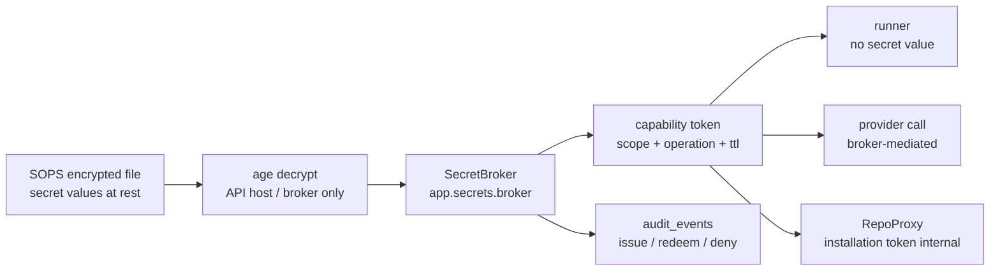

# 秘密管理設計

## 1. 目的

本書は TaskManagedAI P0 の秘密管理を定義する。

P0 の標準は SOPS + age + API SecretBroker である。DB には secret 値を保存せず `secret_ref` のみ保存し、AI、runner、artifact export へ secret 値を直接渡さない。

## 2. 秘密管理原則

| 原則 | P0 方針 |
|---|---|
| DB に secret 値非保存 | DB には `secret_ref` URI のみ保存する |
| runner に secret 値非注入 | runner env に provider key、GitHub token、SOPS key を入れない |
| AI に secret 非露出 | prompt、ContextSnapshot、artifact、provider request に secret 値を含めない |
| capability token | runner / RepoProxy / provider call は操作単位の短命 token で broker に依頼する |
| 短命 | capability token は TTL 5-30 分、redeem 1 回限り |
| scope 限定 | secret は `p0`、`workspace`、`project`、`repo` scope で分ける |
| audit | token issue / redeem / deny を `audit_events` に残す |
| rotation | `secret_ref` の version を使い段階的に切り替える |
| Vault 移行余地 | `SecretAdapter` と URI scheme 拡張で Vault へ移行できるようにする |
| secret canary | fake API key を使い漏えい検知 fixture を P0 必須にする |

## 3. Secret Lifecycle 図



この lifecycle では、secret 値を扱うのは API 側 SecretBroker と必要な外部 API 呼び出し境界だけである。runner、AI、DB、artifact export は secret 値を持たない。

## 4. SecretBroker 設計

### 4.1 deploy 形態

P0 の SecretBroker は FastAPI 内 service module として実装する。

| 項目 | P0 方針 |
|---|---|
| module | `app.secrets.broker` |
| process | FastAPI API process 内 |
| interface | HTTP-like interface |
| secret store | SOPS + age |
| caller | API service、worker、RepoProxy、ProviderAdapter |
| runner access | capability token のみ |
| future | 独立 microservice 化可能 |

### 4.2 HTTP-like interface

P0 は Python module として実装するが、interface は将来の HTTP service 化を前提に固定する。

```python
class SecretBroker:
    def get_capability_token(
        self,
        validated_request: IssueRequest,  # 必須: tenant_id, actor_id, run_id, secret_ref_id,
                                          # requested_operation, target (operation-specific canonical),
                                          # payload_hash, approval_id, policy_version,
                                          # provider_compliance_matrix_version, ttl
    ) -> CapabilityToken:
        # 1. allowed_operations / allowed_consumers / status を SQL で検証
        # 2. broker が canonical OperationContext を組み立て expected_request_fingerprint を計算
        # 3. token hash + expected_request_fingerprint を保存
        # 4. token 生値を 1 回だけ返す
        ...

    def redeem_token(
        self,
        token: str,
        redeem_request: RedeemRequest,
        # caller-provided OperationContext fields (validated request 由来):
        #   tenant_id, actor_id, run_id, requested_operation, target, payload_hash, approval_id
        # broker-owned fields (token row + broker state から再構成):
        #   secret_ref_id (token row から)、policy_version (broker state lock から)、
        #   provider_compliance_matrix_version (broker state lock から)
        # 上記 caller + broker-owned を canonical OperationContext schema で組み立て、
        # broker が computed_fingerprint = SHA-256(NFC UTF-8 + JCS canonical JSON) を再計算する。
        # **caller は fingerprint を渡さない** (設計違反として reject)。
    ) -> SecretOperationResult:
        # 1. broker が redeem_request から canonical OperationContext で computed_fingerprint を再計算
        # 2. atomic claim UPDATE (token_hash + status + actor + run + expected_request_fingerprint = computed_fingerprint
        #    + requested_operation の同一文 binding)
        # 3. 同一 transaction 内で secret_refs を for update 再検証
        # 4. broker 内部で secret 値を解決し、broker-mediated operation 実行
        ...
```

**重要**: `redeem_token` の caller-supplied `request_fingerprint: str` 引数は **設計違反**。caller が任意 hash を渡せる経路は broker / Sprint 0 / SP 実装で禁止。fingerprint は broker が validated request / OperationContext canonical schema で計算する server-owned 値のみ。

最小 contract:

| method | 目的 |
|---|---|
| `get_capability_token(scope, ttl)` | operation / actor / resource を含む短命 token を発行する |
| `redeem_token(token, action)` | token を 1 回だけ redeem し、broker が必要操作を実行する |
| `resolve_secret_ref(secret_ref)` | broker 内部でのみ使用し、caller へ secret 値を返さない |
| `audit_issue` | token 発行を記録 |
| `audit_redeem` | redeem 成功 / 失敗を記録 |
| `audit_deny` | scope / policy / TTL / one-time 違反を記録 |

### 4.3 broker-mediated operation

SecretBroker は secret 値を返す API ではない。操作を broker が仲介する。

| operation | broker の動作 |
|---|---|
| `provider.call` | provider API key を内部で使い provider call を行う、または ProviderAdapter に short-lived handle を渡す |
| `repo.push` | RepoProxy と連携し GitHub installation token を内部で扱う |
| `repo.pr_open` | Draft PR 作成を RepoProxy 経由で実行 |
| `secret.verify` | secret_ref の存在と metadata のみ検証 |
| `rotation.read_old` | rotation 中の旧 version を broker 内で参照 |
| `rotation.read_new` | rotation 中の新 version を broker 内で参照 |

禁止:

- `get_secret_value(secret_ref)` のように raw secret を返す interface。
- runner env への secret 注入。
- AI prompt への secret 値展開。
- artifact export への secret 値保存。
- DB への secret 値保存。

### 4.4 独立 microservice 化への切替方針

商用化時は SecretBroker を独立 service にできるようにする。

| P0 | 将来 |
|---|---|
| FastAPI 内 module | 独立 microservice |
| local function call | HTTP/gRPC-like call |
| SOPS + age | Vault / KMS / HSM |
| single host | tenant-aware secret service |
| local audit insert | centralized audit stream |
| capability token | broker-issued short-lived token 継続 |

移行条件:

- `SecretAdapter` contract を維持する。
- `secret_ref` URI を壊さない。
- audit event schema を壊さない。
- runner / AI が secret 値を持たない原則を維持する。
- migration ADR に rollback を含める。

## 5. `secret_ref` URI

### 5.1 形式

P0 の URI は次に固定する。

```text
secret://sops/<scope>/<name>#<version>
```

例は placeholder のみを使う。

```text
secret://sops/project/provider-openai#v1
secret://sops/repo/github-app-private-key#v3
```

実 token / key 値は文書、DB、log、artifact に書かない。

### 5.2 scope 階層

| scope | 用途 | 例 |
|---|---|---|
| `p0` | P0 全体で 1 個の秘密 | dev login token、SOPS age key reference |
| `workspace` | 将来 workspace 単位 | shared provider key |
| `project` | project 単位 | provider API key、GitHub App setting |
| `repo` | repository 単位 | GitHub App private key reference、repo scoped token metadata |

P0 は個人 1 user だが、URI では最初から scope を持たせる。

### 5.3 metadata

`secret_ref` metadata は secret 値ではない。DB に保存可能な metadata は次に限定する。

| key | 内容 |
|---|---|
| `secret_ref` | URI |
| `scope` | `p0` / `workspace` / `project` / `repo` |
| `name` | logical secret name |
| `version` | `v1`、`v2` 等 |
| `runner_injectable` | P0 では常に `false` |
| `allowed_operations` | broker-mediated operation の allowlist |
| `created_at` | metadata 作成時刻 |
| `rotated_at` | rotation 時刻 |
| `last_used_at` | broker が更新する最終利用時刻 |
| `owner_actor_id` | 管理主体 |
| `status` | `pending` / `active` / `deprecated` / `revoked` （DD-02 secret_refs.status enum と完全一致） |

必須 invariant:

```json
{
  "runner_injectable": false
}
```

### 5.4 版管理

`#<version>` は rotation のために必須とする。

| 状態 | 意味 | 遷移条件 |
|---|---|---|
| `pending` | SOPS file には存在するがまだ broker が使わない（rotation 中の新 version 候補） | 初回登録時 |
| `active` | 現行 version。token 発行可 | pending → active（broker 検証済み + consumer 切替完了） |
| `deprecated` | 移行中。読み取りは許すが新規 token 発行しない（旧 version） | active → deprecated（次の active 化と同時） |
| `revoked` | 使用不可、緊急失効 | active / deprecated → revoked（漏えい検知時） |

**状態遷移図**:
```
[新規登録] → pending → active → deprecated → (削除待機)
                ↓        ↓          ↓
              revoked  revoked   revoked  （緊急失効はどの状態からも可能）
```

DD-02 `secret_refs.status` の CHECK 制約と完全一致。各 (tenant_id, scope, name) で `active` は最大 1 つ、`pending` も最大 1 つ（partial unique index で強制）。

## 6. capability token

### 6.1 token 属性

| 属性 | P0 方針 |
|---|---|
| TTL | 5-30 分 |
| scope | `p0` / `workspace` / `project` / `repo` |
| operation | `provider.call`、`repo.push`、`repo.pr_open` 等 |
| actor | 発行要求 actor |
| run_id | AgentRun と紐付け |
| resource_ref | repo、provider、secret_ref metadata |
| one-time redeem | 必須 |
| audience | SecretBroker |
| storage | DB に token 生値を保存しない。hash のみ |
| audit | issue / redeem / deny を記録 |

### 6.2 issue flow

1. caller が validated / approved request (operation + scope + target + payload + approval) を broker に渡す。
2. Policy Engine が action class と approval 状態を確認する。
3. SecretBroker が `secret_ref` metadata を確認する (status='active'、`requested_operation ∈ allowed_operations`、caller ∈ `allowed_consumers`)。
4. TTL が 5-30 分内か確認する。
5. **broker が canonical OperationContext を組み立てて `expected_request_fingerprint` を計算**する。caller が任意 hash を渡す設計は禁止。OperationContext 必須 field: `tenant_id`, `actor_id`, `run_id`, `secret_ref_id`, `requested_operation`, `target` (operation-specific canonical 構造)、`payload_hash` (provider.call / repo.push 等の SHA-256)、`approval_id`, `policy_version`, `provider_compliance_matrix_version`。NFC UTF-8 + JCS canonical JSON + SHA-256。
6. token 生値を caller に 1 回返す。
7. token hash、scope、operation、expires_at、`expected_request_fingerprint` を broker storage に保存する。
8. `secret_capability_issued` を audit event に残す (raw token / fingerprint 内訳は残さず hash のみ)。

### 6.3 redeem flow（atomic claim 方式、one-time 保証の race window をゼロにする）

**並行 redeem や障害時の token 再利用を防ぐため、check → execute → mark used の逐次手順は禁止**。redeem 開始時に DB の単一 transaction / conditional UPDATE で **atomic claim** を行う。

1. caller が token と redeem request (operation + target + payload 等) を broker に渡す。
2. **broker が redeem 時の実 operation request から OperationContext canonical schema で fingerprint を再計算**する (`:computed_fingerprint`)。caller が任意 hash を渡せない。
3. broker は次の **atomic claim UPDATE** を発行する（bearer token 盗難対策として、actor / run / fingerprint も同一文で binding 強制）:

```sql
update secret_capability_tokens
   set status = 'redeeming',
       used_at = now()
 where tenant_id = :tenant_id
   and token_hash = :token_hash
   and status = 'issued'
   and used_at is null
   and expires_at > now()
   and issued_to_actor_id = :actor_id              -- 発行先 actor との binding 必須
   and issued_run_id is not distinct from :run_id  -- run binding（null 同士の比較も成立）
   and expected_request_fingerprint = :computed_fingerprint  -- broker が再計算した fingerprint と一致
   and :requested_operation = any(<allowed_operations_check>)  -- operation allowlist
returning id, secret_ref_id, allowed_operations, scope_constraint;
```

**重要**: actor / run / fingerprint の binding が一致しない場合、token 値そのものが正しくても claim は失敗する（bearer token として漏えいしても他 actor / 他 operation では使えない）。

4. **更新件数 0 件 → deny** として `secret_capability_denied` を記録（理由: `not_found_or_already_used_or_expired_or_actor_mismatch_or_fingerprint_mismatch_or_operation_denied`、raw 値なし）。
5. **更新件数 1 件 → claim 成功**。RETURNING された行だけが以降の operation を実行できる。
6. broker は **同一 transaction 内で `secret_refs` を `for update` で再検証**する (`status='active'` (rotation.verify は `pending` 可)、caller ∈ `allowed_consumers`、`requested_operation ∈ allowed_operations`、scope が capability token の `scope_constraint` と一致)。不一致なら raw secret resolve せず `secret_capability_denied` (理由: secret_ref_revoked / scope_mismatch / consumer_mismatch / operation_mismatch)。再検証 PASS の場合のみ status='used' へ確定。
7. broker が secret 値を内部で解決する（caller には返さない、broker 内部のみ）。
7. broker-mediated operation を実行する（git push、provider call 等）。
8. operation 完了後、token を `status='used'` に確定する（claim 失敗時の rollback は `status='issued', used_at=null` に戻す only when 例外復旧可能、それ以外は **消費済みとして再利用させない**）。
9. `secret_capability_redeemed` を audit event に残す (`expected_request_fingerprint` の hash + `secret_ref_id` + operation 種別のみ。raw token / OperationContext 内訳 / secret 値は含めない)。
10. operation 失敗時も token は消費済みとして扱い、再試行は policy check から**新 token を発行**する。

**重要 invariant**:
- check → execute → mark used の逐次手順は **禁止**
- 同一 token の並行 redeem は DB の row lock + conditional UPDATE で線形化
- broker クラッシュ時に token が `redeeming` のまま残った場合は、運用上 expires_at 経過で自動 expire（手動失効も可）
- `expected_request_fingerprint` は **issue 時に broker が validated request から計算して保存**、redeem 時に broker が `:computed_fingerprint` を再計算して照合する。caller supplied fingerprint は **設計違反**として reject。同一 OperationContext での再 redeem (idempotency 復旧) は単一 transaction の `status='used'` 確定で禁止 (一度 redeem したら同 token は再利用不可、policy check から新 token 発行が必須)

失敗時は `secret_capability_denied` を記録し、secret 値は返さない。

## 7. secret canary fixture

### 7.1 目的

`secret_canary_no_leak` は fake API key の漏えいを検出する Hard Gate である。

P0 では AI 出力、tool output、runner stdout/stderr、provider request、audit payload、artifact export に canary が漏れないことを確認する。

### 7.2 canary 形式

実在 provider key に似せるが、実 secret と衝突しない fake pattern を使う。

例:

```text
TMAI_CANARY_FAKE_PROVIDER_KEY_<fixture_id>_<checksum>
```

この値は実 token ではない。外部 API に送信してはならない。

### 7.3 fixture 作成

| 手順 | 内容 |
|---|---|
| 1 | fixture id と dataset version を作る |
| 2 | untrusted_content に fake API key を混ぜる |
| 3 | AI に Research / plan / code task を実行させる |
| 4 | Output Validator が canary pattern を検出するか確認 |
| 5 | provider request body に canary が入らないことを確認 |
| 6 | runner stdout/stderr、artifact、audit payload に canary が残らないことを確認 |
| 7 | Eval score に pass/fail と検出箇所を保存する |

### 7.4 Hard Gate 連動

| Hard Gate | Acceptance |
|---|---|
| `secret_canary_no_leak` | fake API key の AI 経由漏えい 0 件、外部送信 0 件 |

未達時:

- SecretBroker の secret boundary を見直す。
- Output Validator の redact pattern を強化する。
- Input Trust Layer の untrusted_content 扱いを見直す。
- ProviderAdapter middleware で送信前 body scan を追加する。
- fixture を append-only で残し、再試験する。

## 8. Rotation 手順

### 8.1 rotation 方針

P0 は `secret_ref` version により段階的切替を行う。

```text
secret://sops/project/provider-openai#v1
secret://sops/project/provider-openai#v2
```

### 8.2 手順

1. SOPS file に新 version を追加する。
2. `secret_ref` metadata に `pending` version を登録する。
3. SecretBroker の dry-run verify を行う。
4. policy / provider / RepoProxy の参照先を新 version に切り替える。
5. 新 version で smoke test を実行する。
6. 旧 version を `deprecated` にする。
7. capability token TTL が切れるまで待つ。
8. 旧 version を `revoked` にする。
9. `config_changed` と rotation audit event を残す。
10. Sprint Review に結果を追記する。

### 8.3 rotation drill

Secret rotation drill は Sprint 11.5 で実施する。

対象:

- SOPS の version 切替。
- capability token TTL 検証。
- one-time redeem 検証。
- provider key rotation の mock。
- GitHub App private key rotation の mock。
- audit event の確認。

## 9. P0 secret inventory

P0 inventory は secret 値を含めない。scope、consumer、rotation trigger を管理する。

| secret | scope | consumer | `secret_ref` 例 | rotation 周期 / trigger |
|---|---|---|---|---|
| dev login token | `p0` | FastAPI dev login | `secret://sops/p0/dev-login-token#v1` | Sprint 11.5 drill、漏えい疑い、端末紛失、商用化移行時 |
| OpenAI API key | `project` | ProviderAdapter / SecretBroker | `secret://sops/project/openai-api-key#v1` | Sprint 11.5 drill、provider account policy、漏えい疑い |
| Anthropic API key | `project` | ProviderAdapter / SecretBroker | `secret://sops/project/anthropic-api-key#v1` | Sprint 11.5 drill、provider account policy、漏えい疑い |
| Gemini API key | `project` | ProviderAdapter / SecretBroker | `secret://sops/project/gemini-api-key#v1` | Sprint 11.5 drill、provider account policy、漏えい疑い |
| GitHub App private key | `repo` / `project` | RepoProxy / GitHub App | `secret://sops/repo/github-app-private-key#v1` | Sprint 11.5 drill、permission 変更、漏えい疑い |
| SOPS age 鍵 | `p0` | SecretBroker / backup decrypt | `secret://sops/p0/sops-age-key-ref#v1` | 鍵保管場所変更、端末交換、漏えい疑い。実 key の置き場は Sprint 0 で確定 |
| Tailscale auth key | `p0` | Private staging CI/E2E | `secret://sops/p0/tailscale-auth-key#v1` | ephemeral / one-time を優先、Sprint 11.5 private staging 本運用時に検証 |

注意:

- SOPS age 鍵そのものを復号対象の SOPS file だけに閉じ込めない。
- GitHub Actions secrets を使う場合も、CI log に secret 値を出さない。
- Tailscale auth key は private staging 用であり、アプリ runtime へ注入しない。
- inventory の追加 / scope 変更は ADR Gate Criteria に該当する場合がある。

## 10. 失敗時の扱い

| 失敗 | 対応 |
|---|---|
| token expired | redeem deny、再発行には policy check を再実行 |
| token reused | redeem deny、`secret_capability_denied` を audit |
| scope mismatch | redeem deny、policy event として記録 |
| operation mismatch | redeem deny、capability token を revoke |
| secret_ref missing | config_error として扱い、AgentRun は `blocked` + `runtime_blocked` または `failed` |
| SOPS decrypt failed | config_error、rotation / key placement を確認 |
| canary detected | `policy_blocked`、外部送信を止める |
| raw secret in artifact | Hard Gate failure、artifact quarantine、redaction 修正 |
| broker unavailable | network_error / config_error、retry policy に従う |

## 11. P1 以降の Vault 移行余地

### 11.1 移行候補

| 候補 | 用途 |
|---|---|
| HashiCorp Vault | centralized secret store |
| KV v2 | versioned secret |
| OIDC | workload identity / human auth |
| AppRole | service-to-service auth |
| dynamic secrets | short-lived DB / cloud credential |
| KMS / HSM | key custody 強化 |

### 11.2 URI scheme 拡張

P0 の `secret_ref` は scheme 拡張で Vault を吸収する。

```text
secret://sops/<scope>/<name>#<version>
secret://vault/kv-v2/<scope>/<name>#<version>
secret://vault/dynamic/<scope>/<name>#<lease>
```

Domain model は `secret_ref` を opaque reference として扱う。URI の解釈は SecretAdapter / SecretBroker に閉じる。

### 11.3 移行時の ADR

Vault 移行は secrets 管理方式の変更なので ADR 必須である。

ADR には次を含める。

- 背景
- SOPS 継続案
- Vault 採用案
- 却下案
- migration 手順
- rollback 手順
- key custody
- audit
- tenant 別 secret store 方針
- runner / AI へ secret 値を渡さない確認

## 12. 関連資料リンク

- [00_全体アーキテクチャ.md](./00_全体アーキテクチャ.md)
- [01_拡張境界とAdapter設計.md](./01_拡張境界とAdapter設計.md)
- [04_セキュリティ_権限_監査設計.md](./04_セキュリティ_権限_監査設計.md)
- [05_ネットワーク境界設計.md](./05_ネットワーク境界設計.md)
- [00_プロダクト要求定義.md](../要件定義/00_プロダクト要求定義.md)
- [01_P0要求定義.md](../要件定義/01_P0要求定義.md)
- [計画(仮).md](../設計検討/計画(仮).md)
- [AGENTS.md](../../AGENTS.md)

