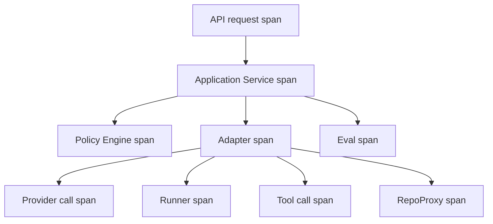

# 可観測性設計

## 1. 目的

本書は TaskManagedAI P0 の observability を定義する。

P0 は Sprint 0 で structured logs、correlation id、error taxonomy を先に固定し、Sprint 11.5 で OpenTelemetry、Prometheus、Loki、Grafana、alerting、SLO を本格化する。Sprint 12 では P0 Acceptance Test の計測を本番運用として確認する。

## 2. 可観測性原則

| 原則 | P0 方針 |
|---|---|
| Sprint 0 最小 | structured logs + correlation id + error taxonomy だけを必須にする |
| Sprint 11.5 本格化 | OTel + Prometheus + Loki + Grafana + alerting + SLO を導入する |
| 三本柱 | logs / metrics / traces を分けて扱う |
| PII redaction | secret、token、個人情報、tailnet auth key、provider key を log に出さない |
| cost-aware retention | Loki retention、artifact retention、trace retention は Sprint 11.5 で確定する |
| audit との分離 | audit は append-only 監査証跡、logs は運用観測として扱う |
| correlation first | `trace_id`、`run_id`、`ticket_id`、`correlation_id` を初期から付与する |
| error taxonomy | service 共通の error 分類を固定し、alerting と dashboard に使う |
| P0 Exit 連動 | Hard Gates 7 件と Quality KPIs 5 件を dashboard / Eval に出す |

## 3. 段階的導入計画

| Sprint | 導入内容 | 対象外 / defer |
|---|---|---|
| Sprint 0 | structured logs、correlation id、error taxonomy、provider usage / cost / latency log | Prometheus、Loki、Grafana dashboard、SLO 自動化 |
| Sprint 11.5 | OTel traces / metrics、Prometheus、Loki、Grafana、alerting、private staging logs、secret rotation drill logs | SLO 自動化の高度化は defer 可 |
| Sprint 12 | P0 Acceptance Test 計測、Hard Gates 7、Quality KPIs 5、Backup/Restore drill、private staging CI/E2E 検証 | shadow mode は P1 以降 |

Sprint 0 で correlation を入れておくことで、Sprint 11.5 の OTel / Loki 移行時に event と log の紐付けを壊さない。

## 4. structured log フォーマット

### 4.1 形式

ログは JSON Lines として出力する。

必須フィールド:

| field | 内容 |
|---|---|
| `timestamp` | ISO 8601 timestamp |
| `level` | `debug` / `info` / `warning` / `error` / `critical` |
| `service` | `api` / `worker` / `web` / `runner` / `repo_proxy` 等 |
| `trace_id` | request / trace id |
| `span_id` | span id。Sprint 0 は null 可、Sprint 11.5 以降は OTel と同期 |
| `run_id` | AgentRun id。該当なしなら null |
| `ticket_id` | Ticket id。該当なしなら null |
| `actor_id` | actor id。該当なしなら service actor |
| `tenant_id` | P0 は `1` |
| `correlation_id` | API、worker、provider、repo を横断する id |
| `event_type` | log event type |
| `message` | 人間が読む短い説明 |

推奨フィールド:

| field | 内容 |
|---|---|
| `error_taxonomy` | error 分類 |
| `provider` | provider 名 |
| `model` | model 名 |
| `cost_usd` | provider call cost |
| `latency_ms` | 処理時間 |
| `policy_decision` | allow / deny / require_approval |
| `action_class` | action class |
| `dataset_version` | Eval dataset |
| `redaction_applied` | redaction 済みか |
| `payload_hash` | payload の hash。raw payload は必要最小限 |

### 4.2 JSON 例

```json
{
  "timestamp": "2026-05-07T12:00:00Z",
  "level": "info",
  "service": "worker",
  "trace_id": "trace_01",
  "span_id": "span_01",
  "run_id": "run_01",
  "ticket_id": "ticket_01",
  "actor_id": "agent:planner",
  "tenant_id": 1,
  "correlation_id": "corr_01",
  "event_type": "provider_requested",
  "message": "Provider request passed compliance gate",
  "provider": "openai",
  "model": "model_requested",
  "action_class": "read/search",
  "policy_decision": "allow",
  "redaction_applied": true
}
```

### 4.3 PII redaction

次は log に出さない。

- provider API key
- GitHub App private key
- GitHub installation token
- Tailscale auth key
- SOPS age private key
- dev login token
- raw secret value
- unredacted personal information
- `provider_continuation_ref` の本体
- secret canary の raw value

出す場合は hash、count、boolean、redacted marker にする。

## 5. correlation id 規約

| id | 発行単位 | 伝播先 |
|---|---|---|
| `trace_id` | API request または worker job | logs、OTel trace、audit payload |
| `span_id` | service 内の処理単位 | logs、OTel span |
| `correlation_id` | user action から派生する一連の処理 | API、worker、provider、runner、RepoProxy |
| `run_id` | AgentRun | agent_run_events、logs、metrics、traces |
| `ticket_id` | Ticket | AgentRun、Eval、approval、dashboard |
| `seq_no` | AgentRunEvent | event ordering、timeline |
| `job_id` | arq worker job | worker log、trace span |
| `approval_request_id` | approval | Approval Inbox、policy log |
| `eval_run_id` | Eval | dashboard、KPI |

規約:

- API entrypoint で `trace_id` と `correlation_id` を生成する。
- AgentRun 作成時に `run_id` を全 downstream call へ渡す。
- `agent_run_events.seq_no` は run 内で monotonic にする。
- worker job は `correlation_id` と `run_id` を job payload に含める。
- provider call は request log、response log、cost metric を同じ `trace_id` で紐付ける。
- RepoProxy call は Draft PR artifact と `correlation_id` を共有する。

## 6. error taxonomy

P0 は 8 分類を共通定義する。

| taxonomy | 意味 | 代表例 | alerting 初期方針 |
|---|---|---|---|
| `provider_error` | provider API / model / schema support に起因 | 5xx、rate limit、unsupported schema | rate と連続失敗を Sprint 11.5 で alert |
| `runner_error` | Docker runner / command / resource cap に起因 | timeout、exit code、sandbox failure | Hard Gate fixture 中は 1 件でも調査 |
| `validation_error` | schema validation / output validation 失敗 | JSON Schema 不一致、repair retry | `repair_exhausted` は alert |
| `policy_error` | policy deny、policy misconfig、approval stale | `policy_blocked`、invalidated | deny 自体は正常。unexpected deny / allow を alert |
| `budget_error` | budget hard limit、global kill switch | cost cap、max tokens、max tool calls | hard limit 到達を notification + dashboard |
| `network_error` | tailnet / provider / GitHub / internal network | private staging 到達不可、DNS、timeout | private staging CI 失敗時に alert |
| `config_error` | secret_ref、Provider Matrix、policy pack、env の設定不整合 | missing secret_ref、Matrix missing | P0 では 1 件でも修正対象 |
| `unknown_error` | 分類不能 | uncaught exception | 1 件でも分類追加または root cause 修正 |

補足:

- `policy_blocked` は必ずしも障害ではない。危険操作を止めた場合は正常 event として扱う。
- `unknown_error` は放置せず、taxonomy を増やすか既存分類に寄せる。
- alert threshold の数値は Sprint 11.5 の SLO / alerting 設計で確定し、ここでは初期方針を固定する。

## 7. metrics

### 7.1 AgentRun metrics

| metric | dimension |
|---|---|
| `agent_run_rate` | provider、run_type、status |
| `agent_run_duration_ms` | provider、run_type |
| `agent_run_blocked_total` | blocked_reason |
| `agent_run_repair_exhausted_total` | provider、schema |
| `agent_run_completed_total` | ticket_id、project_id |

### 7.2 provider metrics

| metric | dimension |
|---|---|
| `provider_call_rate` | provider、model、task_kind |
| `provider_latency_ms` | provider、model |
| `provider_cost_usd` | provider、model、run_id |
| `provider_token_input_total` | provider、model |
| `provider_token_output_total` | provider、model |
| `provider_error_rate` | provider、taxonomy |
| `provider_compliance_block_total` | provider、api_or_feature、data_class |

### 7.3 policy / approval metrics

| metric | dimension |
|---|---|
| `policy_decision_rate` | decision、action_class、policy_version |
| `approval_queue_depth` | project、risk_level |
| `approval_wait_ms` | project、action_class |
| `approval_invalidated_total` | reason |
| `policy_block_recall` | dataset_version |

### 7.4 budget / tool metrics

| metric | dimension |
|---|---|
| `budget_consumption_usd` | scope_type、scope_ref、provider |
| `budget_blocked_total` | scope_type、provider |
| `tool_call_rate` | tool_key、trust_tier、allowed_action |
| `tool_call_blocked_total` | trust_tier、reason |
| `tool_call_latency_ms` | tool_key |

### 7.5 Eval / KPI metrics

| metric | dimension |
|---|---|
| `acceptance_pass_rate` | dataset_version、project |
| `time_to_merge_ms` | mock / draft_pr |
| `approval_wait_ms` | project、action_class |
| `citation_coverage` | research_task、dataset_version |
| `cost_per_completed_task` | provider、project |
| `hard_gate_pass_total` | gate、dataset_version |
| `hard_gate_fail_total` | gate、dataset_version |
| `backup_restore_drill_completed_total` | drill_id、environment、dataset_version |
| `backup_restore_rpo_seconds` | drill_id、environment、backup_id |
| `backup_restore_rto_seconds` | drill_id、environment、backup_id |
| `backup_restore_pitr_success` | drill_id、environment、backup_id（boolean: 1/0） |
| `provider_compliance_blocked_total` | provider、api_or_feature、payload_data_class、allowed_data_class、reason_code |
| `provider_compliance_allowed_total` | provider、api_or_feature、payload_data_class、allowed_data_class |

**注**: AC-HARD-04 (`backup_restore_rpo_rto`) の pass/fail は、`backup_restore_drill_completed` event の payload と `backup_restore_rpo_seconds` / `backup_restore_rto_seconds` / `backup_restore_pitr_success` を Eval Harness が取り込み、`rpo_seconds <= 86400 AND rto_seconds <= 14400 AND pitr_success = 1` で算出する。Provider Compliance 監査 (QA-C-007) のため `payload_data_class` と `allowed_data_class` は**別 dimension** とする（合算した `data_class` 単一 dimension は使わない）。

## 8. traces

### 8.1 OTel span 設計

Sprint 11.5 で OTel span を導入する。



### 8.2 span naming

| span | 例 |
|---|---|
| API | `api.POST /v1/agent-runs` |
| Application Service | `agent_run.create`、`agent_run.resume` |
| Policy | `policy.evaluate`、`approval.create` |
| ProviderAdapter | `provider.execute` |
| Provider | `provider.openai.responses`、`provider.anthropic.messages` |
| RunnerAdapter | `runner.prepare_workspace`、`runner.run_command` |
| ToolAdapter | `tool.invoke` |
| RepoProxy | `repo_proxy.create_draft_pr` |
| Eval | `eval.run_suite` |

### 8.3 span attributes

| attribute | 内容 |
|---|---|
| `tenant_id` | tenant id |
| `run_id` | AgentRun id |
| `ticket_id` | Ticket id |
| `actor_id` | actor id |
| `provider` | provider |
| `model_requested` | requested model |
| `action_class` | action class |
| `policy_version` | policy version |
| `dataset_version` | eval dataset |
| `cost_usd` | cost |
| `error_taxonomy` | error 分類 |
| `redaction_applied` | redaction 有無 |

secret 値、token、生 prompt の過剰な保存は span attribute に入れない。

## 9. Loki ログ集約とクエリ例

### 9.1 trace_id で AgentRun 全体を追う

```logql
{service=~"api|worker|runner|repo_proxy"} | json | trace_id="trace_01"
```

### 9.2 run_id で timeline を追う

```logql
{service=~"api|worker|runner|repo_proxy"} | json | run_id="run_01"
```

### 9.3 `policy_blocked` の絞り込み

```logql
{service=~"api|worker"} | json | event_type="agent_run_state_changed" | blocked_reason="policy_blocked"
```

### 9.4 Compliance Gate deny

```logql
{service="worker"} | json | event_type="provider_blocked" | reason_code="allowed_data_class_exceeded"
```

### 9.5 cost > $0.5/task の検出

```logql
{service="worker"} | json | event_type="eval_completed" | cost_per_completed_task > 0.5
```

### 9.6 secret canary 検知

```logql
{service=~"api|worker|runner"} | json | event_type="secret_canary_detected"
```

### 9.7 private staging CI 失敗

```logql
{service="ci"} | json | event_type="private_staging_e2e_failed"
```

## 10. Grafana dashboard 構成

### 10.1 AgentRun overview

| panel | 内容 |
|---|---|
| Run count by status | status 別 AgentRun 数 |
| Run duration | p50 / p95 duration |
| Blocked reasons | policy / budget / runtime |
| Provider incomplete / refused | provider 別 |
| Timeline drill-down | `run_id` から Loki / trace へ遷移 |

### 10.2 Provider cost

| panel | 内容 |
|---|---|
| Cost by provider | provider / model 別 cost |
| Token usage | input / output tokens |
| Cost per completed task | AC-KPI-05 |
| Provider latency | p50 / p95 |
| Compliance blocks | allowed_data_class 越境 |

### 10.3 Policy decisions

| panel | 内容 |
|---|---|
| allow / deny / require_approval | action_class 別 |
| approval queue depth | risk level 別 |
| approval wait | AC-KPI-03 |
| invalidated approvals | stale reason 別 |
| policy_block_recall | AC-HARD-01 |

### 10.4 Hard Gate fixture results

| panel | 内容 |
|---|---|
| Hard Gate pass/fail | 7 gates |
| secret canary | leak count |
| tenant isolation | SELECT / INSERT / UPDATE / DELETE |
| forbidden path | path pattern |
| dangerous command | command pattern |
| prompt injection | fixture kind |
| backup restore | RPO / RTO |

### 10.5 Quality KPI

| panel | 内容 |
|---|---|
| acceptance_pass_rate | AC-KPI-01 |
| time_to_merge | AC-KPI-02 |
| approval_wait_ms | AC-KPI-03 |
| citation_coverage | AC-KPI-04 |
| cost_per_completed_task | AC-KPI-05 |
| KPI unmet count | P0 判定用 |

## 11. SLO と alerting

### 11.1 SLO 初期設計

P0 では SLO の最終数値を Sprint 11.5 で確定する。初期設計では、P0 Acceptance に直結する状態を優先して alerting する。

| SLO / signal | 初期方針 |
|---|---|
| API availability | private staging E2E smoke が継続失敗したら alert |
| AgentRun completion | `failed` / `repair_exhausted` の増加を dashboard に表示 |
| approval queue depth | queue depth が Sprint 11.5 で定める N を超えたら alert |
| approval wait | AC-KPI-03 の median 4h 超過を warning |
| cost spike | `cost_per_completed_task > 0.5` を warning |
| provider error rate | provider_error が連続または急増したら alert |
| policy unexpected allow | 危険 fixture が allow されたら critical |
| Hard Gate fixture failure | 1 件でも critical |
| secret canary leak | 1 件でも critical |
| private staging E2E | Tailscale GitHub Action 経路失敗を warning / critical |
| backup restore | RPO / RTO 未達を critical |

### 11.2 alert routing

P0 の通知は In-App Notification を基本にする。

| alert | route |
|---|---|
| approval pending | In-App Notification |
| run failed | In-App Notification |
| budget exceeded | In-App Notification |
| Hard Gate failure | Eval Dashboard + In-App Notification |
| secret canary leak | Eval Dashboard + In-App Notification + audit |
| private staging failure | CI log + Loki + In-App Notification |
| provider outage | dashboard + run status |
| config error | dashboard + audit |

Slack / Email / Discord / mobile push は P1 以降に defer する。

### 11.3 alert severity

| severity | 条件 |
|---|---|
| `critical` | secret canary leak、Hard Gate failure、unexpected dangerous allow、backup restore RPO/RTO 未達 |
| `error` | config_error、unknown_error、repair_exhausted、private staging repeated failure |
| `warning` | budget soft limit、approval queue depth、provider error increase、cost spike |
| `info` | approval pending、policy blocked expected、run completed |

## 12. retention と cost control

| 対象 | P0 方針 |
|---|---|
| application logs | JSON Lines。Sprint 11.5 で Loki retention を確定 |
| Loki | 7 日 / 30 日等を Sprint 11.5 で選ぶ |
| Prometheus metrics | P0 Acceptance に必要な期間を保持 |
| traces | Sprint 11.5 で sampling / retention を確定 |
| audit_events | append-only。log retention とは分ける |
| provider payload | raw prompt / raw response の保存は最小化し、artifact と snapshot の policy に従う |
| cost metrics | `cost_per_completed_task` の判定に必要な粒度で保持 |

cost-aware retention の判断基準:

- P0 Acceptance に必要な metric は保持する。
- secret / PII を含みうる raw payload は保持しないか redaction する。
- provider continuation 本体は `exportable=false` とし、監査 export から除外する。
- retention 変更は Sprint 11.5 の運用 hardening で決める。

## 14. QL-D Quality Loop artifact observability (R29 §5 QL-D 反映、2026-05-15 doc-only)

本 section は QL-D Quality Loop run で `docs/設計検討/修正まとめ統合計画.md` の ADOPT 行 A-12 (open finding / harness incident clean evidence gate) + A-15 (defer structured state) + PARTIAL_ADOPT P-08 (Quality Loop product artifact 6 種) を **future implementation gate として記録**する追記。**code / API / metrics / event_type / migration / test 変更を一切行わない**、各 Sprint Pack acceptance spec として cross-reference する。

DD-03 §14 + 新 design doc `docs/設計検討/quality_loop_product_artifact.md` で定義された Quality Loop product artifact 6 種 (plan / review / revision / rereview / conformance / harness_incident) の observability 設計を本 §14 で記録。

### 14.1 audit event 拡張候補 (P0.1 SP-029 候補で実装)

本 §8.2 event_type 一覧の延長として、Quality Loop artifact 6 種に対応する audit event を P0.1 で追加する future implementation gate:

| event_type 候補 | trigger | 必須 payload |
|---|---|---|
| `quality_loop_plan_created` | Quality Loop `plan` artifact 作成 | `tenant_id` / `actor_id` / `sprint_pack_id` / `plan_id` / `plan_version` / `correlation_id` / `trace_id` |
| `quality_loop_review_created` | Quality Loop `review` artifact 作成 (Codex / Claude / human review) | + `reviewed_plan_id` / `reviewer_actor_id` / `reviewer_kind` (codex_plan_review / codex_adversarial_review / claude_plan_reviewer / claude_code_reviewer / human_review) / `verdict` (clean / needs_revision / blocked) / `findings_count` / `round_no` |
| `quality_loop_revision_created` | Quality Loop `revision` artifact 作成 (review 反映後) | + `source_review_id` / `revised_artifact_id` / `adoption_counts` (adopt / reject / defer 件数) / `revision_commit_sha` |
| `quality_loop_rereview_created` | Quality Loop `rereview` artifact 作成 (R2 以降) | + `revision_id` / `previous_review_id` / `verdict` / `findings_count` / `round_no` |
| `quality_loop_conformance_created` | Sprint Pack 完了時 `conformance` artifact 発行 (Sprint Exit) | + `sprint_pack_id` / `must_ship_pass_count` / `must_ship_total` / `hard_gates_pass_count` / `quality_kpis_pass_count` / `final_verdict` (pass / partial / blocked) |
| `quality_loop_harness_incident_recorded` | Quality Loop runtime 中 incident (Codex rate limit / Claude tool error 等) | + `incident_kind` / `incident_at` / `source_artifact_id` / `recovery_action` |
| `quality_loop_harness_incident_resolved` | harness incident の resolve (rollback / abort / defer_entry 移送) (F-PR13-R7-005 P2 adopt: creation だけでなく resolution も audit 必須) | + `incident_id` / `resolved_at` / `resolution_kind` (`rollback` / `abort` / `defer_entry_migrated`) / `linked_defer_id` nullable |

これら event_type 追加は ADR Gate Criteria #3 (API 契約 / event schema) trigger、5+ source 整合 (DB CHECK / SQLAlchemy / Literal / Pydantic / pytest / frontend) は SP-029 候補で実装。**本 run では doc-only、event_type enum に追加しない**。

### 14.2 correlation_id 規約 (§5 拡張)

Quality Loop artifact は Sprint Pack lifecycle event を表現するため、correlation_id 規約は本 §5 の延長として:

- Sprint Pack 単位の lifecycle event chain: **`correlation_id=qloop-<sprint_pack_id>-<artifact_kind>-<seq>` 形式に固定** (F-PR13-R5-003 P2 adopt: 命名規則を §14.2 末尾の SP-029 future 文と統一、本 §14.2 と §14.4 クエリ例で同 format に sticks)。全 Quality Loop artifact 横串 trace では prefix match (`correlation_id =~ "qloop-SP-013-.*"`) を使う
- AgentRun との cross-reference: `quality_loop_review` で参照される source AgentRun (Codex skill 実行時の AgentRun 等) の `run_id` を payload に embed
- Codex multi-round chain: `round_no` (R1, R2, R3, ...) + `previous_review_id` で round 履歴を再構成可能

**`correlation_id` 命名規則 (F-PR13-R5-003 P2 adopt 反映で固定)**: `qloop-<sprint_pack_id>-<artifact_kind>-<seq>` 形式 (e.g., `qloop-SP-013-plan-001` / `qloop-SP-013-review-001` 等)。本 format は P0.1 SP-029 候補 accepted 後の implementation でも維持、本 §14 内で sticks する。

### 14.3 metrics 拡張候補 (本 §7 拡張、P0.1 SP-029 候補で実装)

Quality Loop の閉じ込み度を測定する metrics 候補 (本 §7.5 Eval / KPI metrics の延長):

| metric 候補 | 単位 | 用途 |
|---|---|---|
| `quality_loop_review_round_count{sprint_pack_id, reviewer_kind}` | int | 各 Sprint Pack で clean 達成までの round 数 (Codex multi-round 効率 proxy) |
| `quality_loop_finding_adoption_pass_rate{sprint_pack_id, reviewer_kind}` | float [0,1] | review finding の `adopt` 比率 (reject 率の inverse、Codex 誤読率 proxy) |
| `quality_loop_defer_carry_over{from_sprint_pack_id, to_sprint_pack_id}` | int | Sprint 間 defer 移送件数 (defer 累積監視) |
| `quality_loop_harness_incident_rate{sprint_pack_id, incident_kind}` | float | Sprint Pack 単位の harness incident 発生率 (Codex 失敗 / Claude tool error の rate) |
| `quality_loop_conformance_partial_rate` | float [0,1] | `conformance.final_verdict='partial'` の比率 (Sprint Exit 部分達成の trend) |

これらは P0.1 SP-029 候補で実装、本 §7.5 (`acceptance_pass_rate` / `time_to_merge` / `approval_wait_ms` / `citation_coverage` / `cost_per_completed_task`) の Quality KPIs 5 とは別 layer (Quality Loop 内部効率 metrics)。

### 14.4 Loki クエリ例 (本 §9 拡張、P0.1 SP-029 候補で event_type 追加後に有効化、F-PR13-003 P2 adopt 反映)

Quality Loop event を Loki で trace する想定クエリ例 (本 §9 既存パターン準拠: `service` 等 stable label を stream selector に、JSON log field `event_type` / `correlation_id` は `| json` parse 後 filter):

```
# Sprint Pack 単位で全 Quality Loop event を時系列追跡 (F-PR13-R7-008 P3 adopt: prefix match で全 artifact_kind 横串)
{service=~"api|worker"} | json | event_type =~ "quality_loop_.*" | correlation_id =~ "qloop-SP-013-.*"

# Codex multi-round の round 数集計
sum by (sprint_pack_id) (
  count_over_time({service=~"api|worker"} | json | event_type =~ "quality_loop_review_created|quality_loop_rereview_created" [7d])
)

# harness incident 発生時の前後 30 分の AgentRunEvent も併せて表示
{service=~"api|worker"} | json | event_type = "quality_loop_harness_incident_recorded" | source_artifact_id != ""
```

**Loki label 規約** (F-PR13-R2-001 P2 adopt 反映、本 §9 既存 `service=~"api|worker|runner|repo_proxy|ci"` 規約 sticks): `event_type` / `correlation_id` / `sprint_pack_id` は **high cardinality field** のため Loki stream label に promote しない (`service` / `env` 等 low-cardinality label のみ stream selector に使う、本 §9 既存パターン準拠)。Quality Loop event の主な発生 service は `api` (Sprint Pack management UI / REST API) + `worker` (AgentRun orchestration / Codex review skill 実行) の 2 つのため、本 §14.4 クエリ例も `service=~"api|worker"` に sticks。

これらクエリは P0.1 SP-029 候補で event_type 追加後に有効化される。

### 14.5 Grafana dashboard 拡張候補 (本 §10 拡張、P0.1 SP-029 候補で実装)

`### 10.6 Quality Loop overview` (新規 dashboard 候補):

- Sprint Pack 単位の Quality Loop progress (plan → review → revision → rereview → conformance の round 数推移)
- Codex review verdict 分布 (clean / needs_revision / blocked) と round 数の散布図
- harness incident 発生 timeline (incident_kind 別の積み上げ棒グラフ)
- defer entries の open / resolved 比率 (各 Sprint Pack の `defer_entry` from §14.2 of DD-03)

実装は SP-029 候補で SP-009 (UI Pack) 同時 update 経由。

### 14.6 SLO / alerting (本 §11 拡張)

Quality Loop 関連 SLO の future implementation gate (本 §11.1 SLO 初期設計の延長):

- `quality_loop_review_clean_within_5_rounds{sprint_pack_id}`: 各 Sprint Pack で 5 round 以内に clean 達成、SLO 目標 95%
- `quality_loop_harness_incident_resolved_within_24h`: harness incident の resolve 時間 SLO

alert routing は本 §11.2 と整合、severity 規約は §11.3 と整合 (raw secret 含めない、metadata のみ)。

### 14.7 retention (本 §12 拡張)

Quality Loop artifact の retention 方針 (本 §12 retention と整合):

- `plan` / `review` / `revision` / `rereview` artifact: **当該 Sprint Pack の `conformance` artifact が発行された場合は永続保存** (F-PR13-R5-004 P2 adopt 反映: `conformance` が永続保存される以上、その clean 判定の verification source となる `review`/`revision`/`rereview` も同じ retention で永続保存しないと `conformance.final_verdict` の verifiability が損なわれる)。`conformance` 未発行 (Sprint Pack mid-flight or abort) の場合は当該 Sprint Pack のライフタイム + 90 日 (retro / audit 用)
- `conformance` artifact: tenant 単位で **永続保存** (Sprint Exit evidence、`conformance.final_verdict` を AC-HARD/KPI trace に利用)。conformance 発行と同時に linked される `plan`/`review`/`revision`/`rereview` も同 retention に延長 (F-PR13-R5-004 P2 adopt: retention 整合性維持)
- `harness_incident` artifact: **当該 Sprint Pack の `conformance` artifact が発行された場合は永続保存** (F-PR13-R7-007 P2 adopt: harness incidents も Sprint Exit zero-gate evidence の一部、conformance 永続保存と整合させる必要)。`conformance` 未発行 (Sprint Pack mid-flight or abort) の場合は 90 日 (incident retrospective 用)

raw secret / canary 値は payload に含めない (`.claude/rules/secretbroker-boundary.md §11`)、`exportable=false` 規約 (本 §4.3 PII redaction + 本 §12 retention の延長)。

### 14.8 関連 ADR / Sprint Pack (QL-D update)

- **SP-029 候補 (P0.1)**: Quality Loop event_type / metrics / Loki / Grafana 実装
- **ADR-00028 候補 (P0.1、proposed)**: Quality Loop schema design (DB / API / event_type)
- F-PR13-R4-003 P2 adopt: **P0 期間中、Observability 専用 ADR は存在しない** (ADR-00007 は External exposure 設定 (Tailscale Serve + Funnel 不使用) であり Observability ADR ではない)。DD-07 本書自体が Observability 設計の正本、ADR 起票は P0.1+ で Observability ADR (新規候補) または SP-011.5 operational hardening 配下で実施する future implementation gate
- DD-03 §14 (本 QL-D run で同時追加、Quality Loop product artifact concept)
- `docs/設計検討/quality_loop_product_artifact.md` (本 QL-D run で新規起票、core spec)

## 13. 関連資料リンク

- [00_全体アーキテクチャ.md](./00_全体アーキテクチャ.md)
- [02_データモデル.md](./02_データモデル.md)
- [03_AIオーケストレーション設計.md](./03_AIオーケストレーション設計.md)
- [04_セキュリティ_権限_監査設計.md](./04_セキュリティ_権限_監査設計.md)
- [05_ネットワーク境界設計.md](./05_ネットワーク境界設計.md)
- [06_秘密管理設計.md](./06_秘密管理設計.md)
- [00_プロダクト要求定義.md](../要件定義/00_プロダクト要求定義.md)
- [01_P0要求定義.md](../要件定義/01_P0要求定義.md)
- [計画(仮).md](../設計検討/計画(仮).md)
- [AGENTS.md](../../AGENTS.md)
- [quality_loop_product_artifact.md](../設計検討/quality_loop_product_artifact.md) (QL-D 新規 design doc、本 §14 の詳細 spec)
