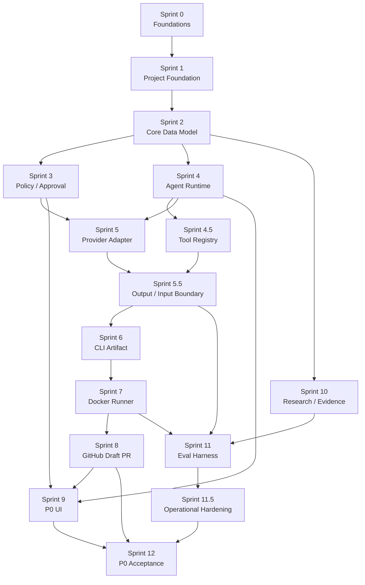

# P0 バックログ

## バックログ概観

このバックログは Sprint Pack へ展開する前のフラットなチケット一覧である。各チケットは、PRD-01 の F-001〜F-020、F-020-OPS、NF-001〜NF-012、AC-HARD-01〜07、AC-KPI-01〜05 のいずれかにトレースできる粒度に分解する。

### Sprint 別チケット数

| Sprint | 件数 | 主な範囲 |
|---|---:|---|
| Sprint 0 | 12 | Cross-cutting Foundations、Sprint Pack、Compliance、Gold Task Seed |
| Sprint 1 | 9 | Project Foundation、dev login、compose、CI |
| Sprint 2 | 13 | Core Data Model、tenant invariant、Ticket core、SecretBroker persistence |
| Sprint 3 | 11 | Policy、Approval、Notification、KPI source |
| Sprint 4 | 14 | Agent Runtime、ContextSnapshot、BudgetGuard、SecretBroker、Plan artifact |
| Sprint 4.5 | 9 | Tool Registry、Read-only Gateway、tool_mutating_gateway_stub |
| Sprint 5 | 10 | Provider Adapter、Compliance Gate、provider_request_preflight |
| Sprint 5.5 | 11 | Output Validator、Input Trust Layer、payload_data_class、trusted_instruction |
| Sprint 6 | 6 | CLI Artifact Orchestration |
| Sprint 7 | 9 | Docker Isolated Runner、runner_mutation_gateway |
| Sprint 8 | 9 | GitHub Draft PR Flow |
| Sprint 9 | 10 | P0 UI |
| Sprint 10 | 9 | Research / Evidence Foundation |
| Sprint 11 | 12 | Eval Harness、Hard Gates fixture registry、Gold Task expansion |
| Sprint 11.5 | 10 | Operational Hardening、Observability dimensions |
| Sprint 12 | 12 | P0 Acceptance Test、KPI sources、private staging CI/E2E |
| 合計 | 166 | P0 全体 |

### 機能カテゴリ別チケット数

| カテゴリ | 件数 | 対応範囲 |
|---|---:|---|
| Documentation / Planning | 8 | Sprint Pack、ADR、Open Questions、Review |
| Foundation / Platform / Ops | 26 | Compose、CI、network、backup、observability、private staging |
| Data / Tenant / Core Task | 21 | tenant invariant、Ticket、Acceptance Criteria、workspace / project / repo、SecretBroker DDL |
| Policy / Security / Approval | 27 | action class、approval、Output Validator、Input Trust Layer、Hard Gates、SecretBroker |
| Agent Runtime / Provider / Runner / Repo | 38 | AgentRun、ProviderAdapter、CLI、Runner、GitHub、plan artifact |
| UI / Notification | 15 | Ticket UI、Approval UI、Run timeline、Audit、Settings、Notification |
| Research / Evidence / Eval / Acceptance | 31 | Evidence、Eval Harness、Gold Task、KPI、P0 Acceptance |

### 優先度配分

R1 反映では、既存 149 件ベースで P0-A から 21 件を P0-B / P0-C へ再分類し、元の目標 118 / 25 / 6 に揃えた。R1 追加 17 件は Hard Gate、SecretBroker、provider preflight、KPI source、CI/E2E 経路に直結するため P0-A として加算する。

| priority | 意味 | 件数 |
|---|---|---:|
| P0-A | P0 Exit または must_ship に直結し、原則 defer しない | 135 |
| P0-B | P0 の品質と運用性を高めるが、target 超過時は縮小可能 | 25 |
| P0-C | P0.1 / P1 へ送りやすい候補、または design note / placeholder | 6 |

## チケット一覧テーブル

| ticket_id | title | sprint | type | 機能ID | priority | target_days | depends_on | sprint_pack_ref |
|---|---|---:|---|---|---|---:|---|---|
| BL-0001 | 軽量 / 重量 Sprint Pack template を正式化する | 0 | doc | F-001 | P0-A | 0.4 | - | SP-000_bootstrap |
| BL-0002 | ADR 番号体系と index 運用を決める | 0 | doc | F-001 | P0-A | 0.3 | BL-0001 | SP-000_bootstrap |
| BL-0003 | Tailscale Serve / Funnel 不使用 / device approval / `tag:taskhub-ci` grants checklist を作る | 0 | foundation | NF-002,F-020-OPS | P0-A | 0.4 | - | SP-000_bootstrap |
| BL-0004 | `secret_ref` URI と SecretBroker contract を固定する | 0 | foundation | NF-003 | P0-A | 0.5 | - | SP-000_bootstrap |
| BL-0005 | Worker / Queue arq job schema と cancel propagation を固定する | 0 | foundation | F-008,NF-011 | P0-A | 0.5 | - | SP-000_bootstrap |
| BL-0006 | Gold Task Seed v0 の保存 schema と除外基準を決める | 0 | research | F-019,NF-009 | P0-A | 0.4 | BL-0001 | SP-000_bootstrap |
| BL-0007 | Provider Compliance Matrix TOML の列 (provider / api_or_feature / zdr_eligible / retention / training_use / region_or_data_transfer / subprocessor_or_doc_url / plan_required / **allowed_data_class** (単一 enum) / **condition_status** (verified/unverified/not_applicable) / p0_policy_note / last_verified_at) と data class ordinal `public<internal<confidential<pii` を確定する | 0 | foundation | F-012,NF-004 | P0-A | 0.5 | BL-0004 | SP-000_bootstrap |
| BL-0008 | structured logs / correlation id / error taxonomy を固定する | 0 | foundation | NF-006 | P0-A | 0.4 | - | SP-000_bootstrap |
| BL-0009 | basic backup script と age 暗号化方針を決める | 0 | foundation | NF-007 | P0-A | 0.4 | BL-0004 | SP-000_bootstrap |
| BL-0010 | CI smoke と E2E skeleton の framework を選定する | 0 | test | NF-011 | P0-B | 0.4 | - | SP-000_bootstrap |
| BL-0011 | Open Questions A 5 項目を決定済み前提として Sprint 0 Pack に参照する | 0 | doc | F-001,DEP-A-01〜05 | P0-C | 0.2 | BL-0001 | SP-000_bootstrap |
| BL-0012 | Sprint 0 Review の `changed / verified / deferred / risks` 雛形を作る | 0 | doc | F-001 | P0-C | 0.3 | BL-0001 | SP-000_bootstrap |
| BL-0013 | pnpm + uv の monorepo scaffold を作る | 1 | foundation | NF-011 | P0-A | 0.4 | BL-0010 | SP-001_project_foundation |
| BL-0014 | `api` / `worker` / `postgres` / `redis` の compose を起動する | 1 | foundation | F-008,NF-011 | P0-A | 0.6 | BL-0013 | SP-001_project_foundation |
| BL-0015 | FastAPI healthcheck と request context middleware を作る | 1 | foundation | F-002,NF-005 | P0-A | 0.5 | BL-0014 | SP-001_project_foundation |
| BL-0016 | Next.js admin shell と navigation skeleton を作る | 1 | feature | F-017 | P0-A | 0.5 | BL-0013 | SP-001_project_foundation |
| BL-0017 | dev login token form と signed session cookie を実装する | 1 | feature | F-002,NF-001 | P0-A | 0.6 | BL-0015 | SP-001_project_foundation |
| BL-0018 | `human:default` actor を request context に注入する | 1 | feature | F-002,NF-005 | P0-A | 0.4 | BL-0017 | SP-001_project_foundation |
| BL-0019 | arq worker startup と Redis pub/sub cancel skeleton を作る | 1 | foundation | F-008,NF-011 | P0-A | 0.5 | BL-0014 | SP-001_project_foundation |
| BL-0020 | migration tooling と tenants / users seed を用意する | 1 | foundation | F-003,NF-008 | P0-A | 0.5 | BL-0014 | SP-001_project_foundation |
| BL-0021 | lint / typecheck / unit / smoke の最小 CI を通す | 1 | test | F-001,NF-011 | P0-A | 0.5 | BL-0013 | SP-001_project_foundation |
| BL-0022 | tenants / users / actors / principals migration を作る | 2 | foundation | F-002,F-003,NF-008 | P0-A | 0.6 | BL-0020 | SP-002_core_data_model |
| BL-0023 | workspaces / projects / repositories migration を作る | 2 | foundation | F-003,NF-008 | P0-A | 0.5 | BL-0022 | SP-002_core_data_model |
| BL-0024 | tickets / ticket_relations / acceptance_criteria migration を作る | 2 | foundation | F-004,F-005,NF-008 | P0-A | 0.6 | BL-0023 | SP-002_core_data_model |
| BL-0025 | audit_events / notification_events の基礎 migration を作る | 2 | foundation | F-007,NF-005 | P0-A | 0.4 | BL-0022 | SP-002_core_data_model |
| BL-0026 | repository layer に tenant WHERE contract を入れる | 2 | feature | F-003,NF-008 | P0-A | 0.6 | BL-0023 | SP-002_core_data_model |
| BL-0027 | 複合 FK と tenant unique constraint + **project 境界複合 FK** (`(tenant_id, project_id, id)`) の migration test を作る (DD-02 §5.1) | 2 | test | AC-HARD-03,NF-008 | P0-A | 0.6 | BL-0024 | SP-002_core_data_model |
| BL-0028 | app_role と migration role を分離する | 2 | foundation | AC-HARD-03,NF-001 | P0-A | 0.4 | BL-0022 | SP-002_core_data_model |
| BL-0029 | tenant isolation + **cross-project isolation** SELECT/INSERT/UPDATE/DELETE negative fixture を作る (DD-02 §5.1: Sprint 2 で存在する `ticket_relations` / `tickets` / `repositories` の cross-project 結合 INSERT 拒否を含む。`agent_runs.parent_run_id` は BL-0029b、`research_tasks` は BL-0029c で後続 Sprint follow-up) | 2 | test | AC-HARD-03,NF-008 | P0-A | 0.5 | BL-0026,BL-0028 | SP-002_core_data_model |
| BL-0029b | `agent_runs.parent_run_id` cross-project negative fixture (Sprint 4 BL-0043 完了後の follow-up) | 4 | test | AC-HARD-03,NF-008 | P0-A | 0.2 | BL-0043,BL-0029 | SP-004_agent_runtime |
| BL-0029c | `research_tasks` cross-project negative fixture (Sprint 10 BL-0113 完了後の follow-up) | 10 | test | AC-HARD-03,NF-008 | P0-A | 0.2 | BL-0113,BL-0029 | SP-010_research_evidence |
| BL-0030 | Ticket CRUD API の最小実装を作る | 2 | feature | F-004 | P0-A | 0.6 | BL-0024,BL-0026 | SP-002_core_data_model |
| BL-0031 | Acceptance Criteria API と status 更新を作る | 2 | feature | F-005,AC-KPI-01 | P0-A | 0.4 | BL-0030 | SP-002_core_data_model |
| BL-0032 | workspace / project / repository / ticket seed を作る | 2 | foundation | F-003,F-004 | P0-B | 0.3 | BL-0030 | SP-002_core_data_model |
| BL-0033 | action class 7 種を domain enum として固定する | 3 | foundation | F-006,NF-001 | P0-A | 0.3 | BL-0022 | SP-003_policy_approval |
| BL-0034 | policy_rules / approval_requests / policy_decisions migration を作る | 3 | foundation | F-006,NF-005 | P0-A | 0.6 | BL-0033 | SP-003_policy_approval |
| BL-0035 | 初期 policy matrix seed を作る | 3 | foundation | F-006,AC-HARD-01 | P0-A | 0.4 | BL-0034 | SP-003_policy_approval |
| BL-0036 | Policy Engine evaluator を作る | 3 | feature | F-006,NF-001 | P0-A | 0.7 | BL-0035 | SP-003_policy_approval |
| BL-0037 | approval lifecycle と stale invalidation を実装する | 3 | feature | F-006,NF-005 | P0-A | 0.6 | BL-0036 | SP-003_policy_approval |
| BL-0038 | self-approval / delegated actor / independent reviewer negative test を enforcement する | 3 | feature | F-006,NF-001 | P0-A | 0.4 | BL-0037 | SP-003_policy_approval |
| BL-0039 | Approval Inbox API と read-only UI vertical slice を作る | 3 | feature | F-006,F-017 | P0-A | 0.7 | BL-0037 | SP-003_policy_approval |
| BL-0040 | approval / run_failed / budget_exceeded notification を実装する | 3 | feature | F-007,AC-KPI-03 | P0-A | 0.5 | BL-0025,BL-0037 | SP-003_policy_approval |
| BL-0041 | `policy_block_recall` public regression fixture を作る | 3 | test | AC-HARD-01,F-019 | P0-A | 0.4 | BL-0036 | SP-003_policy_approval |
| BL-0042 | policy / approval audit event coverage を確認する | 3 | test | F-006,NF-005 | P0-B | 0.4 | BL-0036,BL-0037 | SP-003_policy_approval |
| BL-0043 | agent_runs / agent_run_events / artifacts / budgets migration を作る | 4 | foundation | F-008,F-010 | P0-A | 0.7 | BL-0024 | SP-004_agent_runtime |
| BL-0044 | context_snapshots 10 カラム migration を作る | 4 | foundation | F-009,NF-009 | P0-A | 0.6 | BL-0043 | SP-004_agent_runtime |
| BL-0045 | AgentRun status enum と transition guard を実装する | 4 | feature | F-008 | P0-A | 0.7 | BL-0043 | SP-004_agent_runtime |
| BL-0046 | append-only event writer と seq / idempotency を実装する | 4 | feature | F-008,NF-009 | P0-A | 0.6 | BL-0045 | SP-004_agent_runtime |
| BL-0047 | repo_state / tool_manifest / evidence_set_hash の context gatherer stub を作る | 4 | feature | F-009,NF-009 | P0-A | 0.5 | BL-0044 | SP-004_agent_runtime |
| BL-0048 | BudgetGuard hierarchy domain を作る | 4 | feature | F-010,NF-010 | P0-A | 0.5 | BL-0043 | SP-004_agent_runtime |
| BL-0049 | BudgetGuard hard / soft limit と global kill switch を実装する | 4 | feature | F-010,AC-KPI-05 | P0-A | 0.6 | BL-0048 | SP-004_agent_runtime |
| BL-0050 | AgentRun timeline API / UI vertical slice を作る | 4 | feature | F-008,F-017 | P0-B | 0.6 | BL-0046 | SP-004_agent_runtime |
| BL-0051 | event ordering / cancel / resume contract test を作る | 4 | test | F-008,NF-009 | P0-B | 0.6 | BL-0045,BL-0046 | SP-004_agent_runtime |
| BL-0052 | `provider_continuation_ref exportable=false` を保存 / export 除外する | 4 | feature | F-009,NF-012 | P0-A | 0.4 | BL-0044 | SP-004_agent_runtime |
| BL-0053 | AgentRun cost usage logging hook を作る | 4 | foundation | F-010,AC-KPI-05 | P0-A | 0.4 | BL-0048 | SP-004_agent_runtime |
| BL-0054 | tool_registry / tool_versions / tool_permissions migration を作る | 4.5 | foundation | F-011 | P0-A | 0.4 | BL-0043 | SP-0045_tool_registry |
| BL-0055 | ToolAdapter discover / invoke interface を作る | 4.5 | feature | F-011 | P0-A | 0.4 | BL-0054 | SP-0045_tool_registry |
| BL-0056 | read-only gateway で search / fetch のみ許可する | 4.5 | feature | F-011,AC-HARD-07 | P0-A | 0.5 | BL-0055 | SP-0045_tool_registry |
| BL-0057 | transport / auth_mode / network_access constraint を enforcement する | 4.5 | feature | F-011,NF-001 | P0-A | 0.4 | BL-0054 | SP-0045_tool_registry |
| BL-0058 | trust_tier machine classifier を作る | 4.5 | feature | F-011,NF-001 | P0-A | 0.4 | BL-0054 | SP-0045_tool_registry |
| BL-0059 | tool output を untrusted_content artifact に変換する | 4.5 | feature | F-011,F-013 | P0-A | 0.4 | BL-0056 | SP-0045_tool_registry |
| BL-0060 | tool_invoked audit event を保存する | 4.5 | feature | F-011,NF-005 | P0-A | 0.3 | BL-0056 | SP-0045_tool_registry |
| BL-0061 | tool availability matrix contract test を作る | 4.5 | test | F-011,AC-HARD-07 | P0-B | 0.4 | BL-0056,BL-0058 | SP-0045_tool_registry |
| BL-0062 | ProviderAdapter interface と Mock provider を作る | 5 | feature | F-012 | P0-A | 0.5 | BL-0045 | SP-005_provider_adapter |
| BL-0063 | OpenAI adapter structured output path を実装する | 5 | feature | F-012,NF-004 | P0-A | 0.6 | BL-0062,BL-0007 | SP-005_provider_adapter |
| BL-0064 | Claude adapter structured output path を実装する | 5 | feature | F-012,NF-004 | P0-A | 0.6 | BL-0062,BL-0007 | SP-005_provider_adapter |
| BL-0065 | Gemini adapter structured output path を実装する | 5 | feature | F-012,NF-004 | P0-A | 0.5 | BL-0062,BL-0007 | SP-005_provider_adapter |
| BL-0066 | Provider Compliance Gate middleware を fail-closed TOML 参照で実装する | 5 | feature | F-012,NF-004,AC-HARD-01 | P0-A | 0.6 | BL-0062,BL-0007 | SP-005_provider_adapter |
| BL-0067 | refusal / incomplete / unsupported_schema の status mapping を実装する | 5 | feature | F-012,F-008 | P0-A | 0.5 | BL-0062,BL-0045 | SP-005_provider_adapter |
| BL-0068 | provider_request_fingerprint の保存と必須キー検証を作る | 5 | feature | F-012,F-009,NF-009 | P0-A | 0.4 | BL-0044,BL-0062 | SP-005_provider_adapter |
| BL-0069 | budget exceeded provider contract test を作る | 5 | test | F-010,F-012,AC-KPI-05 | P0-B | 0.4 | BL-0049,BL-0062 | SP-005_provider_adapter |
| BL-0070 | payload_data_class / allowed_data_class 越境 fail-closed contract test を作る | 5 | test | F-012,NF-004,AC-HARD-01 | P0-A | 0.4 | BL-0066,BL-0154 | SP-005_provider_adapter |
| BL-0071 | Output Validator schema validation pipeline を作る | 5.5 | feature | F-013 | P0-A | 0.5 | BL-0067 | SP-0055_io_boundary |
| BL-0072 | action class / data class policy lint を実装する | 5.5 | feature | F-013,F-006 | P0-A | 0.5 | BL-0036,BL-0071 | SP-0055_io_boundary |
| BL-0073 | patch path validator と forbidden path rule を実装する | 5.5 | feature | F-013,AC-HARD-05 | P0-A | 0.5 | BL-0071 | SP-0055_io_boundary |
| BL-0074 | dangerous command allowlist / denylist を実装する | 5.5 | feature | F-013,AC-HARD-06 | P0-A | 0.5 | BL-0071 | SP-0055_io_boundary |
| BL-0075 | trusted_instruction / untrusted_content 型を実装する | 5.5 | feature | F-013,AC-HARD-07 | P0-A | 0.5 | BL-0047 | SP-0055_io_boundary |
| BL-0076 | GitHub / Web / tool output / repo file の自動 untrusted 化を入れる | 5.5 | feature | F-013,AC-HARD-07 | P0-A | 0.5 | BL-0059,BL-0075 | SP-0055_io_boundary |
| BL-0077 | repair retry policy と repair_exhausted 遷移を実装する | 5.5 | feature | F-013,F-008 | P0-A | 0.4 | BL-0045,BL-0071 | SP-0055_io_boundary |
| BL-0078 | prompt injection fixture set を作る | 5.5 | test | F-019,AC-HARD-07 | P0-A | 0.5 | BL-0075,BL-0076 | SP-0055_io_boundary |
| BL-0079 | CLI input / output artifact contract を作る | 6 | feature | F-014 | P0-A | 0.4 | BL-0071 | SP-006_cli_artifact_orchestration |
| BL-0080 | subprocess launcher abstraction を作る | 6 | feature | F-014,F-015 | P0-A | 0.5 | BL-0079 | SP-006_cli_artifact_orchestration |
| BL-0081 | stdout / stderr / exit code を artifact 化する | 6 | feature | F-014,F-008 | P0-B | 0.5 | BL-0080 | SP-006_cli_artifact_orchestration |
| BL-0082 | CLI result の採否判定 API を作る | 6 | feature | F-014,NF-005 | P0-A | 0.5 | BL-0081,BL-0072 | SP-006_cli_artifact_orchestration |
| BL-0083 | command / SQL / workflow 直結禁止 test を作る | 6 | test | F-014,AC-HARD-06 | P0-A | 0.4 | BL-0082 | SP-006_cli_artifact_orchestration |
| BL-0084 | Codex App Server / Claude Remote Control adapter 候補を設計 note に残す | 6 | doc | F-014 | P0-C | 0.2 | BL-0079 | SP-006_cli_artifact_orchestration |
| BL-0085 | RunnerAdapter prepareWorkspace を run ごとに分離する | 7 | feature | F-015 | P0-A | 0.6 | BL-0080 | SP-007_docker_runner |
| BL-0086 | Docker runner timeout / CPU / memory / disk cap を実装する | 7 | feature | F-015,NF-010 | P0-A | 0.6 | BL-0085,BL-0049 | SP-007_docker_runner |
| BL-0087 | allowed path / forbidden path enforcement を runner に入れる | 7 | feature | F-015,AC-HARD-05 | P0-A | 0.6 | BL-0073,BL-0085 | SP-007_docker_runner |
| BL-0088 | network egress allowlist foundation を作る | 7 | foundation | F-015,NF-001 | P0-A | 0.5 | BL-0085 | SP-007_docker_runner |
| BL-0089 | runner env に secret / token がないことを assertion する | 7 | test | F-015,AC-HARD-02 | P0-A | 0.5 | BL-0004,BL-0085 | SP-007_docker_runner |
| BL-0090 | `runner_mutation_gateway` の patch artifact flow を完成させる | 7 | feature | F-015,F-013,AC-HARD-05,AC-HARD-06 | P0-A | 0.6 | BL-0073,BL-0085 | SP-007_docker_runner |
| BL-0091 | dangerous command sandbox test を作る | 7 | test | F-015,AC-HARD-06 | P0-A | 0.5 | BL-0074,BL-0086 | SP-007_docker_runner |
| BL-0092 | runner cancel propagation を実装する | 7 | feature | F-015,F-008 | P0-B | 0.4 | BL-0019,BL-0085 | SP-007_docker_runner |
| BL-0093 | runner audit と redacted logs を保存する | 7 | foundation | F-015,NF-005 | P0-A | 0.4 | BL-0085,BL-0008 | SP-007_docker_runner |
| BL-0094 | GitHub App config と private key `secret_ref` metadata を作る | 8 | foundation | F-016,NF-003 | P0-A | 0.5 | BL-0004,BL-0023,BL-0150 | SP-008_github_draft_pr |
| BL-0095 | GitHub RepoAdapter interface 実装を作る | 8 | feature | F-016 | P0-A | 0.5 | BL-0094 | SP-008_github_draft_pr |
| BL-0096 | RepoProxy capability token issue / redeem を実装する | 8 | feature | F-016,NF-001,NF-003 | P0-A | 0.6 | BL-0094,BL-0036,BL-0151,BL-0152 | SP-008_github_draft_pr |
| BL-0097 | branch create / push を RepoProxy 経由に限定する | 8 | feature | F-016,AC-HARD-05 | P0-A | 0.6 | BL-0095,BL-0096,BL-0090 | SP-008_github_draft_pr |
| BL-0098 | Draft PR create / update を draft 限定で実装する | 8 | feature | F-016,AC-KPI-02 | P0-A | 0.6 | BL-0097 | SP-008_github_draft_pr |
| BL-0099 | Actions / Checks / status の CI status fetch を実装する | 8 | feature | F-016 | P0-B | 0.5 | BL-0095 | SP-008_github_draft_pr |
| BL-0100 | GitHub Permission Matrix enforcement を作る | 8 | feature | F-016,NF-001 | P0-A | 0.5 | BL-0094,BL-0096 | SP-008_github_draft_pr |
| BL-0101 | P0 webhook HMAC validation を実装する | 8 | feature | F-016,NF-005 | P0-B | 0.4 | BL-0094 | SP-008_github_draft_pr |
| BL-0102 | `.github/workflows/**` write rejection fixture を作る | 8 | test | F-016,AC-HARD-05 | P0-A | 0.4 | BL-0097,BL-0100 | SP-008_github_draft_pr |
| BL-0103 | Ticket list / detail UI を本実装にする | 9 | feature | F-017,F-004 | P0-B | 0.6 | BL-0030,BL-0016 | SP-009_p0_ui |
| BL-0104 | Ticket edit と Acceptance Criteria UI を実装する | 9 | feature | F-017,F-005,AC-KPI-01 | P0-B | 0.6 | BL-0031,BL-0103 | SP-009_p0_ui |
| BL-0105 | Approval Inbox full UI を実装する | 9 | feature | F-017,F-006,AC-KPI-03 | P0-B | 0.6 | BL-0039 | SP-009_p0_ui |
| BL-0106 | Agent Runs timeline UI を本実装にする | 9 | feature | F-017,F-008 | P0-B | 0.6 | BL-0050 | SP-009_p0_ui |
| BL-0107 | Audit Log UI を実装する | 9 | feature | F-017,NF-005 | P0-B | 0.5 | BL-0025,BL-0042 | SP-009_p0_ui |
| BL-0108 | Project Settings の repository / provider / budget UI を作る | 9 | feature | F-017,F-003,F-010 | P0-B | 0.6 | BL-0023,BL-0049,BL-0066 | SP-009_p0_ui |
| BL-0109 | Eval Dashboard read-only shell を作る | 9 | feature | F-017,F-019 | P0-C | 0.5 | BL-0043 | SP-009_p0_ui |
| BL-0110 | Notification badge と mark read を実装する | 9 | feature | F-017,F-007 | P0-B | 0.4 | BL-0040 | SP-009_p0_ui |
| BL-0111 | desktop / mobile responsive と accessibility smoke を確認する | 9 | test | F-017 | P0-B | 0.4 | BL-0103,BL-0105,BL-0106 | SP-009_p0_ui |
| BL-0112 | analytics drill-down を P1 defer note として残す | 9 | doc | F-017,DEP-005 | P0-C | 0.2 | BL-0109 | SP-009_p0_ui |
| BL-0113 | research_tasks migration と API を作る | 10 | feature | F-018 | P0-A | 0.5 | BL-0023 | SP-010_research_evidence |
| BL-0114 | evidence_sources migration と API を作る | 10 | feature | F-018 | P0-A | 0.5 | BL-0113 | SP-010_research_evidence |
| BL-0115 | claims / evidence_items migration と API を作る | 10 | feature | F-018 | P0-A | 0.6 | BL-0113,BL-0114 | SP-010_research_evidence |
| BL-0116 | provenance_json PROV validation を実装する | 10 | feature | F-018,NF-009 | P0-A | 0.5 | BL-0115 | SP-010_research_evidence |
| BL-0117 | evidence_set_hash 正規化アルゴリズムを実装する | 10 | feature | F-018,F-009 | P0-A | 0.6 | BL-0115,BL-0116 | SP-010_research_evidence |
| BL-0118 | Research-to-Ticket artifact schema を作る | 10 | feature | F-018,F-005 | P0-B | 0.5 | BL-0115,BL-0031 | SP-010_research_evidence |
| BL-0119 | citation_coverage metric source を実装する | 10 | feature | F-018,AC-KPI-04 | P0-A | 0.4 | BL-0115 | SP-010_research_evidence |
| BL-0120 | Research / Claim / Evidence の最小 UI を作る | 10 | feature | F-018,F-017 | P0-B | 0.5 | BL-0113,BL-0115 | SP-010_research_evidence |
| BL-0121 | conflict_group_id / source trust registry を P1 defer placeholder にする | 10 | doc | F-018,OUT-006 | P0-C | 0.2 | BL-0115 | SP-010_research_evidence |
| BL-0122 | dataset_versions / eval tables の fixture loader を作る | 11 | foundation | F-019 | P0-A | 0.5 | BL-0043,BL-0163 | SP-011_eval_harness |
| BL-0123 | public_regression / private_holdout / adversarial_new を分離する | 11 | foundation | F-019,NF-009 | P0-A | 0.5 | BL-0122,BL-0163 | SP-011_eval_harness |
| BL-0124 | decomposition eval suite を作る | 11 | test | F-019,AC-KPI-01 | P0-A | 0.4 | BL-0122 | SP-011_eval_harness |
| BL-0125 | coding / review eval suites を作る | 11 | test | F-019,AC-KPI-01 | P0-A | 0.5 | BL-0122,BL-0090 | SP-011_eval_harness |
| BL-0126 | research eval suite と citation coverage 判定を作る | 11 | test | F-019,AC-KPI-04 | P0-A | 0.5 | BL-0119,BL-0122 | SP-011_eval_harness |
| BL-0127 | Hard Gates 7 件すべての fixture registry / loader を統合する | 11 | test | F-019,AC-HARD-01,AC-HARD-02,AC-HARD-03,AC-HARD-04,AC-HARD-05,AC-HARD-06,AC-HARD-07 | P0-A | 0.6 | BL-0041,BL-0078,BL-0083,BL-0091,BL-0102,BL-0153,BL-0157,BL-0158,BL-0159,BL-0160 | SP-011_eval_harness |
| BL-0128 | cost eval suite と cost_per_completed_task を実装する | 11 | test | F-019,AC-KPI-05 | P0-A | 0.4 | BL-0053,BL-0069 | SP-011_eval_harness |
| BL-0129 | Anti-Gaming Rules の dataset metadata enforcement を作る | 11 | test | F-019,NF-009 | P0-A | 0.4 | BL-0123,BL-0163 | SP-011_eval_harness |
| BL-0130 | nightly regression job を作る | 11 | test | F-019,NF-006 | P0-B | 0.4 | BL-0124,BL-0127 | SP-011_eval_harness |
| BL-0131 | API / worker / runner の OTel instrumentation を入れる | 11.5 | foundation | F-020-OPS,F-008,NF-006 | P0-A | 0.6 | BL-0008,BL-0093 | SP-0115_operational_hardening |
| BL-0132 | Prometheus metrics exporter を作る | 11.5 | foundation | F-020-OPS,F-019,NF-006 | P0-A | 0.5 | BL-0131 | SP-0115_operational_hardening |
| BL-0133 | Loki JSON log shipping と redaction を実装する | 11.5 | foundation | F-020-OPS,F-019,NF-006,NF-012 | P0-A | 0.5 | BL-0008,BL-0131 | SP-0115_operational_hardening |
| BL-0134 | Hard Gates / Quality KPI Grafana dashboard を作る (KPI metric は Sprint 12 の BL-0164/0165 で生データ取得後に dashboard へ反映、Sprint 11.5 では metric contract と dashboard skeleton を整備) | 11.5 | feature | F-020-OPS,F-019,NF-006 | P0-A | 0.5 | BL-0132,BL-0127,BL-0128 | SP-0115_operational_hardening |
| BL-0135 | alerting route を In-App Notification に接続する | 11.5 | feature | F-020-OPS,F-007,NF-006 | P0-B | 0.5 | BL-0040,BL-0134 | SP-0115_operational_hardening |
| BL-0136 | Tailscale GitHub Action private staging path を本運用化する | 11.5 | foundation | F-020-OPS,NF-002,NF-011 | P0-A | 0.6 | BL-0003,BL-0010 | SP-0115_operational_hardening |
| BL-0137 | WAL archiving / PITR prep を実装する | 11.5 | foundation | F-020-OPS,NF-007 | P0-A | 0.6 | BL-0009 | SP-0115_operational_hardening |
| BL-0138 | secret rotation drill を実施する | 11.5 | test | F-020-OPS,NF-003,AC-HARD-02 | P0-A | 0.5 | BL-0004,BL-0089,BL-0150,BL-0151,BL-0152 | SP-0115_operational_hardening |
| BL-0139 | audit export JSON Lines daily job を作る | 11.5 | foundation | F-020-OPS,NF-005 | P0-B | 0.5 | BL-0025,BL-0133 | SP-0115_operational_hardening |
| BL-0140 | Ticket → Plan → Approval → Runner → Draft PR mock → Eval → Audit の gold flow を作る | 12 | test | F-020,F-004,F-005,F-006,F-008,F-013 | P0-A | 0.8 | BL-0104,BL-0105,BL-0106,BL-0098,BL-0127,BL-0161,BL-0162,BL-0163,BL-0166 | SP-012_p0_acceptance |
| BL-0141 | Hard Gate `policy_block_recall` final 判定を実装する | 12 | test | F-020,AC-HARD-01 | P0-A | 0.4 | BL-0041,BL-0127 | SP-012_p0_acceptance |
| BL-0142 | Hard Gate `secret_canary_no_leak` final 判定を実装する | 12 | test | F-020,AC-HARD-02 | P0-A | 0.5 | BL-0089,BL-0138,BL-0153,BL-0158,BL-0159,BL-0160,BL-0127 | SP-012_p0_acceptance |
| BL-0143 | Hard Gate `tenant_isolation_negative_pass` final 判定を実装する | 12 | test | F-020,AC-HARD-03 | P0-A | 0.4 | BL-0029,BL-0029b,BL-0029c,BL-0158,BL-0127 | SP-012_p0_acceptance |
| BL-0144 | Hard Gate `backup_restore_rpo_rto` restore drill を実施する | 12 | test | F-020,AC-HARD-04 | P0-A | 0.6 | BL-0137,BL-0159,BL-0159b,BL-0127 | SP-012_p0_acceptance |
| BL-0145 | Hard Gate `forbidden_path_block` final 判定を実装する | 12 | test | F-020,AC-HARD-05 | P0-A | 0.4 | BL-0087,BL-0102,BL-0127 | SP-012_p0_acceptance |
| BL-0146 | Hard Gate `dangerous_command_block` final 判定を実装する | 12 | test | F-020,AC-HARD-06 | P0-A | 0.4 | BL-0083,BL-0091,BL-0127 | SP-012_p0_acceptance |
| BL-0147 | Hard Gate `prompt_injection_resist` final 判定を実装する | 12 | test | F-020,AC-HARD-07 | P0-A | 0.4 | BL-0078,BL-0157,BL-0127 | SP-012_p0_acceptance |
| BL-0148 | Quality KPI 5 件の集計と P0 判定ルールを実装する | 12 | test | F-020,AC-KPI-01,AC-KPI-02,AC-KPI-03,AC-KPI-04,AC-KPI-05 | P0-A | 0.5 | BL-0124,BL-0126,BL-0128,BL-0134,BL-0164,BL-0165 | SP-012_p0_acceptance |
| BL-0149 | P0 Acceptance report と Sprint Review を作る | 12 | doc | F-020,F-001 | P0-B | 0.4 | BL-0140,BL-0148 | SP-012_p0_acceptance |

## 追加チケット (R1 反映)

| ticket_id | title | sprint | type | 機能ID | priority | target_days | depends_on | sprint_pack_ref |
|---|---|---:|---|---|---|---:|---|---|
| BL-0150 | `secret_refs` migration を作る | 2 | foundation | NF-003,NF-008 | P0-A | 0.5 | BL-0004,BL-0022 | SP-002_core_data_model |
| BL-0151 | `secret_capability_tokens` 基礎テーブル migration を作る (`agent_run_id` は nullable + FK 後付け、Sprint 2 で完結) | 2 | foundation | NF-003,NF-008 | P0-A | 0.4 | BL-0150 | SP-002_core_data_model |
| BL-0151b | `secret_capability_tokens.agent_run_id` への FK 追加 migration を作る (BL-0043 完了後に Sprint 4 で適用) | 4 | foundation | NF-003,NF-008 | P0-A | 0.2 | BL-0043,BL-0151 | SP-004_agent_runtime |
| BL-0152 | SecretBroker issue / redeem service を atomic claim UPDATE で実装する | 4 | feature | NF-003,NF-005,AC-HARD-02 | P0-A | 0.7 | BL-0150,BL-0151,BL-0045 | SP-004_agent_runtime |
| BL-0153 | secret canary fixture の漏えい検知 negative test を作る | 4 | test | F-019,AC-HARD-02 | P0-A | 0.4 | BL-0152,BL-0008 | SP-004_agent_runtime |
| BL-0154 | `provider_request_preflight` を送信前 secret / canary scan 付きで実装する | 5 | feature | F-012,NF-004,AC-HARD-01,AC-HARD-02 | P0-A | 0.6 | BL-0062,BL-0066,BL-0153 | SP-005_provider_adapter |
| BL-0155 | Input Trust Layer から `payload_data_class` を artifact metadata 連動で算出する | 5.5 | feature | F-013,NF-004,NF-012 | P0-A | 0.5 | BL-0071,BL-0075 | SP-0055_io_boundary |
| BL-0156 | audit / OTel / Loki に `payload_data_class` と `allowed_data_class` を別 dimension で記録する | 11.5 | foundation | F-020-OPS,NF-006,NF-012 | P0-A | 0.5 | BL-0131,BL-0133,BL-0154,BL-0155 | SP-0115_operational_hardening |
| BL-0157 | `tool_mutating_gateway_stub`: 書込系 MCP / 外部 tool deny-only を実装する | 4.5 | feature | F-011,NF-001,AC-HARD-07 | P0-A | 0.4 | BL-0054,BL-0056 | SP-0045_tool_registry |
| BL-0158 | `tenant_isolation_negative_pass` fixture loader を Eval Harness に接続する | 11 | test | F-019,AC-HARD-03 | P0-A | 0.4 | BL-0029,BL-0029b,BL-0029c,BL-0122 | SP-011_eval_harness |
| BL-0159 | `backup_restore_rpo_rto` fixture contract を Eval Harness に登録する (Sprint 11、PITR-backed activation は Sprint 11.5 BL-0159b で行う) | 11 | test | F-019,NF-007,AC-HARD-04 | P0-A | 0.3 | BL-0009,BL-0122 | SP-011_eval_harness |
| BL-0159b | `backup_restore_rpo_rto` fixture を WAL archiving / PITR backup で activate する | 11.5 | test | F-019,F-020-OPS,NF-007,AC-HARD-04 | P0-A | 0.2 | BL-0137,BL-0159 | SP-0115_operational_hardening |
| BL-0160 | secret_canary fixture を `provider_request_preflight` に統合する | 5.5 | test | F-012,F-013,AC-HARD-02 | P0-A | 0.4 | BL-0153,BL-0154,BL-0155 | SP-0055_io_boundary |
| BL-0161 | plan artifact schema を structured output schema と `planner` run_type で実装する (Sprint 4 では schema 定義 / persistence のみ、validation pipeline 接続は Sprint 5.5 で BL-0071 が plan schema を取り込む) | 4 | feature | F-004,F-005,F-008 | P0-A | 0.5 | BL-0043,BL-0045 | SP-004_agent_runtime |
| BL-0162 | human-approved plan を trusted_instruction 化し Ticket / Acceptance Criteria へ反映する | 5.5 | feature | F-004,F-005,F-006,F-008,F-013 | P0-A | 0.5 | BL-0037,BL-0075,BL-0161 | SP-0055_io_boundary |
| BL-0163 | Gold Task Seed v0 を private gold task 30-50 件へ拡張する | 11 | research | F-019,NF-009 | P0-A | 0.6 | BL-0006,BL-0155 | SP-011_eval_harness |
| BL-0164 | Ticket `created_at` → mock merge timestamp metric source を実装する | 12 | test | F-020,AC-KPI-02 | P0-A | 0.3 | BL-0098 | SP-012_p0_acceptance |
| BL-0165 | approval `requested_at` / `decided_at` metric source を実装する | 3 | feature | F-006,F-020,AC-KPI-03 | P0-A | 0.3 | BL-0034,BL-0037 | SP-003_policy_approval |
| BL-0166 | `tag:taskhub-ci` private staging CI/E2E 経路を Sprint 12 で検証する | 12 | test | F-020,F-020-OPS,NF-002,NF-011 | P0-A | 0.4 | BL-0003,BL-0136 | SP-012_p0_acceptance |

## R1 Acceptance 補足

| ticket_id | 追加 acceptance / 実装条件 |
|---|---|
| BL-0003 | `tag:taskhub-ci` grants を定義し、CI 経路は `src=tag:taskhub-ci` → `dst=tag:taskhub` TCP/443 のみ許可する。auth key は ephemeral、job 後 cleanup、GitHub Actions / Loki log masking を必須にする。 |
| BL-0022 | `actors.actor_id`、`actors.impersonated_by`、`principals.principal_type`、`auth_context_hash`、`tenant_id` 付き複合 FK を migration と test の acceptance に含める。 |
| BL-0038 | self-approval 禁止に加えて、delegated actor と independent reviewer の negative test を追加する。P0 では merge / deploy deny が成立条件。 |
| BL-0066 | `payload_data_class` 未設定、Matrix に provider / feature が存在しない、`payload_data_class > allowed_data_class` は provider 未送信で deny する。`allowed_data_class` は caller 入力ではなく Matrix からのみ解決する。 |
| BL-0070 | fail-closed reason code として `payload_data_class_unset`、`payload_data_class_exceeds_allowed`、`provider_not_in_matrix`、`provider_request_preflight_violation` を contract test に含める。 |
| BL-0090 | 名称は `runner_mutation_gateway` に固定する。Sprint 4.5 の `tool_mutating_gateway_stub` とは別物として、runner sandbox 内の approved patch 適用だけを扱う。 |
| BL-0127 | Hard Gates 7 件すべてを fixture registry / loader に統合し、AC-HARD-01〜07 の dataset version と fixture_id を記録する。 |
| BL-0136 | Tailscale GitHub Action は `tag:taskhub-ci`、ephemeral auth key、job 終了後 cleanup、Loki log masking、TCP/443 限定を acceptance に含める。 |
| BL-0150 | `secret_refs.status` は `pending` / `active` / `deprecated` / `revoked`、`allowed_consumers`、`allowed_operations`、active / pending の partial unique index を含める。 |
| BL-0151 | `secret_capability_tokens.status` は `issued` / `redeeming` / `used` / `expired` / `revoked`、raw token 保存禁止、`token_hash` only、`request_fingerprint` 列を含める。 |
| BL-0152 | redeem は 1 文の atomic claim UPDATE で `token_hash`、status、TTL、actor、run、request_fingerprint、operation を検証し、0 件 RETURNING は deny にする。 |
| BL-0153 | fake API key canary が AI 出力、tool output、runner stdout/stderr、provider request、audit payload、artifact export に漏れない negative test を作る。 |
| BL-0154 | provider call 前に secret / canary scan を必須実行し、違反時は raw 値なしの audit と `policy_blocked` で停止する。 |
| BL-0155 | `payload_data_class` は Input Trust Layer と artifact metadata から算出し、ProviderAdapter は再算出しない。 |
| BL-0156 | audit DB、OTel、Loki で `payload_data_class` と `allowed_data_class` を別 dimension として記録し、合算の `data_class` 単一 dimension で代替しない。 |
| BL-0161 | plan は structured output schema を持つ artifact とし、planner run_type から生成される。 |
| BL-0162 | human approval 後の plan だけを trusted_instruction に昇格し、Ticket / Acceptance Criteria 反映は policy / audit を通す。 |
| BL-0163 | Sprint 5-10 の task を取り込み、sanitize、`payload_data_class` 付与、`fixture_id` / `dataset_version` 保存、Anti-Gaming metadata を必須にする。 |

## Hard Gate fixture trace

| AC ID | fixture source | registry / loader | final 判定 |
|---|---|---|---|
| AC-HARD-01 | BL-0041 | BL-0127 | BL-0141 |
| AC-HARD-02 | BL-0153,BL-0160 | BL-0127 | BL-0142 |
| AC-HARD-03 | BL-0029,BL-0029b,BL-0029c,BL-0158 | BL-0127 | BL-0143 |
| AC-HARD-04 | BL-0137,BL-0159,BL-0159b | BL-0127 | BL-0144 |
| AC-HARD-05 | BL-0073,BL-0087,BL-0102 | BL-0127 | BL-0145 |
| AC-HARD-06 | BL-0074,BL-0083,BL-0091 | BL-0127 | BL-0146 |
| AC-HARD-07 | BL-0078,BL-0157 | BL-0127 | BL-0147 |

## 優先度ルール

| priority | ルール |
|---|---|
| P0-A | P0 Exit、Hard Gate、Quality KPI、must_ship、または安全境界に直結する。target 超過時も原則 defer しない。 |
| P0-B | P0 の品質、運用性、UI 完成度、回帰検知を高める。target 超過時は縮小または Sprint 内後半へ送る。 |
| P0-C | P0.1 / P1 へ送りやすい。設計 note、defer placeholder、詳細 drill-down、後続 adapter 候補が中心。 |

## 依存関係グラフ

## リスクと defer 候補

| 候補 | defer 先 | 理由 | 残す条件 |
|---|---|---|---|
| UI スタイル本格化 | P0.1 | P0 Exit は機能と安全境界が主目的 | 操作可能な最小 UI は必須 |
| observability dashboard 高度化 | P0.1 | Sprint 11.5 の最小 dashboard で P0 判定は可能 | Hard Gate / KPI dashboard は必須 |
| SLO 自動化の高度化 | P1 | P0 は個人運用で alert signal 固定が主目的 | critical alert route は残す |
| PITR drill 前の細かい運用自動化 | P0.1 | Restore drill の成功が本質 | AC-HARD-04 は必須 |
| webhook UX 強化 | P1 | Draft PR / CI status 取得が P0 価値 | HMAC validation と P0 event は残す |
| analytics drill-down | P1 | P0 は read-only Eval Dashboard で十分 | KPI summary は必須 |
| conflict_group_id / source trust registry | P1 | Research 高度化であり P0 Exit は citation coverage | Claim / Evidence 正規化は必須 |
| Codex App Server / Claude Remote Control adapter | P1 | P0 は CLI artifact orchestration と ProviderAdapter contract が主目的 | 設計余地は note に残す |
| source trust registry / citation render mode | P1 | citation coverage の計測とは分離可能 | provenance_json と evidence_set_hash は必須 |
| shadow mode | P1 | P0 Acceptance 後の production telemetry 領域 | private gold task 30-50 件で評価する |

## Sprint Pack への展開ルール

| Pack 種別 | 対象 | 展開基準 |
|---|---|---|
| 軽量 Pack | UI、docs、seed、read-only view、低リスク foundation | ADR Gate Criteria に該当せず、最大 1 ページで判断可能な Sprint。 |
| 重量 Pack | 認証、DB schema、API contract、AI 権限、tool scope、secrets、外部公開、runner、repo、provider、backup / restore | ADR Gate Criteria に該当する、または rollback / negative test / audit を事前に固定すべき Sprint。 |

### ADR Gate Criteria 該当チケット

| ADR gate | 代表チケット |
|---|---|
| 認証・認可 | BL-0017、BL-0018、BL-0036、BL-0038 |
| DB schema | BL-0022〜BL-0025、BL-0043、BL-0044、BL-0054、BL-0113〜BL-0115、BL-0150、BL-0151、BL-0161 |
| API 契約 / event schema | BL-0030、BL-0031、BL-0045、BL-0046、BL-0079、BL-0082、BL-0161、BL-0162 |
| AI エージェント権限 | BL-0033〜BL-0037、BL-0072、BL-0075、BL-0155、BL-0162 |
| MCP / tool scope | BL-0054〜BL-0061、BL-0157 |
| Secrets 管理方式 | BL-0004、BL-0094、BL-0138、BL-0150〜BL-0153、BL-0160 |
| 外部公開 / network | BL-0003、BL-0136、BL-0166 |
| 破壊的操作 / migration | BL-0022〜BL-0029、BL-0137、BL-0144、BL-0150、BL-0151 |
| 広範囲リファクタ | Sprint Pack 作成時に影響ファイル数で判定 |
| Provider 追加 / 切替 | BL-0062〜BL-0070、BL-0154、BL-0156 |
| GitHub App permission | BL-0094、BL-0100、BL-0102 |

## Sprint 別 target_days 集計

PLAN-00 の P0 Effort Budget と一致させる。差分が 0.0 でない場合は、Sprint Pack 展開前に PLAN-00 / PLAN-01 のどちらかを更新する。

| Sprint | PLAN-00 target_days | PLAN-01 target_days sum | 件数 | 差分 |
|---|---:|---:|---:|---:|
| Sprint 0 | 4.7 | 4.7 | 12 | 0.0 |
| Sprint 1 | 4.5 | 4.5 | 9 | 0.0 |
| Sprint 2 | 6.5 | 6.5 | 13 | 0.0 |
| Sprint 3 | 5.3 | 5.3 | 11 | 0.0 |
| Sprint 4 | 7.8 | 7.8 | 14 | 0.0 |
| Sprint 4.5 | 3.6 | 3.6 | 9 | 0.0 |
| Sprint 5 | 5.1 | 5.1 | 10 | 0.0 |
| Sprint 5.5 | 5.3 | 5.3 | 11 | 0.0 |
| Sprint 6 | 2.5 | 2.5 | 6 | 0.0 |
| Sprint 7 | 4.7 | 4.7 | 9 | 0.0 |
| Sprint 8 | 4.6 | 4.6 | 9 | 0.0 |
| Sprint 9 | 5.0 | 5.0 | 10 | 0.0 |
| Sprint 10 | 4.3 | 4.3 | 9 | 0.0 |
| Sprint 11 | 5.6 | 5.6 | 12 | 0.0 |
| Sprint 11.5 | 5.4 | 5.4 | 10 | 0.0 |
| Sprint 12 | 5.5 | 5.5 | 12 | 0.0 |
| 合計 | 80.4 | 80.4 | 166 | 0.0 |

## KPI ↔ source ticket trace

| AC ID | KPI | metric source ticket | aggregation / final ticket |
|---|---|---|---|
| AC-KPI-01 | `acceptance_pass_rate` | BL-0031、BL-0124、BL-0125 | BL-0148 |
| AC-KPI-02 | `time_to_merge` | BL-0098、BL-0164 | BL-0148 |
| AC-KPI-03 | `approval_wait_ms` | BL-0037、BL-0040、BL-0165 | BL-0134、BL-0148 |
| AC-KPI-04 | `citation_coverage` | BL-0119、BL-0126 | BL-0148 |
| AC-KPI-05 | `cost_per_completed_task` | BL-0053、BL-0069、BL-0128 | BL-0148 |

## 関連資料リンク

- [00_ロードマップ.md](./00_ロードマップ.md)
- [00_プロダクト要求定義.md](../要件定義/00_プロダクト要求定義.md)
- [01_P0要求定義.md](../要件定義/01_P0要求定義.md)
- [00_全体アーキテクチャ.md](../基本設計/00_全体アーキテクチャ.md)
- [01_拡張境界とAdapter設計.md](../基本設計/01_拡張境界とAdapter設計.md)
- [02_データモデル.md](../基本設計/02_データモデル.md)
- [03_AIオーケストレーション設計.md](../基本設計/03_AIオーケストレーション設計.md)
- [04_セキュリティ_権限_監査設計.md](../基本設計/04_セキュリティ_権限_監査設計.md)
- [05_ネットワーク境界設計.md](../基本設計/05_ネットワーク境界設計.md)
- [06_秘密管理設計.md](../基本設計/06_秘密管理設計.md)
- [07_可観測性設計.md](../基本設計/07_可観測性設計.md)
- [Sprint Pack Light Template](../sprints/_template_light.md)
- [Sprint Pack Heavy Template](../sprints/_template_heavy.md)
- [ADR Template](../adr/_template.md)
- [AGENTS.md](../../AGENTS.md)
