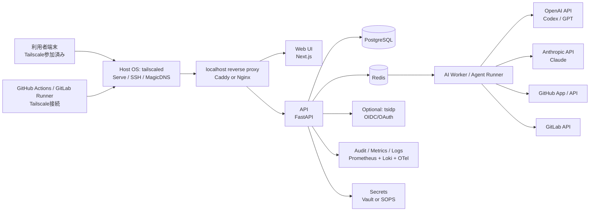
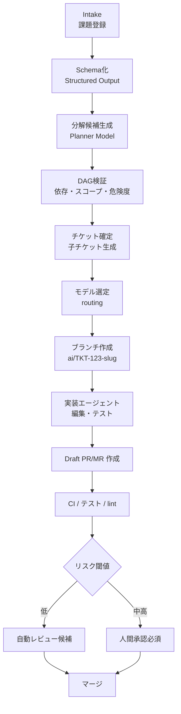

# VPS上の自作タスク管理ツールにAI実装支援を組み込む実務設計レポート

## エグゼクティブサマリ

本件の前提が「自作ツールをVPS上に置く」「外部公開は原則しない」「entity["company","Tailscale","vpn company"]で限定アクセスする」「AIがチケット単位で分割・実装・PR作成まで支援する」である以上、現時点で最も実用的なのは、**単一VPS上の Docker Compose 構成**を第一段階とし、**Tailscale Serve と Tailscale SSH をホスト側で動かし、アプリは localhost バインドで閉じる**方式です。これにより、公開 80/443 を不要にしつつ、`ts.net` の HTTPS と tailnet 内限定アクセスを利用でき、GitHub-hosted runner からも Tailscale GitHub Action 経由で私設ステージングへ安全に到達できます。さらに、entity["company","Hostinger","hosting company"]のVPSは小規模構成の初期コストを低く抑えられ、Docker Compose は複数サービスを単一 YAML で管理できます。citeturn13search0turn13search8turn31view0turn26search1turn26search5turn38search8

認証・認可は、**ネットワーク境界を Tailscale、アプリ境界を OIDC/JWT または Tailscale の identity/app-capabilities header** で二段階に分けるのがよいです。Tailscale は deny-by-default の ACL / grants を持ち、Serve は app backend にユーザー identity header を渡せます。さらに最新の `tsidp` を使えば、tailnet のアイデンティティをそのまま OIDC/OAuth に変換できるため、**「Tailscale に入れた人だけが、追加ログイン最小でアプリに入れる」**構成がかなり現実的になっています。アプリ側の RBAC は、`Tailscale-App-Capabilities` を受けてプロジェクト権限へ写像する設計が、いま最もきれいです。citeturn23search3turn31view1turn29search3turn29search6

AI 部分は、**分解・分類は低コストモデル、実装はコーディング特化モデル、難題のみ最上位モデル**に振り分けるルーティングが最もコスト効率に優れます。entity["company","OpenAI","ai company"]の API では GPT-5.5 / GPT-5.4 / GPT-5.4 mini の価格差が大きく、Codex 系は agentic coding 用に特化しています。entity["company","Anthropic","ai company"]側では Claude Opus 4.7 / Sonnet 4.6 / Haiku 4.5 が役割分担しやすく、Claude Code GitHub Actions も公式サポートがあります。両社とも prompt caching や structured outputs を使えるため、**チケット分割 JSON の安定化と、同一リポジトリ文脈の反復コスト削減**が可能です。citeturn41search0turn21search16turn25search3turn40view0turn10view1turn8search2turn7search2turn21search2turn28search0

結論として、本レポートの推奨は次のとおりです。**単一VPS + Docker Compose + PostgreSQL + Redis/BullMQ もしくは軽量 Python worker + Tailscale Serve/SSH + GitHub App + GitHub Actions + OpenAI Codex / Claude のハイブリッド運用**を第一段階の推奨構成とし、**Temporal と Kubernetes は「複数VPS・長時間ワークフロー・高並列・高可用性」が必要になった時点で導入**するのが、最新かつ実務的です。citeturn15search6turn15search10turn15search15turn14search0turn14search8turn14search20

## 前提条件と未指定事項

### 未指定事項

以下はユーザー要求文で**未指定**だったため、本報告では実務上もっとも無理の少ない前提で補っています。

| 項目 | 状態 | 本報告での扱い |
|---|---|---|
| 利用者数 | 未指定 | 小規模チームを前提 |
| 商用/非商用 | 未指定 | **商用の可能性あり**として設計 |
| リポジトリホスト | 未指定 | GitHub を第一推奨、GitLab を代替 |
| コードベース規模 | 未指定 | 中規模単一 repo 〜 数 repo |
| SLA / 可用性要件 | 未指定 | 単一VPS許容、マルチAZ不要 |
| RTO / RPO | 未指定 | RTO 数時間、RPO 24時間未満を仮定 |
| 個人情報・機密度 | 未指定 | **ソースコードと運用情報は機密**として扱う |
| データ所在地要件 | 未指定 | 明示要件なし。ただし越境移転を考慮 |
| 監査要件 | 未指定 | 監査ログ保存を必須扱い |
| 自動マージ許容範囲 | 未指定 | 低リスクのみ自動、基本は人間承認 |

### 設計時に固定すべき属性

実装前に確定すべき属性は、チケットの属性だけでなく、**AIが安全に触ってよい境界**です。特に重要なのは、**対象 repo / ブランチ / テスト可能範囲 / 変更禁止領域 / 秘密情報の有無 / 生成コードの最大差分量 / 人間承認要否 / 使用可能モデル / 1チケットあたり予算**です。アーキテクチャの複雑化を防ぐため、最初は「1チケット = 1ブランチ = 1 Draft PR/MR = 1 CI 結果 = 1 人間判断」に揃えるべきです。これは、実リポジトリ問題が単なるコード生成ではなく、既存コードベース・Issue・PR を横断して解く必要があることを示した SWE-bench 系の知見とも整合します。citeturn24search2turn24search10

### 判断原則

本報告では、次の原則を採用します。**外部公開しない、秘密をリポジトリに置かない、AI には最小権限しか与えない、変更はドラフト PR/MR で止める、モデルは task routing で使い分ける、失敗しても復旧可能な永続化と監査を入れる**、の6点です。Tailscale の access control は deny-by-default で、GitHub App は OAuth App より fine-grained permission と short-lived token を使えるため、この原則と相性がよいです。citeturn23search3turn33view3

## 推奨アーキテクチャ

### 推奨構成

推奨の第一段階は、**VPS 1台・ホストOSに tailscaled・アプリは Docker Compose**です。アプリ公開は `tailscale serve` で `127.0.0.1:8080` の reverse proxy に流し、**コンテナの公開ポートは localhost または internal network のみ**にします。これは Docker が UFW と相性が悪く、port publish が firewall を迂回しうるためです。したがって、**「UFW で閉じる」だけでは不十分で、そもそも Docker で public bind しない**のが重要です。Tailscale Serve 自体も、backend を localhost だけで listen させるのがベストプラクティスとしています。citeturn38search0turn38search3turn31view1



この構成の要点は、**Tailscale を「VPN」ではなく identity-aware private transport として使う**ことです。Serve は tailnet 内サービス公開に使え、identity header を backend に渡せます。最新の app capabilities header を使えば、たとえば `project.admin` や `ticket.approver` のような権限を Tailscale grants 側で定義し、アプリで解釈できます。さらに OIDC が必要なアプリには `tsidp` を組み合わせれば、tailnet identity をそのまま OIDC ログインに変換できます。citeturn31view0turn31view1turn23search7turn29search3

### 認証・認可の推奨設計

認証は三層に分けます。**端末認証は Tailscale、ブラウザセッションは OIDC / secure cookie、サービス間は短命 JWT**です。運用上もっとも扱いやすいのは次の順序です。

| 層 | 推奨 | 役割 |
|---|---|---|
| 端末/人 | Tailscale + device approval + Tailnet Lock | tailnet 参加端末を限定 |
| Web ログイン | `tsidp` または既存 OIDC | UI セッションと権限反映 |
| Backend 間 | 短命 JWT | worker / scheduler / api 間の呼出し |
| Repo 操作 | GitHub App installation token / GitLab project token | PR/MR 作成や clone/push |
| CI/CD | GitHub Action secrets から開始、成長後は Vault | 秘密の配布 |

Tailscale 側では device approval、device posture、Tailnet Lock を順に有効化すると、**「参加できる端末」「条件を満たす端末」「署名済み端末」**の三段階で強化できます。GitHub 連携には OAuth app より GitHub App を推奨します。GitHub Docs 自身が、GitHub App は fine-grained permissions と short-lived tokens により OAuth app より推奨だと説明しています。citeturn23search12turn23search0turn23search1turn23search13turn33view3turn33view0

### HTTPS と命名の注意点

Tailscale の HTTPS は便利ですが、**machine 名と tailnet DNS 名が Certificate Transparency の公開台帳に載る**点は必ず考慮してください。したがって、ホスト名に顧客名・案件名・機密プロダクト名を入れてはいけません。`taskhub-prod-01` のような匿名的命名にすべきです。もしこれが許容できないなら、**Serve は使いつつ HTTPS 証明書発行を避けるか、内部 reverse proxy と別の証明書戦略を取る**べきです。citeturn32view0turn32view1turn32view2

### チケットライフサイクル



このフローは、**Plan-and-Solve の「まず分解し、その後に実行する」発想**と、**ReAct の「推論とアクションを交互に行う」発想**を、実リポジトリの software engineering task に落とし込んだものです。Tree of Thoughts 型の探索は、難チケットのときだけ限定的に使うのが現実的です。常時多分岐探索をするとコストが跳ねやすく、日常の Issue-to-PR ワークフローでは過剰です。citeturn24search1turn24search0turn24search3turn24search2

## 推奨技術スタック比較

### 第一推奨スタック

本件の条件では、**GitHub 中心・Docker Compose 中心・OpenAI/Claude ハイブリッド**が最も実装しやすいです。理由は、GitHub App、PR API、Tailscale GitHub Action、Claude Code GitHub Actions、Codex GitHub code review がいずれも公式ドキュメントで揃っているからです。citeturn34view0turn34view3turn26search1turn8search2turn25search2

| レイヤ | 第一推奨 | 代替 | コメント |
|---|---|---|---|
| ホスティング | Hostinger VPS KVM2 相当 | 他社 KVM VPS | まず 2 vCPU / 8GB クラスが無難 |
| OS | Ubuntu LTS | Debian | 運用しやすさ重視 |
| 公開方式 | Tailscale Serve | host-level reverse proxy + tailnet 私設DNS | 公開 internet 不要なら Serve が楽 |
| UI | Next.js App Router | React SPA + FastAPI BFF | SSR/Server Functions と相性がよい |
| API | FastAPI | Node/NestJS | 速度より実装スピードを優先 |
| Queue | BullMQ + Redis | Temporal | BullMQ は軽量、Temporal は長時間ワークフロー向け |
| 永続DB | PostgreSQL | MySQL / SQLite | チケット管理・監査・JSONB・PITR のバランスがよい |
| Repo連携 | GitHub App | GitLab Project/Group Token | GitHub App の fine-grained 権限が有利 |
| CI/CD | GitHub Actions + Tailscale GitHub Action | GitLab CI + Tailscale Runner | 私設 staging へ安全到達しやすい |
| Secrets | 最初は Actions Secrets、成長後 Vault | SOPS | 単一VPSなら SOPS でも可 |
| 観測性 | Prometheus + Loki + OTel + Grafana | Sentry 追加 | 自前運用しやすい |
| AI 実装 | GPT-5.3-Codex / GPT-5.4 mini / Claude Sonnet 4.6 | Claude Opus 4.7 / GPT-5.5 | task routing 前提 |

この比較の根拠は、Next.js App Router、FastAPI の async 処理、BullMQ の Redis ベース queue と flow、Temporal の workflow / activity モデル、PostgreSQL の JSON および backup / continuous archiving、Kubernetes の control plane / worker 構造に基づいています。単一VPSでは Kubernetes の抽象度が優位になるより先に運用負荷が先行しやすいため、**現段階では Compose 優先**が妥当です。citeturn15search1turn15search12turn15search10turn15search6turn15search15turn15search23turn14search3turn14search6turn14search2turn14search0turn14search8turn38search8

### モデル選定の比較

| 用途 | 推奨モデル | 理由 | コスト感 |
|---|---|---|---|
| チケット受付・分類・要約 | GPT-5.4 mini | 安価で coding / subagents 向き | 低 |
| JSON 分解・依存グラフ化 | GPT-5.4 mini または Claude Sonnet 4.6 | structured output / prompt discipline と相性 | 低〜中 |
| 実装エージェント | GPT-5.3-Codex | agentic coding 特化 | 中 |
| 長時間の大きな改修 | GPT-5.1-Codex-Max | long-running task 最適化 | 中 |
| PR レビュー代替 / 第二意見 | Claude Sonnet 4.6 | 速度と知能のバランス | 中 |
| 難しいアーキ設計 / 失敗再挑戦 | GPT-5.5 または Claude Opus 4.7 | 最上位 reasoning / coding | 高 |

OpenAI 側では、GPT-5.5 が高性能、GPT-5.4 が中価格、GPT-5.4 mini が低価格で、GPT-5.3-Codex は agentic coding 特化です。Anthropic 側では、Opus 4.7 が最上位、Sonnet 4.6 が速度と知能のバランス、Haiku 4.5 が最安です。これにより、**「常に最上位モデル」は不要**で、ticket routing が前提になります。citeturn41search0turn25search3turn40view0turn40view2turn10view1

## 構築手順

### 構成の立ち上げ手順

以下は、**最短で壊れにくい**順序です。

1. **VPS を作成する。**  
   まずは 2 vCPU / 8GB RAM クラスを推奨します。Hostinger の KVM2 は 2 vCPU / 8GB / 100GB NVMe / 8TB bandwidth で、小規模開発用として十分な出発点です。自動 weekly backup と manual snapshot があるため、最初の disaster recovery も組みやすいです。citeturn13search0turn13search8

2. **ホストOSを初期化する。**  
   新規ユーザー作成、SSH 鍵認証、password login 無効化、OS update、fail2ban 相当、UFW default deny を設定します。ここでは **22番は一時的に管理元IPだけ許可**し、Tailscale SSH 完了後に閉じる前提で進めます。Tailscale SSH は tailnet 内 SSH の認証・認可を Tailscale 側で管理できます。citeturn13search1turn23search6

3. **Tailscale をホストに入れる。**  
   MagicDNS、device approval、必要なら Tailnet Lock を有効化します。内部サービス公開は `tailscale serve` を使う前提なので、Funnel は不要なら off にします。Serve は tailnet 内限定、Funnel は public internet 向けです。citeturn22search9turn22search3turn23search12turn23search1

4. **匿名的な machine naming を決める。**  
   HTTPS を使うなら machine 名が CT に出るため、`customer-a-prod` のような漏えい名は避けます。`taskhub-prod-01` のような中立名に変えた後で HTTPS を有効化します。citeturn32view0turn32view1

5. **Docker Engine と Compose plugin を入れる。**  
   本番では Docker repository 方式を使うのが無難です。Compose plugin は `docker compose` を使えるようにし、公開ポートは極力発生させません。Docker は UFW と衝突しうるため、`ports:` を安易に public bind しないことが重要です。必要なら rootless mode や userns-remap を検討します。citeturn38search0turn38search1turn38search2turn38search3turn38search20

6. **Compose で基盤サービスを起動する。**  
   まず `postgres`, `redis`, `api`, `worker`, `web`, `reverse-proxy` の6サービスで十分です。reverse proxy は Caddy でも Nginx でもよいですが、**外向き公開はせず localhost でのみ待ち受け**ます。その上に `tailscale serve 8080` を載せます。citeturn38search8turn31view0turn31view1

7. **DB とバックアップを整える。**  
   PostgreSQL を ticket / audit / run state の source of truth にします。メタデータは JSONB、厳密な状態遷移は relational table で持つのが扱いやすいです。夜間 `pg_dump` と、可能なら WAL archiving を有効化し、PITR 前提で restore test まで行います。citeturn14search3turn14search7turn14search6turn14search2turn14search18

8. **リポジトリ連携を作る。**  
   GitHub なら GitHub App を作成し、Contents / Pull requests / Issues の最小権限で installation token を発行して clone / push / PR 作成を行います。Git URL に installation token を HTTP password として使えるため、bot PAT より安全です。GitLab なら project/group token で MR API を使います。citeturn33view3turn33view0turn34view0turn36view2turn37view0

9. **CI/CD を private staging と接続する。**  
   GitHub Actions を使う場合、Tailscale GitHub Action により GitHub-hosted runner を tailnet へ一時接続できるため、自前 self-hosted runner を最初から用意しなくても private staging にアクセスできます。GitLab でも公式に Tailscale Runner 構成があります。citeturn26search1turn26search5turn27search0

10. **AI ルーティングを実装する。**  
    `planner`, `coder`, `reviewer` の3ロールに分けます。planner は structured output で ticket tree を作成、coder はブランチ上で編集・テスト、reviewer は PR 要約・懸念点抽出・再分解を担当します。OpenAI Agents SDK や Codex、Anthropic tool use はいずれも multi-step tool loop を前提に使えます。citeturn25search6turn25search17turn28search1turn28search9

11. **監査・観測を入れる。**  
    Tailscale の設定変更監査ログ、network flow logs、アプリの audit table、Prometheus 指標、Loki ログ、OpenTelemetry trace を揃えます。Tailscale の configuration audit logs はデフォルトで最新90日が見られます。citeturn22search1turn22search4turn22search7turn16search0turn16search1turn16search2

12. **承認ゲートを有効化してから自動化を広げる。**  
    第一段階では、AI は **Draft PR/MR まで**に止めます。merge は protected branch と required review の下で行い、auto-merge は low-risk チケットに限定します。GitLab では protected branch で direct push を明示的に禁止し、MR approval を必須にできます。citeturn35view2turn36view3turn27search12

## API設計とプロンプト設計

### サンプル API 設計

以下は最小限で十分な REST 設計です。

| エンドポイント | 目的 | 認証方式 | 備考 |
|---|---|---|---|
| `POST /api/v1/tickets` | 課題登録 | Web session cookie | UI から登録 |
| `POST /api/v1/tickets/{id}/decompose` | ticket 分割 | Web session + RBAC | planner を起動 |
| `POST /api/v1/tickets/{id}/dispatch` | 子チケット割り振り | service JWT | queue 登録 |
| `GET /api/v1/tickets/{id}` | 状態取得 | Web session | DAG / status / logs |
| `POST /api/v1/agent-runs` | 実装 run 開始 | service JWT | worker が受ける |
| `POST /api/v1/agent-runs/{id}/approve` | 人間承認 | Web session + approver 権限 | merge 前 gate |
| `POST /api/v1/repos/github/webhook` | GitHub webhook | GitHub HMAC | PR 更新受信 |
| `POST /api/v1/repos/gitlab/webhook` | GitLab webhook | webhook secret | MR 更新受信 |
| `POST /api/v1/pull-requests` | Draft PR/MR 作成 | service JWT | backend が repo API を叩く |
| `GET /api/v1/audit/events` | 監査閲覧 | admin session | セキュリティ監査用 |

GitHub App installation token による server-to-server 認証は、bot PAT より権限を絞りやすく、PR 作成や Git clone に必要な repository permission を最小化できます。GitLab API でも MR 作成・承認・保護ブランチ制御が公式 API と UI で揃っています。citeturn33view0turn34view0turn34view3turn36view2turn37view0turn36view3

### チケット分割アルゴリズム

実務的には、LLM に丸投げせず、**LLM + ルールベース + リポジトリ事実確認**の三段構えにします。

| ステップ | 処理 | 実装ポイント |
|---|---|---|
| 正規化 | 課題文を schema 化 | title, goal, constraints, acceptance criteria, risk, deadline |
| 文脈収集 | repo tree, ownership, tests, open PR, labels を取得 | GitHub/GitLab API と local repo scan |
| 初回分解 | planner model が subtasks を JSON 出力 | Structured Outputs / JSON schema |
| 制約適用 | 差分量・責務・依存数を閾値で再分割 | 例: diff<400 LOC, files<=8, deps<=3 |
| DAG 化 | 依存順・並列可能性を決定 | parent/child relation を保存 |
| ルーティング | model / reviewer / branch policy を決定 | low-cost / coding / premium を分岐 |
| 実装前検証 | forbidden path, secrets, migration, schema change を判定 | high-risk flag を付与 |
| 実行 | 1 子チケット 1 branch で coder 実行 | Draft PR/MR まで自動 |
| 事後評価 | test 成否、lint、review コメントを反映 | 再分解 or 再実装 |

この方式は、Plan-and-Solve の「先に計画してから解く」、ReAct の「計画と行動を交互に進める」、SWE-bench の「実リポジトリ文脈で評価する」教訓を合わせたものです。**repo grounding がない task decomposition は現場でほぼ破綻する**ので、tree 生成前に repo facts を必ず入れてください。citeturn24search1turn24search0turn24search2

### サンプルプロンプト

#### チケット分割プロンプト

```text
あなたはソフトウェア開発のプランナーです。
目的は「大きな要求」を、レビュー可能でCIしやすい子チケットに分解することです。

制約:
- 出力はJSONのみ
- 各子チケットは1つの明確な成果物に限定
- 1子チケットあたり想定差分は400 LOC以下
- DB migration / auth / billing / security は high_risk=true
- 依存は明示し、循環依存は禁止
- 既存テストまたは追加テスト方針を必ず含める
- 変更禁止パスに触れない

入力:
- issue_text
- repository_map
- codeowners
- existing_labels
- forbidden_paths
- branch_policy
- budget_per_ticket_usd

出力スキーマ:
{
  "epic_summary": "...",
  "tickets": [
    {
      "ticket_id": "TEMP-1",
      "title": "...",
      "goal": "...",
      "acceptance_criteria": ["..."],
      "depends_on": [],
      "target_paths": ["..."],
      "estimated_change_size": "xs|s|m",
      "recommended_model": "gpt-5.4-mini|gpt-5.3-codex|claude-sonnet-4-6|premium",
      "high_risk": false,
      "test_plan": ["..."]
    }
  ]
}
```

#### 実装プロンプト

```text
あなたは限定権限の実装エージェントです。
対象チケットだけを実装してください。

必須:
- 触ってよいのは target_paths のみ
- 既存の設計規約に従う
- 変更前に関連コードを読み、作業計画を5行以内で出す
- 実装後に test_plan を実行する
- 失敗時は原因を分類し、再試行は2回まで
- secrets, tokens, .env, migration を勝手に作成しない
- 完了したら PR 本文の下書きを Markdown で返す

入力:
- normalized_ticket
- repository_snapshot
- changed_files_limit
- test_commands
- coding_guidelines
- commit_style
```

#### PR 要約 / レビュー補助プロンプト

```text
あなたはレビュアー補助エージェントです。
差分を読み、次の4項目だけを返してください。

1. 何が変わったか
2. 仕様リスク
3. テスト不足
4. マージ前確認項目

ルール:
- 重大度は critical/high/medium/low
- 推測ではなく差分根拠ベース
- コード修正案は必要時のみ短く
- 出力は markdown
```

OpenAI は structured outputs を公式に提供し、GPT-5.5 系では outcome-oriented prompt と structured outputs を推奨しています。Anthropic は prompt engineering のベストプラクティスとして、明確さ、例示、XML 構造化、thinking、prompt chaining をガイドしています。citeturn21search2turn21search7turn21search10turn21search19turn11search2turn11search4

## 運用設計とセキュリティ

### 秘密管理

最初の段階では、**repo 外に secrets を置く**ことが最優先です。GitHub Actions には repository / environment / organization secrets がありますが、環境数と権限境界が増えると Vault に移行したくなります。Vault は JWT / OIDC 認証を使え、KV v2 で versioned secret を扱えます。単一VPSの最初期だけは SOPS + age でも十分ですが、**AI ワーカーに「いま必要な秘密だけ出す」**設計まで考えるなら Vault が上位です。citeturn17search3turn17search11turn17search0turn17search1turn17search13

### 監査ログ

監査は最低でも四層必要です。**Tailscale の設定変更ログ、アプリの操作監査、repo 操作監査、AI run ごとの入出力メタデータ**です。Tailscale の configuration audit logs は誰が何を変えたかを残し、最新90日が確認できます。network flow logs は Enterprise 向けですが、型としては SIEM 連携まで想定できます。アプリ側では `ticket_id`, `run_id`, `model`, `token_usage`, `repo_ref`, `actor`, `approval_event`, `merge_result` を最低限保存してください。citeturn22search1turn22search4turn22search7turn22search13

### 観測とアラート

単一VPSでも、Prometheus + Grafana + Loki + OpenTelemetry は十分現実的です。Prometheus は systems monitoring / alerting toolkit、Loki は log aggregation、OpenTelemetry は traces / metrics / logs 取得の共通基盤として使えます。アプリ障害検出をもっと早くしたいなら Sentry を追加しますが、まずは self-hosted の三本柱で問題ありません。citeturn16search0turn16search1turn16search2turn16search10turn16search8

### スケーラビリティ

スケール順序は、**モデル呼出し最適化 → worker 並列数増加 → VPS を分離 → その後に Kubernetes**です。OpenAI prompt caching は入力コストとレイテンシを大きく下げられ、Anthropic も uncached input 中心に rate limit を計算するため、まずは cache を効かせるのが先です。ワークフローの再開・人間承認・長時間 execution が増えたら Temporal を検討し、さらに multi-node / HA / rolling orchestration が必要になったら Kubernetes へ移るのが順当です。citeturn7search2turn10view2turn28search0turn15search15turn14search0turn14search8

### 法的・プライバシー上の注意

まず、**ソースコードが外部 AI API に送信される**こと自体がプライバシーと契約上の論点です。OpenAI の business/API の入力・出力はデフォルトで学習に使われず、顧客がデータを所有・管理できますが、API では abuse monitoring logs が最大30日保持される既定があります。Responses API では `store: false` で保存を無効化できます。MCP や外部コネクタ先は第三者サービスなので、その側の retention / residency policy を別に確認する必要があります。citeturn20view0turn21search0turn21search13turn21search11turn21search15

Anthropic では Claude API に Zero Data Retention と data residency control があり、Messages API などは ZDR 対象ですが、Message Batches や Agent Skills など ZDR 対象外の機能もあります。したがって、**厳しい機密コードでは「ZDR 対象機能だけを使用する」設計判断**が必要です。citeturn19search3turn19search1turn19search15turn19search13

日本法の観点では、個人情報保護委員会は越境移転や外国第三者提供時の情報提供を論点として示しています。もし ticket 内に顧客情報や個人情報が入りうるなら、**AI プロンプト投入前に PII を除去し、必要に応じて利用目的・提供先国の説明や委託契約の整理**が必要です。本件は法的助言ではありませんが、APPI / 取引先契約 / OSS license policy を法務レビューに通すべきです。citeturn18search2turn18search10turn18search4

## コスト見積りとリスク

### 概算コスト

以下は**小規模チーム・250チケット/月・低〜中程度の実装自動化**を仮定した概算です。`未指定` の項目は明示してあります。

| 項目 | 概算 | 前提 |
|---|---|---|
| VPS | 月額 約 $9〜$15 | Hostinger KVM2 の promo〜renewal 相当 |
| バックアップ追加 | 月額 $0〜$10 | Hostinger 週次 backup + 外部保存少量 |
| 監視基盤 | 月額 $0〜$20 | self-hosted 中心、外部SaaS最小 |
| AI 分解コスト | 月額 $10〜$40 | GPT-5.4 mini 中心 |
| AI 実装コスト | 月額 $80〜$250 | GPT-5.3-Codex / GPT-5.1-Codex-Max の混在 |
| AI レビュー/再判定 | 月額 $20〜$100 | Claude Sonnet 4.6 または GPT-5.4 |
| CI/CD 追加費 | 未指定 | GitHub/GitLab プラン依存 |
| Tailscale | 未指定 | commercial / seat 数依存。Personal は商用向けではない |
| 合計 | **月額 約 $110〜$395 + 未指定分** | 小〜中規模運用 |

OpenAI の価格は GPT-5.5 が input $5 / output $30、GPT-5.4 が $2.5 / $15、GPT-5.4 mini が $0.75 / $4.5、GPT-5.3-Codex が $1.75 / $14、GPT-5.1-Codex-Max が $1.25 / $10 です。Anthropic は Opus 4.7 が $5 / $25、Sonnet 4.6 が $3 / $15、Haiku 4.5 が $1 / $5 です。Prompt caching や batch の適用でさらに圧縮できますが、Anthropic の batch は ZDR 非対象なので、機密要件と両立するかは別判断です。citeturn41search0turn40view0turn40view2turn10view1turn28search6

### 主要リスクと緩和策

| リスク | 具体例 | 緩和策 |
|---|---|---|
| port 露出 | Docker publish が public に出る | `ports` を避ける、localhost bind、Serve 利用 |
| 過権限 repo token | bot token から全 repo へ書込 | GitHub App / project token 最小権限 |
| モデル暴走 | 大量差分・秘密ファイル改変 | forbidden path、diff cap、human approval |
| コスト暴騰 | 高価モデルの無制限使用 | ticket 単位 budget cap、model routing、prompt caching |
| 誤分解 | チケットが大きすぎる/依存循環 | rule-based validator、再分解、high-risk 手動化 |
| 機密漏えい | prompts に secrets / PII 混入 | redaction、synthetic fixtures、Vault、LLM 入力前フィルタ |
| HTTPS 名称漏えい | machine 名が CT に掲載 | 匿名ホスト名、HTTPS 有効化前の命名見直し |
| CI から private 接続不可 | private staging へ届かない | Tailscale GitHub Action / GitLab Runner 用 tailnet 接続 |
| 復旧不能 | DB 破損・誤削除 | pg_dump + WAL archiving + snapshot + restore drill |

この中で特に見落とされやすいのは、**Docker と UFW の食い違い**、**Tailscale HTTPS の公開台帳**、**AI が third-party MCP / batch 機能へデータを広げること**の3点です。ここを設計初日に潰しておくと、後から大きくやり直す可能性が減ります。citeturn38search0turn38search3turn32view1turn21search11turn19search13

### 最終提案

未指定条件を保守的に補ったうえでの最終提案は、**単一VPS + Docker Compose + PostgreSQL + Redis + FastAPI + Next.js + Tailscale Serve/SSH + tsidp 任意 + GitHub App + GitHub Actions + GPT-5.3-Codex / GPT-5.4 mini / Claude Sonnet 4.6 のハイブリッド**です。これが、今の公式機能群に最も素直に乗り、限定公開・実装支援・PR 自動化・監査・コスト制御を両立できます。Kubernetes と Temporal は将来の拡張路として残しつつ、最初からは入れない方が、実務上は成功確率が高いです。citeturn26search1turn25search3turn25search2turn10view1turn15search6turn14search0

### オープンクエスチョンと限界

本報告でなお `未指定` のため残る論点は、**repo が GitHub か GitLab か、利用者数、商用利用の有無、法務上のデータ所在地要件、扱うコードや ticket に個人情報が含まれるか、どこまで自動マージを許容するか**です。これらが確定すれば、最終的な OAuth / JWT / Vault / CI / backup retention / model budget はさらに具体化できます。現在の提案は、**小規模から始めて安全に拡張する**ことに最適化した設計です。