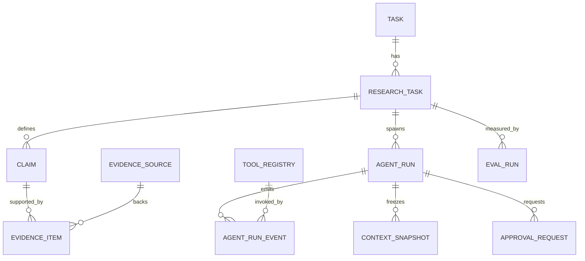
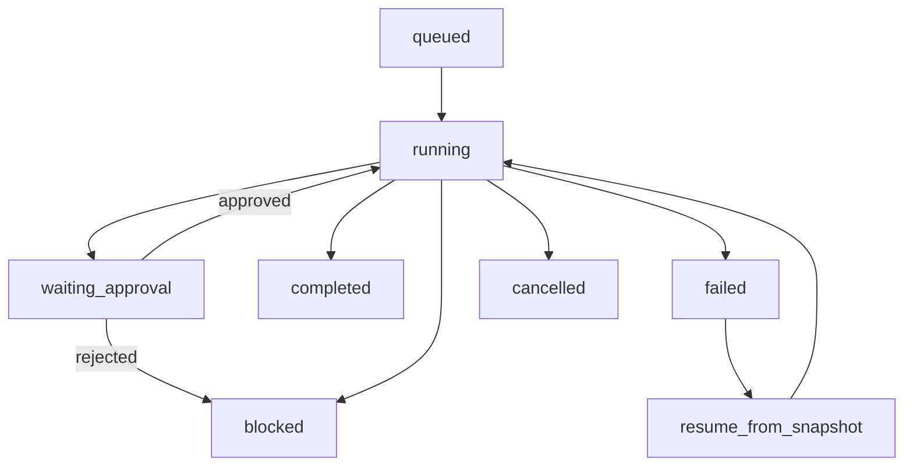

# Deep Research タスク管理ツール設計の妥当性評価レポート

## エグゼクティブサマリー

評価対象の元設計レポートは、**「タスク管理コア」**と**「AI 実行基盤」**を分け、`ProjectTask`、`EvidenceCard`、`AgentRun`、`ContextSnapshot`、`Policy Engine`、`RepoAdapter` を中心に組み立てようとしている点で、方向性はかなり良いです。特に、**証拠を first-class に置くこと、実行ログを単なるチャット履歴で終わらせないこと、人間承認をワークフローに埋め込むこと**は、最新の deep research / agent 実装や標準・ガイドラインと整合します。fileciteturn0file0 citeturn27view1turn28view0turn21view4turn36view0turn29view1

ただし、**2025–2026 時点の最新実装水準**に引き上げるには、元レポートのままでは不足があります。最大の不足は、**評価基盤**、**真正な provenance を持つ evidence/claim モデル**、**MCP の信頼境界**、**秘密情報・権限・保持期間の統制**、**計画系プロダクト要件の不足**です。今日のベンダー実装では、entity["company","GitHub","developer platform"] は issue type / sub-issue / dependency / custom fields / board / roadmap / metrics を持ち、entity["company","Linear","project tracking saas"] は cycles / dependencies / initiatives / customer requests を持ち、entity["company","OpenAI","ai company"] と entity["company","Anthropic","ai company"] は agent 実行・tool use・prompt caching・一部データ保持制御を提供しています。したがって、**「AI を載せたタスク管理」ではなく、「研究タスク・証拠・承認・実行履歴をネイティブに持つ作業OS」**へ設計を更新すべきです。citeturn22view2turn22view3turn25view0turn24view0turn24view4turn24view5turn24view6turn21view4turn33view1turn33view4turn33view5turn35view0

総合判定は次のとおりです。**支持**: Deep Research evidence model、AI agent roles and adapters、context snapshotting、policy/approval engine。**一部支持**: product requirements、AgentRun schema、MCP/tool gateway、LLM/agent security、data model and APIs、MVP phasing。**不支持または重大な不足**: metrics/evaluation framework、enterprise-grade な保持/監査/秘密管理/テナント分離。citeturn27view1turn28view0turn36view0turn37view4turn29view1turn29view2turn29view4turn20view20turn35view1turn19view21turn19view22turn19view23turn19view24

## 評価の前提と判断基準

この評価では、元レポートの方向性を、公式ドキュメントと一次情報を優先して照合しました。主な参照体系は、entity["organization","W3C","web standards consortium"] の PROV、entity["organization","NIST","standards institute us"] の AI RMF / SSDF、entity["organization","OWASP","appsec nonprofit"] の GenAI/LLM リスク、OpenAI / Anthropic / GitHub / entity["company","Tailscale","networking company"] の公式ドキュメント、ならびに SWE-bench / GAIA / BrowseComp / WebArena / DORA などの近年の評価・分析です。citeturn28view0turn29view1turn29view2turn29view3turn29view4turn19view10turn31search3turn21view4turn33view1turn35view0turn22view6turn20view20turn19view21turn19view22turn19view23turn19view24

判断基準は、単に「API があるか」ではなく、**再現性、監査性、権限分離、ベンダー差し替え可能性、人間承認、評価可能性**を満たすかどうかです。元レポートはこの方向に向いていますが、最新の MCP 認証仕様では OAuth 2.1、resource parameter、audience 検証、PKCE、Protected Resource Metadata が要求され、ベンダーの tool / connector / approval 設計も 2025–2026 でかなり具体化しました。よって、古い「AI 連携」設計よりも、**run/evidence/approval/tool trust** を中心に据えた構造のほうが正しいです。citeturn37view4turn37view1turn36view0turn36view1

## 領域別評価

**プロダクト要件 — 一部支持**  
元レポートの task-centric な中核は妥当ですが、**単一の `ProjectTask` 中心では足りません**。現在の実務標準では、GitHub 側でも issue type、sub-issue、blocked dependencies、custom fields、table/board/roadmap views、charts、automation が揃っており、Linear では cycles、project dependencies、templates、initiatives、customer requests が入り、Jira Advanced Roadmaps では custom hierarchy と dependency visualization が前提です。したがって、**研究タスク、実装タスク、ポートフォリオ計画、依存関係、インテーク**を分ける必要があります。citeturn22view2turn22view3turn25view0turn20view19turn24view0turn24view4turn24view5turn24view6  
優先ソース（リンク）: GitHub Projects / Issues — custom fields・roadmap・issue types・dependencies。citeturn22view2turn22view3turn25view0turn20view19  Linear — cycles・initiatives・customer requests・project templates / dependencies。citeturn24view0turn24view2turn24view3turn24view4  Atlassian Jira — advanced roadmaps の custom hierarchy / dependency 表示。citeturn24view5turn24view6  
具体変更: P0 で `issue_type`、`parent_task_id`、`task_links`、`initiative_id`、`cycle_id`、`intake_source` を追加。P1 で roadmap / dependency graph / customer request inbox / templates 画面。P2 で portfolio health と capacity planning。  
リスクと対策: 階層を増やしすぎると運用が破綻するので、**Initiative → Project/ResearchTask → Task → Subtask** の 4 層までを first-class、その他は custom fields に逃がす。  
検証: 依存関係を含む 20–30 件の実案件で、作業の見通し、ブロッカー検出、サイクル運用、インテークから実装開始までの lead time を比較する。

**Deep Research evidence model — 支持**  
元レポートの EvidenceCard 発想は正しいです。OpenAI の deep research API は、最終回答に inline citations を持ち、出力配列に web search / file search / remote MCP の各呼び出しを残し、citation annotation で URL・title・文字位置を持てます。さらに W3C PROV は provenance を「どの entity / activity / person がそのデータ生成に関わったか」という情報として定義し、**再現性、versioning、derivation**まで含めるべきとしています。したがって、EvidenceCard は簡易メモではなく、**Claim・EvidenceItem・EvidenceSource・Provenance** に正規化すべきです。citeturn27view1turn27view3turn28view0  
優先ソース（リンク）: OpenAI Deep Research API — output item と inline citation annotation。citeturn27view1  OpenAI product deep research — clear citations と sources used / progress summary。citeturn27view3  W3C PROV — provenance, reproducibility, versioning。citeturn28view0  
具体変更: P0 で `claims`、`evidence_sources`、`evidence_items` を分割し、`canonical_url`、`retrieved_at`、`published_at`、`annotation_span`、`claim_hash`、`supports|contradicts|context` を保存。P1 で `conflict_group_id`、`freshness_score`、`provenance_json`、`citation_render_mode`。P2 で source trust registry と domain-level evidence policy。  
リスクと対策: 証拠の粒度が粗いと後から再検証できない。逆に細かすぎると UI が破綻する。**source と fragment を分け、claim ベースで束ねる**のが最小実装です。  
検証: claim-citation 整合率、リンク切れ率、矛盾検出率、freshness warning の適合率を測る。外部ベンチマークは BrowseComp / GAIA を補助的に使い、最終判断は自社ゴールドセットで行う。citeturn19view22turn19view23

**AI agent roles and adapters — 支持**  
role 分離と adapter 化は、いまの実装水準に合っています。OpenAI Agents SDK は instructions / tools / guardrails / handoffs / human-in-the-loop / sessions / tracing を持ち、JS 版は provider-agnostic を明示しています。Anthropic は client tools と server tools を分け、Claude Code は GitHub Actions 実行もでき、GitHub Copilot cloud agent も repository research / plan / code / PR を独立して扱えます。よって、**単一の “万能エージェント” より、planner / researcher / coder / verifier / releaser の役割分離**が妥当です。citeturn34view0turn21view4turn20view14turn20view16turn20view17turn35view0  
優先ソース（リンク）: OpenAI Agents SDK — handoffs / guardrails / HITL / tracing / provider-agnostic。citeturn34view0turn21view4  Anthropic tool use / Claude Code GitHub Actions。citeturn20view14turn20view16turn20view17  GitHub Copilot cloud agent / custom agents。citeturn35view0turn35view1  
具体変更: P0 で `agent_profiles` と `adapter_capabilities` を導入し、role ごとに許可 tool / provider / context budget / approval policy を固定。P1 で provider fallback と task-type routing。P2 で long-term memory strategy を role ごとに可変化。  
リスクと対策: ベンダー差し替え時に振る舞いが崩れる。**adapter contract test** と **role 別のゴールドプロンプト**で吸収する。  
検証: 同一タスクの provider 横断 contract test、tool availability matrix test、handoff 成功率、verifier による不具合検出率。

**AgentRun schema — 一部支持**  
`AgentRun` を first-class にする方針は正しいですが、**1 レコード 1 実行**だけでは不十分です。OpenAI の deep research 出力は tool call 単位の item を持ち、Agents SDK は state / tracing / approvals を前提化し、OpenTelemetry は trace / span モデル、Temporal は workflow history を前提にしています。したがって、`AgentRun` は**イベントソース型**に寄せるべきで、run 本体に加え `agent_run_events`、`tool_invocations`、`run_artifacts` が必要です。citeturn27view1turn21view4turn21view5turn20view18turn20view21  
優先ソース（リンク）: OpenAI Deep Research API — output array に action log を持つ。citeturn27view1  OpenAI Agents SDK — state / approvals / tracing。citeturn21view4turn21view5  OpenTelemetry / Temporal — span と workflow history。citeturn20view18turn20view21  
具体変更: P0 で `status` を `queued|running|waiting_approval|blocked|completed|failed|cancelled` に拡張し、`parent_run_id`、`trace_id`、`current_snapshot_id`、`cost_usd`、`error_code` を追加。P0 で `agent_run_events` を append-only にする。P1 で replay / cancel / resume API。P2 で span export。  
リスクと対策: 巨大ログ、PII 混入、並列実行での順序崩れ。**seq_no unique**、redaction、retention tier、idempotency key で対処。  
検証: out-of-order event 注入、再実行 determinism、cancel/resume、event volume 負荷テスト。

**Context snapshotting — 支持**  
ContextSnapshot は必須です。PROV が reproducibility / versioning を求め、Temporal も history/replay を軸にしており、OpenAI Responses API は `store:false` と `reasoning.encrypted_content` により stateless continuation を可能にしています。一方、prompt caching は性能最適化であり、**再現性の代替ではありません**。したがって snapshot には、**repo SHA、prompt pack version、policy version、tool manifest、evidence set hash、model config、reasoning carry-forward 参照**が必要です。citeturn28view0turn33view1turn33view0turn33view4turn20view21  
優先ソース（リンク）: W3C PROV — reproducibility / versioning。citeturn28view0  OpenAI Responses — `store:false`、encrypted reasoning。citeturn33view1turn33view0  OpenAI Prompt Caching — 性能改善だが再現性の話ではない。citeturn33view4  
具体変更: P0 で `context_snapshots` に `prompt_pack_version`、`policy_version`、`repo_state`、`tool_manifest`、`evidence_set_hash`、`reasoning_ciphertext_ref` を入れる。P1 で snapshot diff / restore preview。P2 で dedup / compression。  
リスクと対策: 秘密情報や個人情報の二重保存。**snapshot には secret 値を入れず reference のみ**、暗号化、TTL、削除ポリシーを適用する。  
検証: 同一 SHA・同一 snapshot からの再開成功率、`store:false` 運用での継続性、snapshot 再現時の差分率、resume latency。

**Policy/approval engine — 支持**  
人間承認を設計の中心に置くべき、という元レポートの判断は強く支持できます。OpenAI は MCP / connector tool call を明示承認付きまたは自動許可で扱え、敏感な操作には approval を推奨しています。GitHub は branch protection、rulesets、required reviews、environment required reviewers、prevent self-review を持ち、Copilot cloud agent もレビュー・PR を人間のフローに乗せる前提です。つまり、**承認エンジンをアプリ内部に持たずに、AI を安全に production に乗せるのはほぼ不可能**です。citeturn36view0turn26search6turn26search4turn26search8turn26search10turn35view0  
優先ソース（リンク）: OpenAI MCP and Connectors — `require_approval` と sensitive actions の approval。citeturn36view0  GitHub branch protection / required reviews / environments。citeturn26search6turn26search4turn26search8turn26search10  
具体変更: P0 で `policy_rules`・`approval_requests`・`policy_decisions` テーブル、Approvals Inbox UI、Policy Simulator UI。P0 で action class を `read/search`、`task_write`、`repo_write`、`pr_open`、`merge`、`deploy`、`secret_access` に分ける。P1 で diff 変更時の stale approval invalidation。P2 で policy analytics。  
リスクと対策: 承認が多すぎると実運用で回らない。**read は自動、write は差分確認、merge/deploy/secret は必須承認**という初期デフォルトが無難です。  
検証: 不正 merge/block、required reviewers、self-review 拒否、approval stale 化、policy regression suite。

**MCP/tool gateway — 一部支持**  
MCP 自体を採る方向は正しいですが、**「何でも MCP に載せる」設計は危険**です。OpenAI の MCP ガイドは deep research / company knowledge 向けに `search` と `fetch` の read-only compatibility schema を推奨し、connectors / remote MCP server は approval や trusted server 選定が必要だと明示しています。MCP 認証仕様も OAuth 2.1、metadata discovery、audience 検証、resource parameter、PKCE、DCR を要求し、security best practices では token passthrough を明示的に禁止し、SSRF リスクまで扱っています。したがって、元レポートの MCP 連携は、**Tool Registry + Trust Tier + Read-only Gateway + Mutating Gateway** の二段構えにすべきです。citeturn36view1turn36view0turn37view4turn38view0  
優先ソース（リンク）: OpenAI MCP build guide — deep research 向け `search`/`fetch`。citeturn36view1  OpenAI MCP and Connectors — approval / trusted servers / third-party risks。citeturn36view0  MCP Authorization — OAuth 2.1 / audience / PKCE / metadata。citeturn37view4turn37view1turn37view2turn37view3  MCP Security Best Practices — token passthrough 禁止、SSRF、per-client consent。citeturn38view0  
具体変更: P0 で `tool_registry`、`oauth_clients`、`server_metadata_cache`、`tool_scopes` を追加し、`trust_tier=official|self_hosted|third_party|experimental` を持たせる。P0 で read-only `search/fetch` と mutating tools を分離。P1 で egress proxy / outbound allowlist。P2 で private MCP SSO。  
リスクと対策: 悪意ある MCP、SSRF、confused deputy、token passthrough。**official server 優先、HTTP 禁止、private IP block、audience validation、per-client consent**が必須です。  
検証: OAuth flow test、audience mismatch negative test、PKCE test、token passthrough 拒否、SSRF block test、tool schema compatibility test。

**LLM/agent security — 一部支持**  
元レポートにはセキュリティ意識がありますが、**最新の LLM/agent セキュリティ要件までは届いていません**。OWASP 2025 は prompt injection、sensitive information disclosure、improper output handling、excessive agency、unbounded consumption を主要リスクとして整理し、NIST AI RMF は human oversight、third-party component risk、risk tracking、feedback incorporation、decommissioning を要求しています。GitHub App は workflow 編集時に `workflows` 権限が必要であり、branch protection と environments を併用することで secret access を承認前に止められます。よって、**権限最小化、出力サニタイズ、secret governance、budget/kill-switch、監査ログ、incident response**までアプリに織り込む必要があります。citeturn31search3turn19view11turn31search1turn30search3turn31search4turn29view1turn29view2turn29view3turn29view4turn19view3turn26search9  
優先ソース（リンク）: OWASP Top 10 2025 overview / Prompt Injection / Sensitive Information Disclosure / Unbounded Consumption / 2026 exploit round-up。citeturn31search3turn19view11turn31search1turn30search3turn31search4  NIST AI RMF / SSDF。citeturn29view1turn29view2turn29view3turn29view4turn19view10  GitHub App permissions / environment secret protection。citeturn19view3turn26search9  
具体変更: P0 で `secret_scope`、`max_tool_calls`、`max_runtime_sec`、`max_tokens`、`allowed_domains`、`redact_patterns`、`data_classification` を policy に追加。P0 で secret canary / output sanitizer / cost guardrail。P1 で adversarial-context quarantine と security posture dashboard。P2 で automated red team suite。  
リスクと対策: hidden prompt injection、誤出力経由の exfiltration、過度な自律、コスト爆発。**approval、allowlist、sandbox、least privilege、quota、redaction、kill switch**で止める。  
検証: hidden-instruction corpus、secret canary、tool-output XSS/URL exfil、cost abuse、scope escalation、malicious dependency PR。

**Metrics/evaluation framework — 不支持**  
ここは元レポートの最大の弱点です。GitHub Copilot cloud agent は PR 数・merge 数・median time to merge などの lifecycle metrics を API と usage metrics で提供しており、DORA は throughput / instability を含む delivery performance を継続的に整理しています。ベンチマーク側でも SWE-bench、GAIA、BrowseComp、WebArena などがあり、少なくとも**offline eval + online production metrics + fresh private holdout** の三層が必要です。これが無いままでは、「よく働く AI」ではなく「見た目が派手な AI」になります。citeturn35view1turn22view0turn20view20turn21view0turn19view21turn19view22turn19view23turn19view24turn8search8  
優先ソース（リンク）: GitHub Copilot usage metrics / cloud agent PR outcomes。citeturn22view0turn35view1  DORA 2025 year in review。citeturn20view20turn21view0  SWE-bench / GAIA / BrowseComp / WebArena。citeturn19view21turn19view22turn19view23turn19view24  
具体変更: P0 で `eval_runs`、`eval_cases`、`eval_scores`、`run_metrics_daily`。P0 で online KPI を `cycle_time`, `time_to_merge`, `approval_wait_ms`, `citation_coverage`, `acceptance_pass_rate`, `cost_per_completed_task` に固定。P1 で claim-source alignment metric と contradiction resolution metric。P2 で shadow mode と provider bake-off。  
リスクと対策: benchmark leakage、metric gaming、実案件との乖離。**public benchmark は参考、最終 KPI は private gold tasks と production telemetry**に置く。  
検証: nightly regression、monthly holdout refresh、A/B comparison、人手採点との相関。

**Data model and APIs — 一部支持**  
元レポートのデータモデル案は骨格としては妥当ですが、**task management core と research runtime を分離していない点**が弱いです。OpenAI は typed `response` object と output items、Structured Outputs/JSON Schema を前提にしており、GitHub 側も issue / dependency / rule / environment を API で個別管理します。したがって、アプリ側も `Task`、`ResearchTask`、`AgentRun`、`Evidence`、`Approval`、`Tool`、`Eval` を別コンテキストに切り分けたほうが API と DB の寿命が長いです。citeturn33view2turn20view9turn18view5turn26search15turn26search7  
優先ソース（リンク）: OpenAI Responses / Structured Outputs。citeturn33view2turn20view9  GitHub Issues / rules / environments APIs。citeturn18view5turn26search15turn26search7  
具体変更: P0 で `research_tasks` を `tasks` から分離し、idempotency key と append-only event API を導入。P0 で `/research-tasks`、`/agent-runs`、`/approvals`、`/evidence`、`/tools`、`/eval-runs` を versioned REST として定義。P1 で webhook / export API。P2 で public SDK。  
リスクと対策: task と run をベタ結合すると migration が難しくなる。**bounded context と join token**で疎結合にする。  
検証: schema validation、API contract test、backward-compatible migration、webhook replay。

**MVP phasing — 一部支持**  
段階導入そのものは妥当ですが、優先順位は更新すべきです。現在は OpenAI 側に deep research / MCP / Responses / tracing / encrypted reasoning があり、Anthropic と GitHub も tool use / GitHub Actions / usage metrics が進んでいます。一方で、Tailscale の authenticated MCP と `tsidp` は有望ですが experimental です。したがって、**P0 で private auth を深追いするより、評価基盤と approval 基盤を先に固めるべき**です。citeturn36view0turn36view1turn21view4turn35view0turn22view6turn23view0  
優先ソース（リンク）: OpenAI MCP / Responses / tracing。citeturn36view0turn36view1turn21view4turn33view1  GitHub cloud agent / metrics。citeturn35view0turn35view1  Tailscale Serve / authenticated MCP / tsidp experimental。citeturn22view4turn22view6turn23view0  
具体変更: P0 は **Task core + ResearchTask + Evidence/Claim + AgentRun/Events + Approval engine + GitHub adapter + Eval harness**。P1 は **multi-provider adapters + remote MCP read-only gateway + roadmap/intake/customer requests**。P2 は **deploy automation + GitLab adapter + advanced portfolio analytics + private MCP SSO/tsidp**。  
リスクと対策: P0 に機能を詰め込みすぎると検証不能になる。**P0 の exit criteria を「安全・測定可能・承認可能」に固定**する。  
検証: phase ごとに exit criteria を定義し、P0 は `acceptance_pass_rate`, `approval_blocking`, `citation_coverage`, `time_to_merge` の 4 指標で合否を判定する。

**Missing gaps — 不支持**  
元レポートで最もカバーしきれていないのは、**テナント分離・保持期間・監査・秘密管理・prompt/policy versioning・decommissioning**です。NIST AI RMF は inventory、ongoing review、third-party risk monitoring、feedback incorporation、decommissioning を要求しており、MCP 側も data sharing log と third-party retention risk を明示しています。ここが弱いままでは、たとえ AI の出力品質が高くても、本番導入で止まります。citeturn29view1turn29view4turn36view0turn38view0  
優先ソース（リンク）: NIST AI RMF — inventory / review / decommissioning / third-party monitoring。citeturn29view1turn29view4  OpenAI MCP guide — third-party MCP への送信ログと retention risk。citeturn36view0  
具体変更: P0 で tenant-aware authorization、RLS、audit export、retention policy、secret vault reference model、prompt pack / policy pack versioning。P1 で deletion/export workflow と legal hold。P2 で residency-aware hosting strategy。  
リスクと対策: enterprise 利用で導入不可、事故時の説明不能、データ削除要求に未対応。**app-level audit trail と retention matrix**を早期に入れる。  
検証: authz matrix、deletion/export、retention TTL、tenant leakage test、secret rotation drill。

## 推奨アーキテクチャの更新

現時点で最も堅い構成は、**Task 管理コア**と**Research 実行基盤**を分け、Research 側で `ResearchTask → Claim/Evidence → AgentRun → Approval → Artifact/Eval` を閉じる形です。これにより、OpenAI 系の deep research / tracing / MCP、Anthropic 系の tool use / prompt caching、GitHub 系の repo execution / PR telemetry、NIST/PROV の再現性・監査性を無理なく吸収できます。citeturn27view1turn28view0turn21view4turn33view5turn35view0turn29view1

| スタック | ネイティブに強い領域 | 制約 | この設計での主担当 |
|---|---|---|---|
| OpenAI API + Agents SDK | deep research、Responses、tracing、state/approvals、remote MCP、`store:false` と encrypted reasoning、prompt caching、tool-heavy loop の高速化。citeturn27view1turn21view4turn33view1turn33view4turn33view3 | third-party MCP の retention は相手依存。citeturn36view0 | planner / researcher / orchestrator |
| Anthropic Claude API + Claude Code | tool use、client/server tools、GitHub Actions 実行、automatic prompt caching。Messages API は ZDR eligible、ただし Message Batches は非対象。citeturn20view14turn20view16turn20view17turn33view5turn21view13turn20view15 | deep research 相当の first-party run object は薄いので、自前 runtime 管理が必要。 | coder / verifier |
| GitHub Copilot cloud agent | repo research、implementation plan、branch 上の code change、PR lifecycle metrics、custom agents、MCP / hooks / skills。citeturn35view0turn35view1 | repo 外の複合 orchestration には不向き。ruleset/branch protection 非互換時は詰まりうる。citeturn35view1 | GitHub 内完結の repo worker |

| アクション種別 | 推奨デフォルト | 根拠 |
|---|---|---|
| Web / file / read-only internal search | 自動許可 | deep research は多数の read 操作を前提にし、最終回答は citation と source metadata を返せる。citeturn27view1turn27view3 |
| Trusted MCP の `search` / `fetch` | 自動許可 + 全件ログ | OpenAI の deep research / company knowledge 互換は read-only `search` / `fetch` が基本。citeturn36view1 |
| Repo write on branch / Draft PR 作成 | 差分確認を必須 | GitHub は review / rulesets / branch protection を前提にしている。citeturn26search6turn26search8 |
| Merge / deploy / environment secrets access | 人手承認必須、self-review 禁止 | GitHub environments の required reviewers と prevent self-review が直接使える。citeturn26search4turn26search10 |
| Mutating MCP tools | デフォルト拒否、policy 明示時のみ | OpenAI と MCP spec は approval、trusted server、audience validation、token passthrough 禁止を要求。citeturn36view0turn37view4turn38view0 |

下図は、推奨するデータ境界です。証拠・承認・実行ログをタスク本体から切り出すことで、再現性と監査性を一気に上げられます。citeturn28view0turn27view1turn21view4turn29view1



下図は AgentRun のライフサイクルです。ポイントは、**approval 待ちを first-class state にすること**、そして failure と policy block を別状態にすることです。citeturn21view4turn27view1turn36view0turn26search4



## 提案スキーマとAPI

以下は、元レポートの骨格を保ちながら、足りない部分だけを補強した**最小で実務的な**追加案です。特に `ResearchTask` と `AgentRun` を task 本体から分離し、evidence・approval・eval を独立させるのが重要です。citeturn27view1turn28view0turn33view2turn35view1

推奨 API エンドポイントの最小集合は次のとおりです。

- `POST /v1/research-tasks`
- `GET /v1/research-tasks/:id`
- `POST /v1/research-tasks/:id/plan`
- `POST /v1/agent-runs`
- `GET /v1/agent-runs/:id`
- `GET /v1/agent-runs/:id/events`
- `POST /v1/agent-runs/:id/cancel`
- `POST /v1/agent-runs/:id/resume`
- `POST /v1/approvals`
- `POST /v1/approvals/:id/decide`
- `GET /v1/evidence/:id/provenance`
- `POST /v1/tools/discover`
- `GET /v1/tools`
- `POST /v1/eval-runs`
- `GET /v1/metrics/summary`

### 推奨 SQL スキーマ

```sql
create table research_tasks (
  id uuid primary key,
  task_id uuid null references tasks(id),
  title text not null,
  objective text not null,
  status text not null check (
    status in ('draft','planned','running','needs_review','ready','archived')
  ),
  scope jsonb not null default '{}'::jsonb,
  policy_profile text not null,
  evidence_requirement text not null default 'decision_grade',
  owner_user_id uuid null,
  latest_plan_id uuid null,
  created_at timestamptz not null default now(),
  updated_at timestamptz not null default now()
);

create table agent_runs (
  id uuid primary key,
  research_task_id uuid not null references research_tasks(id),
  parent_run_id uuid null references agent_runs(id),
  run_type text not null check (
    run_type in ('plan','research','code','verify','apply','eval')
  ),
  provider text not null,
  model text not null,
  adapter text not null,
  status text not null check (
    status in ('queued','running','waiting_approval','blocked','completed','failed','cancelled')
  ),
  trace_id text null,
  current_snapshot_id uuid null,
  cost_input_tokens bigint not null default 0,
  cost_output_tokens bigint not null default 0,
  cost_usd numeric(12,4) not null default 0,
  error_code text null,
  error_summary text null,
  started_at timestamptz null,
  ended_at timestamptz null,
  created_at timestamptz not null default now()
);

create table agent_run_events (
  id bigserial primary key,
  run_id uuid not null references agent_runs(id),
  seq_no bigint not null,
  event_type text not null,
  payload jsonb not null,
  created_at timestamptz not null default now(),
  unique (run_id, seq_no)
);

create table context_snapshots (
  id uuid primary key,
  run_id uuid not null references agent_runs(id),
  snapshot_kind text not null check (
    snapshot_kind in ('input','pre_tool','post_tool','resume','final')
  ),
  prompt_pack_version text not null,
  policy_version text not null,
  repo_state jsonb not null default '{}'::jsonb,
  tool_manifest jsonb not null default '[]'::jsonb,
  evidence_set_hash text null,
  reasoning_ciphertext_ref text null,
  state_json jsonb not null,
  created_at timestamptz not null default now()
);

create table evidence_sources (
  id uuid primary key,
  source_type text not null check (
    source_type in ('web','file','mcp','repo','manual')
  ),
  canonical_url text null,
  title text null,
  publisher text null,
  published_at timestamptz null,
  retrieved_at timestamptz not null,
  content_hash text null,
  metadata jsonb not null default '{}'::jsonb
);

create table claims (
  id uuid primary key,
  research_task_id uuid not null references research_tasks(id),
  claim_text text not null,
  claim_hash text not null unique,
  status text not null check (
    status in ('draft','supported','contradicted','unresolved')
  ),
  created_at timestamptz not null default now()
);

create table evidence_items (
  id uuid primary key,
  claim_id uuid not null references claims(id),
  source_id uuid not null references evidence_sources(id),
  relation text not null check (
    relation in ('supports','contradicts','context')
  ),
  excerpt text null,
  locator jsonb not null default '{}'::jsonb,
  relevance_score numeric(5,4) null,
  freshness_score numeric(5,4) null,
  provenance jsonb not null,
  created_at timestamptz not null default now()
);

create table approval_requests (
  id uuid primary key,
  run_id uuid not null references agent_runs(id),
  action_type text not null,
  resource_ref text not null,
  risk_level text not null check (
    risk_level in ('low','medium','high','critical')
  ),
  decision text null check (
    decision in ('approved','rejected','expired')
  ),
  requested_at timestamptz not null default now(),
  decided_at timestamptz null,
  decided_by uuid null,
  rationale text null
);

create table tool_registry (
  id uuid primary key,
  tool_key text not null unique,
  transport text not null check (
    transport in ('builtin','mcp','http','local')
  ),
  server_url text null,
  trust_tier text not null check (
    trust_tier in ('official','self_hosted','third_party','experimental')
  ),
  read_only boolean not null default true,
  require_approval_by_default boolean not null default true,
  allowed_domains text[] not null default '{}',
  auth_metadata jsonb not null default '{}'::jsonb,
  created_at timestamptz not null default now()
);

create table eval_runs (
  id uuid primary key,
  suite_name text not null,
  provider text not null,
  model text not null,
  adapter text not null,
  snapshot_version text not null,
  summary jsonb not null default '{}'::jsonb,
  started_at timestamptz not null default now(),
  ended_at timestamptz null
);
```

### AgentRun の JSON Schema 例

```json
{
  "$schema": "https://json-schema.org/draft/2020-12/schema",
  "title": "AgentRun",
  "type": "object",
  "required": [
    "id",
    "researchTaskId",
    "runType",
    "provider",
    "model",
    "adapter",
    "status",
    "createdAt"
  ],
  "properties": {
    "id": { "type": "string", "format": "uuid" },
    "researchTaskId": { "type": "string", "format": "uuid" },
    "parentRunId": { "type": ["string", "null"], "format": "uuid" },
    "runType": {
      "type": "string",
      "enum": ["plan", "research", "code", "verify", "apply", "eval"]
    },
    "provider": { "type": "string" },
    "model": { "type": "string" },
    "adapter": { "type": "string" },
    "status": {
      "type": "string",
      "enum": [
        "queued",
        "running",
        "waiting_approval",
        "blocked",
        "completed",
        "failed",
        "cancelled"
      ]
    },
    "trace": {
      "type": "object",
      "properties": {
        "traceId": { "type": "string" },
        "spanCount": { "type": "integer", "minimum": 0 }
      }
    },
    "currentSnapshotId": {
      "type": ["string", "null"],
      "format": "uuid"
    },
    "cost": {
      "type": "object",
      "properties": {
        "inputTokens": { "type": "integer", "minimum": 0 },
        "outputTokens": { "type": "integer", "minimum": 0 },
        "usd": { "type": "number", "minimum": 0 }
      }
    },
    "approvals": {
      "type": "array",
      "items": {
        "type": "object",
        "required": ["actionType", "riskLevel", "decision"],
        "properties": {
          "actionType": { "type": "string" },
          "riskLevel": {
            "type": "string",
            "enum": ["low", "medium", "high", "critical"]
          },
          "decision": {
            "type": ["string", "null"],
            "enum": ["approved", "rejected", "expired", null]
          }
        }
      }
    },
    "artifacts": {
      "type": "array",
      "items": {
        "type": "object",
        "required": ["kind", "uri"],
        "properties": {
          "kind": {
            "type": "string",
            "enum": ["plan", "patch", "report", "pr", "log", "eval"]
          },
          "uri": { "type": "string" }
        }
      }
    },
    "createdAt": { "type": "string", "format": "date-time" },
    "startedAt": { "type": ["string", "null"], "format": "date-time" },
    "endedAt": { "type": ["string", "null"], "format": "date-time" }
  }
}
```

### ResearchTask の JSON Schema 例

```json
{
  "$schema": "https://json-schema.org/draft/2020-12/schema",
  "title": "ResearchTask",
  "type": "object",
  "required": [
    "id",
    "title",
    "objective",
    "status",
    "evidencePolicy",
    "createdAt"
  ],
  "properties": {
    "id": { "type": "string", "format": "uuid" },
    "taskId": { "type": ["string", "null"], "format": "uuid" },
    "title": { "type": "string", "minLength": 1 },
    "objective": { "type": "string", "minLength": 1 },
    "status": {
      "type": "string",
      "enum": ["draft", "planned", "running", "needs_review", "ready", "archived"]
    },
    "acceptanceCriteria": {
      "type": "array",
      "items": { "type": "string" }
    },
    "constraints": {
      "type": "object",
      "properties": {
        "allowedDomains": {
          "type": "array",
          "items": { "type": "string" }
        },
        "languages": {
          "type": "array",
          "items": { "type": "string" }
        },
        "maxRuntimeSeconds": { "type": "integer", "minimum": 1 }
      }
    },
    "evidencePolicy": {
      "type": "object",
      "required": ["minCitationsPerSection", "allowUnresolvedConflicts"],
      "properties": {
        "minCitationsPerSection": { "type": "integer", "minimum": 0 },
        "allowUnresolvedConflicts": { "type": "boolean" },
        "requireFreshnessWindowDays": {
          "type": ["integer", "null"],
          "minimum": 1
        }
      }
    },
    "toolPolicyProfile": { "type": "string" },
    "ownerUserId": { "type": ["string", "null"], "format": "uuid" },
    "createdAt": { "type": "string", "format": "date-time" },
    "updatedAt": { "type": "string", "format": "date-time" }
  }
}
```

## 未解決論点と次の調査

未解決のまま残る論点は五つあります。ひとつは **single-tenant か multi-tenant か** です。multi-tenant なら、RLS、tenant-aware vector store、per-tenant secret vault が P0 に前倒しになります。二つ目は **GitHub 以外のデータソース範囲**で、docs / Slack / incident / CRM まで初期から扱うのか、まず repo と issue に限定するのかで MCP gateway の設計が変わります。三つ目は **自動 PR まで許すか、Draft PR までに留めるか** です。四つ目は **evidence retention** を URL 参照で済ませるか、断片スナップショットまで自前保持するか。五つ目は **データ保持・削除・監査** の要求水準です。ここが厳しい場合、ベンダー選定や `store:false` / ZDR の使い方が大きく変わります。citeturn33view1turn36view0turn21view13turn20view15turn29view1turn29view4

次に進めるなら、調査として最も価値が高いのは次の順です。**第一に**、自社 repo / issue / docs から 30–50 件の private gold tasks を作り、SWE-bench や GAIA ではなく自社条件で評価を回すこと。**第二に**、OpenAI・Anthropic・GitHub の三系統で provider bake-off を行い、planner / researcher / coder / verifier の最適担当を決めること。**第三に**、MCP gateway に対して prompt injection・SSRF・token audience mismatch・approval bypass の脅威モデルと回帰テストを作ること。**第四に**、policy pack / prompt pack / schema version を immutable artifact にし、snapshot から再開できることを実証することです。これを終えれば、元レポートは「よい構想」から「安全に運用できる製品設計」に変わります。citeturn19view21turn19view22turn19view23turn19view24turn21view4turn35view1turn36view0turn37view4turn38view0
