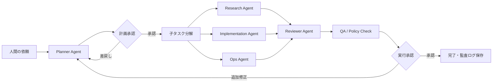
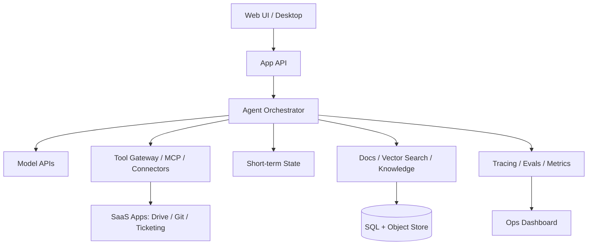
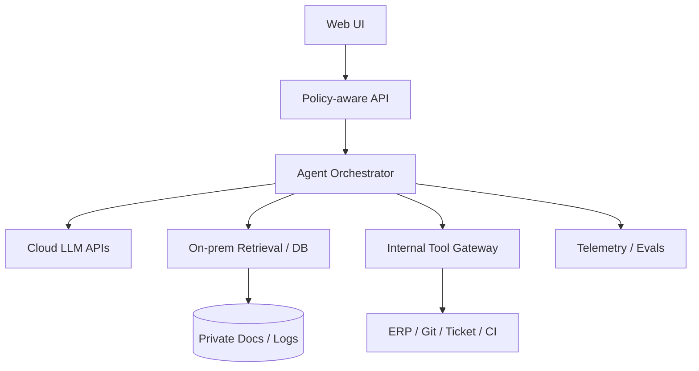
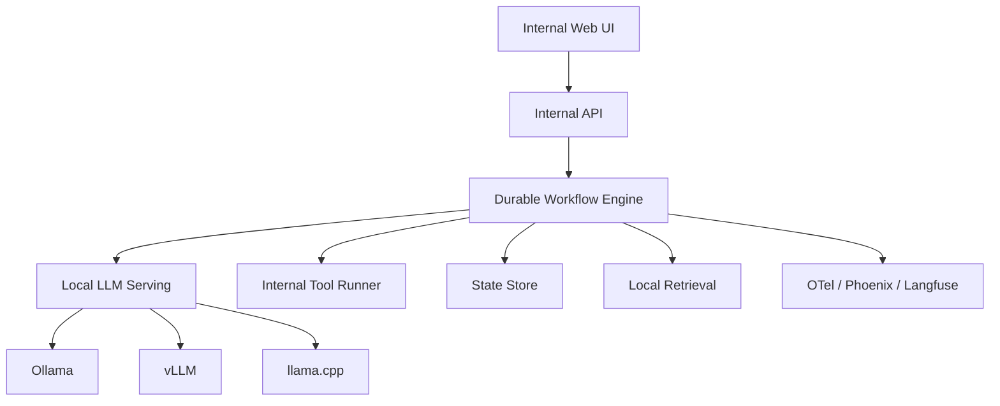
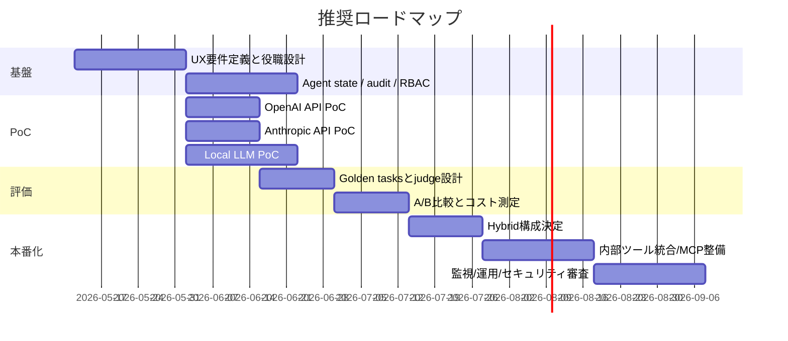

# AI統合タスク管理プラットフォームの最新UIUXと実装選定レポート

## エグゼクティブサマリー

現代の「AI + タスク管理」プラットフォームは、単なるチャットボット連携ではなく、**仕事の文脈そのものに常駐する AI teammate / agent** へ急速に進化しています。商用プロダクトでは、urlAsanahttps://asana.com の entity["software","AI Teammates","Asana AI agent feature"]、urlClickUphttps://clickup.com の entity["software","Super Agents","ClickUp AI teammate feature"]、urlAtlassianhttps://www.atlassian.com の entity["software","Rovo","Atlassian AI teamwork platform"]、urlNotionhttps://www.notion.com の entity["software","Notion Agent","Notion AI workspace agent"] が、タスク割当、分解、実行、検索、文書作成、要約、レビューを「人の横で動く teammate」として提供しています。OSS 側では、entity["software","LangGraph","agent orchestration framework"]、entity["software","CrewAI","multi-agent orchestration framework"]、entity["software","AutoGen","multi-agent conversation framework"]、entity["software","Semantic Kernel","AI orchestration SDK"]、entity["software","Dapr Agents","durable agent framework"] が、役割分担、会話、耐障害性、長時間実行、human-in-the-loop を組み合わせる基盤として有力です。citeturn20search0turn20search2turn19search3turn17search1turn18search0turn12search3turn11search3turn11search5turn15search0turn14search2

UI/UXの観点では、評価が高い体験はほぼ共通しており、**自然言語で仕事を渡せること**、**AI が自分で計画を出し、人間が計画段階でレビューできること**、**AI が途中経過・根拠・次の一手を可視化すること**、**権限に従って必要な文脈だけを参照すること**、**ワンクリック承認で実行を進められること**、**同じ AI を役職・技能・記憶付きで繰り返し使えること**が重要です。これは、entity["organization","Microsoft Research","research organization"] の Human-AI interaction guidelines が強調する「期待値の明示」「継続的な説明」「誤り時の修正導線」とも一致します。citeturn10search1turn20search0turn18search0turn19search3turn17search1

実装可否の結論を先に言うと、**あなた自身のサービスに組み込むなら、Claude / ChatGPT の“サブスク”単体では足りず、原則として API かローカル LLM 基盤が必要**です。entity["software","Claude","Anthropic conversational AI product"] の有料プランは claude.ai 上で Integrations / remote MCP を使える一方、API Console は別課金です。entity["software","ChatGPT","OpenAI conversational AI product"] の Business/Enterprise は apps/connectors を使えますが、これも API とは別契約です。対してローカル LLM は、entity["software","Ollama","local LLM runtime"]、entity["software","vLLM","Open-source LLM serving system"]、entity["software","llama.cpp","Open-source local inference engine"] を使えば自前統合できますが、認証、ジョブキュー、監査、評価、ガードレール、運用監視を自分で作る必要があります。citeturn6search2turn6search4turn5search3turn4search0turn4search6turn3search1turn23search5turn25search4turn7search0turn8search7turn9search5

## 実務で参考になる製品とOSSカタログ

まず商用プロダクト群は、**「AI が仕事のオブジェクトを直接持てるか」**で差がつきます。タスク、ドキュメント、会話、外部コネクタ、承認を同じ UI の中に持つ製品ほど、現場の採用率が上がりやすいです。citeturn17search1turn20search1turn18search0turn19search3

| 種別 | 製品 | 中核UX | 自律性 | ホスト形態 | ライセンス |
|---|---|---|---|---|---|
| ワーク管理SaaS | urlAsanahttps://asana.com / entity["software","AI Teammates","Asana AI agent feature"] | Asana Work Graph 文脈でタスク・プロジェクト・ゴールを読み書き、共有メモリ、チェックポイント、権限制御 | 中〜高 | Hosted | 商用 |
| ワーク管理SaaS | urlClickUphttps://clickup.com / entity["software","Super Agents","ClickUp AI teammate feature"] | AI を「人間の同僚」のように @mention / assign / DM、継続実行、無限メモリ訴求 | 高 | Hosted | 商用 |
| ワーク管理SaaS | urlAtlassianhttps://www.atlassian.com / entity["software","Rovo","Atlassian AI teamwork platform"] | Jira/Confluence 上で検索・チャット・エージェント・作業分解・自律プロジェクト推進 | 中〜高 | Hosted | 商用 |
| ワーク/ドキュメントSaaS | urlNotionhttps://www.notion.com / entity["software","Notion Agent","Notion AI workspace agent"] | Plan Mode、skills、Enterprise Search、DB/ページ作成編集、コネクタ検索 | 中 | Hosted | 商用 |
| ワーク管理SaaS | urlmonday.comhttps://monday.com | AI work platform として計画・実行・リスク検知を一体化 | 低〜中 | Hosted | 商用 |

この比較は、各製品の公式ヘルプ・製品ページに基づくものです。citeturn20search0turn20search1turn19search3turn19search8turn17search1turn17search2turn18search0turn18search5turn18search4

OSS / 開発者向け基盤では、**「どの粒度で制御したいか」**で選ぶのが最も失敗しにくいです。低レベル制御なら entity["software","LangGraph","agent orchestration framework"] や entity["software","Dapr Agents","durable agent framework"]、会話中心なら entity["software","AutoGen","multi-agent conversation framework"]、業務チーム編成なら entity["software","CrewAI","multi-agent orchestration framework"]、ビジュアル構築なら entity["software","Dify","LLM app and agent platform"] と entity["software","Flowise","visual LLM workflow builder"]、長期記憶重視なら entity["software","Letta","memory-first agent platform"] が強いです。citeturn12search3turn14search2turn11search5turn11search3turn11search11turn16search6turn12search5

| OSS / SDK | 得意分野 | 主な特徴 | ホスト形態 | ライセンス |
|---|---|---|---|---|
| entity["software","LangGraph","agent orchestration framework"] | 信頼性重視の agent runtime | human-in-the-loop、memory、streaming、single/multi/hierarchical 制御 | Self-hosted | OSS（詳細未指定） |
| entity["software","CrewAI","multi-agent orchestration framework"] | 役割分担型ワークフロー | crews と flows、guardrails、knowledge、observability、RBAC | Self-hosted / Enterprise | OSS + 商用拡張 |
| entity["software","AutoGen","multi-agent conversation framework"] | agent-to-agent 会話 | conversable agents、human/tools/code 統合 | Self-hosted | OSS（詳細未指定） |
| entity["software","Semantic Kernel","AI orchestration SDK"] | .NET / enterprise integration | sequential / concurrent / handoff / group chat / magentic | Self-hosted | OSS（詳細未指定） |
| entity["software","Dapr Agents","durable agent framework"] | durable execution | durable workflow、retries、state、observability、agents-as-tools | Self-hosted / K8s | OSS（Dapr系） |
| entity["software","Dify","LLM app and agent platform"] | ノーコード/ローコード | visual workflow、Agent node、Function Calling / ReAct、knowledge | Hosted / Self-hosted | OSS（詳細未指定） |
| entity["software","Flowise","visual LLM workflow builder"] | ビジュアル agent graph | AgentFlow V2、multi-agent、ノード中心設計 | Hosted / Self-hosted | OSS（詳細未指定） |
| entity["software","Letta","memory-first agent platform"] | 長期記憶 | persistent memory、memory hierarchy、stateful agents | Hosted / Self-hosted | OSS + 商用 |
| entity["software","OpenHands","open platform for cloud coding agents"] | コーディングワークフロー | skills、micro-agents、sandbox、GitHub/GitLab/Slack/API 連携 | Hosted / Self-hosted | OSS |
| entity["software","TaskingAI","AI-native application platform"] | unified model/tool API | plugin、async high concurrency、OpenAI-compatible API | Hosted / Self-hosted | OSS（詳細未指定） |

表の内容は各公式ドキュメントやリポジトリ説明に基づいて整理しています。citeturn11search3turn11search0turn11search5turn15search0turn14search2turn11search11turn16search6turn12search5turn13search1turn16search10

研究・概念面では、**ReAct → multi-agent conversation → role-based software company** という流れが実務実装に強く影響しています。entity["other","ReAct","LLM reasoning and acting paradigm"] は reasoning と action の交互実行を示し、entity["other","AutoGen: Enabling Next-Gen LLM Applications via Multi-Agent Conversation","research paper"] は multi-agent 会話を汎用化し、entity["software","MetaGPT","multi-agent software company framework"] や entity["software","CAMEL-AI","multi-agent framework"] は役割・SOP・society を明示化しました。実務で有効なのは、これらをそのまま真似ることではなく、**Planner / Executor / Reviewer / QA / Human gate** へ落とし込むことです。citeturn29search0turn27search0turn31search7turn31search4

## UIUXパターンと推奨ワークフロー

AI チーム向け UI/UX で最も重要なのは、**「AI が賢い」ことより「AI の仕事が読める」こと**です。高評価な体験は、仕事の各段階を「依頼 → 計画 → 実行 → レビュー → 承認 → 完了」に分け、そのたびに人間が必要な深さで割り込める設計になっています。entity["organization","Microsoft Research","research organization"] のガイドラインでも、AI は最初に期待値を調整し、通常時は効率化し、誤り時には回復しやすく、時間とともに学ぶべきだと整理されています。citeturn10search1turn20search0turn18search0turn19search3

推奨する中心画面は、**「ボード + 実行ログ + 承認待ちキュー + エージェント会話」**の4面構成です。タスク管理側の主画面では、人が見るのはタスクそのものではなく、**どの AI 役職がそのタスクを持ち、今どのフェーズにいて、何がブロッカーか**です。詳細画面では、AI が作った plan を読み、plan 単位で approve / edit / reject できる必要があります。作業ログではトークン列ではなく、**tool call、取得根拠、生成物差分、評価結果、次のアクション候補**が見えるべきです。citeturn17search1turn20search2turn19search3turn12search3turn11search3

```text
[ Portfolio / Team Board ]
┌────────────────────────────────────────────────────────────┐
│ Sprint / Queue / SLA / Risk                               │
├────────────────────────────────────────────────────────────┤
│ To Plan      │ In Execution   │ Review Needed │ Done       │
│ PM-Agent     │ Dev-Agent      │ QA-Agent      │ Human      │
│ Ops-Agent    │ Research-Agent │ Reviewer      │ Approved   │
└────────────────────────────────────────────────────────────┘

[ Task Detail ]
┌─────────────────────────┬──────────────────────────────────┐
│ 左: 依頼・要件          │ 右: AI計画 / 子タスク / 承認      │
│ - 目的                  │ - plan_v3                        │
│ - 制約                  │ - reviewer comment               │
│ - 期限                  │ - approve / edit / reject        │
├─────────────────────────┴──────────────────────────────────┤
│ 実行ログ: tools / citations / diffs / eval scores         │
└────────────────────────────────────────────────────────────┘
```

この UI は、Asana の checkpoints、ClickUp の assignable agents、Notion の Plan Mode、Atlassian の Jira 上 agent、OSS 側の LangGraph/CrewAI/OpenHands の traceable execution から抽出した設計原則です。citeturn20search0turn19search3turn18search0turn17search1turn12search3turn11search3turn13search1

自律性を高めたい場合でも、UX 上は **完全自律を前面に出さない** ほうがよいです。実際には「always-on ambient agent」より、**イベント駆動 + 明示的承認 + 例外時の escalation** が現場に受け入れられやすいです。Dapr Agents の durable execution、Semantic Kernel の handoff / group chat、CrewAI の flows、Flowise の AgentFlow V2 は、この設計と相性が良いです。citeturn14search2turn15search0turn15search6turn11search3turn16search6



上のフローは、ReAct 系の「reason + act」、AutoGen / Semantic Kernel の multi-agent coordination、Asana / Notion の review-first UX を現実的な業務画面に落としたものです。citeturn29search0turn27search0turn15search0turn20search0turn18search0

## 技術アーキテクチャ

技術構成は、**Cloud hosted、Hybrid、On-prem/local** の3類型で考えると整理しやすいです。商用SaaSを最大活用するなら hosted、社内データ重視なら hybrid、厳格な秘匿性や閉域要件が強いなら on-prem/local が基本です。citeturn22search0turn23search4turn14search2turn25search6

### Cloud hosted



この構成は、OpenAI / Anthropic API、LangGraph / CrewAI / Semantic Kernel などのオーケストレータ、SaaS コネクタ、OpenTelemetry 系の観測を前提にした最短構成です。導入速度が最優先なら最も有利です。citeturn21search4turn25search4turn12search3turn11search3turn15search0turn10search4turn32search2

### Hybrid



Hybrid は、**推論だけクラウド、知識と実データは社内境界に残す** 設計です。多くの企業では第一選択肢になります。OpenAI API の data residency / ZDR、Anthropic の retention 制御、クラウド推論 + 社内 retrieval の組み合わせが現実的です。citeturn22search0turn22search4turn23search0turn23search3

### On-prem / local LLM



On-prem では、**LLM serving と durable workflow を分ける**のが要点です。entity["software","Ollama","local LLM runtime"] は試作が最速、entity["software","vLLM","Open-source LLM serving system"] は GPU サーバ向け高スループット、entity["software","llama.cpp","Open-source local inference engine"] は軽量・エッジ向けです。entity["software","Text Generation Inference","LLM serving toolkit"] は Hugging Face 公式 docs で maintenance mode とされ、今後は vLLM / SGLang / llama.cpp / MLX 推奨寄りです。citeturn7search0turn8search7turn9search5turn7search4

## 提供形態別の実現可能性

ここが最重要の結論です。**Claude のサブスク、OpenAI のサブスク、ローカル LLM は、統合できる範囲が根本的に違います。** UI 上で使うか、自分のサービスの backend に組み込むかを分けて考える必要があります。citeturn6search2turn4search0turn7search0

| 選択肢 | ベンダーUI内でのツール統合 | 自作サービス backend への組込み | 制約 | 必要な実装負荷 | 総評 |
|---|---|---|---|---|---|
| entity["software","Claude","Anthropic conversational AI product"] 有料プラン | 可能。remote MCP / Integrations が強い | 原則不可。API は別契約 | サブスクと API が別、claude.ai 内体験中心 | 低 | 個人/チーム利用に強い |
| entity["software","ChatGPT","OpenAI conversational AI product"] 有料プラン | 可能。apps/connectors、custom GPTs、workspace 機能 | 原則不可。API は別契約 | ChatGPT と API が分離 | 低 | 社内アシスタントに強い |
| urlAnthropichttps://www.anthropic.com API | 可能 | 可能 | rate limits、retention/BAA 制約 | 中 | マルチツール、長文、MCP 系に強い |
| urlOpenAIhttps://openai.com API | 可能 | 可能 | org/project limits、ZDR 非対応機能あり | 中 | 生成・agent SDK・evals が強い |
| ローカル LLM | 自前で作れば可能 | 可能 | モデル品質・運用負荷・認証自前 | 高 | privacy/on-prem 最強 |

この表は、Anthropic / OpenAI の公式料金・ヘルプ・API ドキュメント、および Ollama などのローカル基盤 docs に基づく整理です。citeturn6search2turn6search4turn5search3turn4search0turn4search6turn3search1turn7search0

### Claude サブスクと Anthropic API

公式ヘルプでは、**Claude の paid plans と API Console は別製品で、サブスクは API 利用を含みません**。一方で、Claude の paid plans は Research、Projects、Google Workspace 接続、そして remote MCP servers を使った Integrations に強みがあります。つまり、**「claude.ai の中で仕事を回す」には向くが、「あなたのタスク管理サービスの頭脳」としては API を別途契約すべき**ということです。citeturn6search2turn6search4turn5search3turn1search8

Anthropic API 側は、`x-api-key` 認証、tool use、prompt caching、Message Batches、workspace 単位の利用管理、MCP connector を備えています。MCP connector は remote MCP server を Messages API から直接呼べますが、現時点では **tool calls 中心**で、公開 HTTP server 前提です。標準 tier rate limits は RPM / ITPM / OTPM で管理され、Batches は最長24時間、最大 100,000 requests 規模です。citeturn23search5turn2search1turn24search6turn2search2turn25search4turn37search0

費用面では、公式 pricing で Claude Sonnet 4 は **入力 $3 / MTok、出力 $15 / MTok**、Haiku 3.5 は **入力 $0.80 / MTok、出力 $4 / MTok**です。サブスク側は Pro が **$17/年換算月額または $20/月**、Max は **$100/月から**、Team は **$25/人/月（年払い）または $30/人/月（月払い）**です。価格は変動しうるため、実調達時には最新ページを再確認すべきです。citeturn5search4turn5search3turn5search6

### ChatGPT サブスクと OpenAI API

公式ヘルプでは、**ChatGPT Business は API platform と別であり、サブスクリプションに API usage は含まれません**。ただし ChatGPT 側は、apps/connectors、deep research、workspace admin、projects などの UI 機能が強く、チーム内アシスタントとしては非常に高機能です。したがって、**ChatGPT は“上流の使い勝手”に、OpenAI API は“製品組込み”に向く**と考えるのが実務的です。citeturn4search0turn4search6turn3search1

OpenAI API 側は、Agents SDK、agent evals、prompt optimizer、prompt caching、Batch API、Responses 系の状態管理を提供しています。公式 pricing では GPT-5 は **入力 $1.25 / MTok、出力 $10 / MTok**、GPT-5 mini は **入力 $0.25 / MTok、出力 $2 / MTok**です。Rate limits は org / project 単位で RPM、RPD、TPM、TPD、IPM があり、長文リクエストには別レートが設定される場合があります。Responses API の background mode は polling 用に一時的な state を保持するため、Zero Data Retention とは相性に制約があります。citeturn21search4turn21search0turn21search3turn21search2turn21search1turn21search5turn22search0

サブスク料金ページでは ChatGPT Plus が **$20/月**、Pro が **$200/月**、Business が **$25/人/月（年払い）または $30/人/月（月払い）**です。Business/Enterprise 側は、コネクタ利用、SAML SSO、MFA、管理機能が強い一方、API は別課金です。citeturn3search1turn4search0

### ローカル LLM

ローカル LLM は、**最も自由度が高く、最もエンジニアリング負荷も高い**選択肢です。entity["software","Ollama","local LLM runtime"] は OpenAI compatibility を持ち、chat completions、Responses、streaming、tools、embeddings を扱えます。ただし OpenAI-compatible client の `api_key` は **required but ignored** と明記されているため、本番の multi-user SaaS ではそのまま使わず、必ず API gateway / IdP / RBAC を前段に置くべきです。さらに agent/coding 用には context length を 64k 以上に上げるよう公式 docs が推奨しています。citeturn7search0turn25search0turn25search8

entity["software","vLLM","Open-source LLM serving system"] は OpenAI-compatible server と structured outputs に強く、GPU サーバでの高スループット用途に向きます。entity["software","llama.cpp","Open-source local inference engine"] は OpenAI-compatible chat/responses/embeddings だけでなく Anthropic Messages 互換、schema-constrained JSON、function calling / tool use、monitoring endpoints、continuous batching を持つため、**閉域環境で“軽くて制御しやすい agent backend”**を作るのに向きます。citeturn8search7turn8search0turn9search5turn9search6

ローカル LLM ではトークン課金はありませんが、その代わり **GPU、電力、監視、SRE、モデル更新、評価、自前の安全対策**にコストが移ります。したがって、privacy が最大要件でない限り、最初の PoC は cloud API、段階的に hybrid、最終的に local 化、という順番が最もリスクが低いです。これは本報告の推奨的な判断です。citeturn7search0turn8search7turn9search5turn14search2

## セキュリティ、プライバシー、コンプライアンス

AI チーム向けのタスク管理基盤では、**モデルそのものよりツール境界が最大の攻撃面**です。具体的には、prompt injection、過剰権限コネクタ、機密ファイルの横断検索、tool call の副作用、監査不能な自律実行が主要リスクになります。entity["organization","IPA","Information-technology Promotion Agency, Japan"] は AI セキュリティ上の課題として、漏えい、改ざん、サプライチェーン、学習データ汚染、説明性、コンプライアンスを挙げています。citeturn33search5

日本法・ガバナンスの観点では、最低限、entity["organization","個人情報保護委員会","Japan privacy regulator"] の個人情報保護法ガイドライン、entity["organization","経済産業省","Japan ministry"] の AI事業者ガイドライン第1.2版、そして IPA の AI セキュリティ資料を踏まえるべきです。特に METI ガイドラインは、人間中心、安全性、公平性、プライバシー保護、セキュリティ確保、透明性、アカウンタビリティ、教育・リテラシーを共通指針として強調しています。citeturn33search1turn34search1turn34search16turn33search5

ベンダー別には、OpenAI API は **API データをデフォルトで学習に使わない**、abuse monitoring logs は通常最大30日、ZDR/MAM は承認制、data residency は eligible customers 向け、Web Search は ZDR 互換だが HIPAA 互換ではない、という整理です。ChatGPT Business/Enterprise/Edu でも business data はデフォルトで学習に使われません。citeturn22search0turn22search2turn3search1turn4search0

Anthropic では、商用利用向けに **consumer と commercial を明確に分離**しており、Claude.ai の Free/Pro/Max と、Team/Enterprise/API のデータ扱いが異なります。商用ユースでは generative model training に customer data を使わない方針、標準 retention 30日、Zero data retention 構成、BAA の適用対象は HIPAA eligible services に限定、Team/Enterprise 一般機能や claude.ai Pro/Max には BAA が及ばない、という点が重要です。citeturn23search2turn36search0turn23search3turn23search4turn36search5

実装上の最低コントロールは、**最小権限コネクタ、role-based access、危険ツールの approval gate、監査ログの不可変保存、context boundary の明示、ローカル/隔離コード実行、モデル出力の未信頼前提**です。UI 上でも「誰が何を見たか」「どの root context から判断したか」「どの tool が副作用を起こしたか」を遡れる必要があります。これは HAX ガイドラインの説明責任、METI の透明性・アカウンタビリティ、IPA のセキュリティ論点と整合します。citeturn10search1turn34search16turn33search5

## テスト、評価、ダッシュボード

マルチエージェント系では、unit test だけでは品質保証になりません。必要なのは、**コードレベル、ツールレベル、ワークフローレベル、judge/eval レベル、プロダクション監視レベル**の多層評価です。OpenAI は agent evals と prompt optimizer を持ち、Anthropic は Console の Evaluation Tool を提供し、Phoenix と Langfuse はベンダ非依存の eval / trace / dataset 運用を支えます。citeturn21search0turn21search3turn24search0turn32search0turn32search4turn32search6

推奨メトリクスは、単純な「回答精度」ではなく、**仕事の完了品質**で見るべきです。具体的には、plan acceptance rate、tool success rate、review rework rate、task cycle time、handoff count、human override rate、SLA breach prediction accuracy、cost per completed task、tokens per completed task、approval latency、citation coverage、安全逸脱件数が中核になります。OpenTelemetry の GenAI semantic conventions を使うと、モデル呼び出し、tool call、retrieval、session、cost を横断的に追いやすくなります。citeturn32search2turn10search4turn32search4

| レイヤ | 何を試験するか | 代表指標 | 推奨手法 |
|---|---|---|---|
| Unit | prompt formatter / parser / policy gate | pass rate | pytest 等で決定論的試験 |
| Integration | tool call、権限制御、MCP/connector | success rate、auth failures | sandbox + replay |
| Workflow | plan→execute→review→QA | task completion、rework rate | trace replay、golden tasks |
| Model eval | 要約・分類・レビュー品質 | rubric score、hallucination rate | LLM-as-a-judge + 人手検証 |
| A/B | prompt / model / orchestration差 | acceptance rate、cost/task | online experiment |
| Production | latency / throughput / failure | p95 latency、queue depth、429 rate | OTel + dashboard + alert |

この枠組みは、OpenAI Agent Evals、Anthropic Evaluation Tool、Phoenix の deterministic / LLM-as-a-judge 評価、Langfuse datasets、OTel tracing の公式資料と整合しています。citeturn21search0turn24search0turn32search0turn32search4turn32search6turn32search2

ダッシュボードは、**技術監視用**と**業務価値監視用**を分けるべきです。技術監視は p95 latency、queue depth、provider error rate、tool timeout、cache hit rate、429/5xx、GPU utilization。業務価値監視は plan acceptance、human escalation、review loop count、completed tasks/day、cost per resolved item、agent idle/active 比率です。citeturn21search2turn37search0turn32search4

## 推奨スタック、PoC、ロードマップ、参考ソース

私の推奨は、制約別に以下の3パターンです。これは上記のプロダクト/OSS/プロバイダ特性からの**設計提案**です。citeturn12search3turn11search3turn14search2turn7search0turn8search7turn9search5

| 制約 | 推奨スタック | 優先度 | 実装難易度 |
|---|---|---|---|
| 速い PoC | Next.js + FastAPI + entity["software","LangGraph","agent orchestration framework"] or entity["software","CrewAI","multi-agent orchestration framework"] + urlOpenAIhttps://openai.com API or urlAnthropichttps://www.anthropic.com API + Phoenix/Langfuse | 最優先 | 中 |
| 企業向け hybrid | React + FastAPI + entity["software","Semantic Kernel","AI orchestration SDK"] or entity["software","Dapr Agents","durable agent framework"] + private RAG + cloud API + OTel | 高 | 中〜高 |
| privacy 最優先 | Internal Web + durable workflow + entity["software","vLLM","Open-source LLM serving system"] / entity["software","llama.cpp","Open-source local inference engine"] + local retrieval + policy gateway | 高 | 高 |

PoC は provider ごとに分けて比較するのがよいです。Claude 系 PoC では **planner + reviewer + MCP tool gateway**、OpenAI 系 PoC では **agent SDK + eval flywheel + background job**、local 系 PoC では **Ollama か vLLM + deterministic review + strict approval gates** を最小構成にします。比較軸は、完了率、review 修正率、1件あたりコスト、平均待ち時間、運用のしやすさです。citeturn25search4turn21search4turn21search0turn7search0turn8search7



優先して読むべきソースは、まず official docs、その次に研究論文、その次に日本のガイドラインです。特に重要なのは、urlOpenAI API Docshttps://platform.openai.com/docs、urlAnthropic Docshttps://docs.anthropic.com、urlModel Context Protocolhttps://modelcontextprotocol.io、urlOllama Docshttps://docs.ollama.com、urlvLLM Docshttps://docs.vllm.ai、urlllama.cpp repositoryhttps://github.com/ggml-org/llama.cpp、entity["organization","経済産業省","Japan ministry"] の AI事業者ガイドライン、entity["organization","個人情報保護委員会","Japan privacy regulator"] の個人情報保護法ガイドライン、entity["organization","IPA","Information-technology Promotion Agency, Japan"] の AI セキュリティです。citeturn22search0turn23search5turn26search6turn7search0turn8search7turn9search5turn34search1turn33search1turn33search5

未解決事項としては、各 OSS の license 詳細を本報告では一部**未指定**扱いにした点、SaaS 製品の機能ロールアウトが速く細部が変わりやすい点、そして「AI が新しい AI を自動生成する」機能は研究/OSS では実装しやすい一方、商用ワーク管理 SaaS ではまだ限定的である点が挙げられます。この部分は、製品選定の最終段階で必ず現時点の契約条件・機能制限を再確認すべきです。citeturn31search7turn31search6turn20search0turn19search3turn17search3