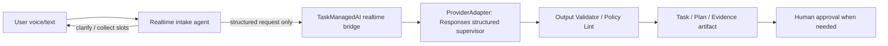
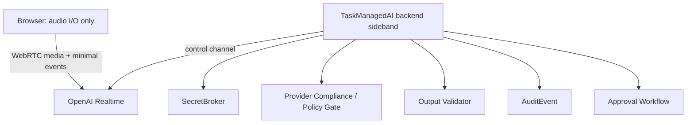

# 01. Reusable Patterns

最終更新: 2026-05-14

## Executive Decision

OpenAI Realtime Agents sample から TaskManagedAI に取り込むべきものは、runtime の丸ごと移植ではなく **interaction pattern / orchestration pattern / UI pattern / safety gate pattern** です。

特に有用なのは、Realtime を「ユーザーとの低遅延 intake surface」として使い、実際の判断・構造化 artifact・tool 実行・承認は TaskManagedAI backend の既存 pipeline に残す設計です。

## 採用候補一覧

| Pattern | 判定 | TaskManagedAI での使い道 | 実装時期目安 |
|---|---|---|---|
| Chat-Supervisor | `adopt` as design pattern | voice/text intake と structured supervisor の分離 | doc now, prototype P0.1 |
| Sideband server control | `adopt` as required architecture | tool / policy / approval / audit を server-side に保持 | implementation gate |
| Transcript + event log UI | `adopt` as UI reference | AgentRunEvent / AuditEvent / cost / approval timeline | Sprint 9 UI |
| Sequential Handoff | `adopt` as conceptual model | specialist role graph / inter-agent timeline | P0.1 multi-agent |
| High-stakes escalation | `adopt` as decision pattern | risky decisionsだけ stronger model + stricter schema/eval | existing ProviderAdapter evolution |
| Output guardrail display | `adopt` as UI state only | live validation state display | Sprint 9 UI |
| Text-only low-latency intake baseline | `adopt_first` | Realtime の価値検証前の低リスク比較対象 | P0 / P0.1 planning |
| Chained STT -> ProviderAdapter -> TTS | `compare_before_realtime` | voice UX が必要な場合の監査しやすい代替 | P0.1 planning |
| Voice agent metaprompt / state machine | `prototype_later` | task intake slot-filling / bug report interview | after eval fixtures |
| WebRTC realtime voice session | `prototype_later` | voice intake / review session | after gates |
| Realtime MCP tools | `reject_direct` / research only | direct execution は不可。synthetic/public-doc-only research だけ可 | after Tool/MCP gateway |
| Client-side function/business logic | `reject` | not compatible with TaskManagedAI safety boundary | never as product pattern |
| Unrestricted `/api/responses` proxy | `reject` | bypasses ProviderAdapter and policy | never |
| Automatic audio recording/download | `reject unless gated` | possible only with consent/retention design | no P0 |

## 1. Chat-Supervisor pattern

### サンプルでの形

`chatAgent` は Realtime model でユーザーと自然に話し、基本的な挨拶・軽い会話・情報収集だけを許可されています。それ以外は `getNextResponseFromSupervisor` に defer します。

Supervisor は conversation history と last-user context を受け取り、Responses API と tool calls で次の発話文を生成します。

### TaskManagedAI への適用

TaskManagedAI では、Realtime agent を「AI 実装 agent 本体」として扱わず、次のように分離するのがよいです。

使いどころ:

- 新規 task 作成時の曖昧な要件整理。
- bug report の再現手順ヒアリング。
- plan review 前の不足情報収集。
- 実装後の説明・レビュー質問への対話的回答。

採用条件:

- Realtime 側の出力は canonical artifact ではなく untrusted conversation input として扱う。
- Supervisor は structured output を返せる ProviderAdapter を通す。
- Realtime transcript は Input Trust Layer で `untrusted_content` とする。
- AI output から direct command / repo action / secret resolution へ接続しない。

## 2. Sideband server control

### 公式仕様からの示唆

OpenAI の server-side controls docs は、WebRTC/SIP の client connection とは別に application server が同一 Realtime session に接続し、monitor / session update / tool response を行う sideband control channel を説明しています。

### TaskManagedAI への適用

これは TaskManagedAI では必須 architecture に近いです。

採用条件:

- Standard OpenAI API key は browser に出さない。
- WebRTC 初期化は、backend が `/v1/realtime/calls` を作成する unified interface を第一候補にする。ephemeral client secret flow は代替候補として扱い、使う場合も authenticated backend endpoint のみで mint する。
- Tool execution、business logic、session update、approval、audit は sideband/backend に置く。
- Browser は untrusted client として扱い、音声入出力と最小イベントだけを担当する。
- Browser から送れる event は media transport event と bridge-approved user input event に限定する。
- `function_call_output`、`mcp_approval_response`、`session.update`、`response.tools`、tool result、retention/tracing/model/tool config は server-side only とし、将来 ADR で個別許可しない限り browser から拒否または backend policy で上書きする。

## 3. Sequential Handoff pattern

### サンプルでの形

authentication / returns / sales / simulatedHuman のような specialist agent があり、handoff graph に従って user intent を処理します。

### TaskManagedAI への適用

TaskManagedAI では、handoff を「権限移譲」ではなく「UI / orchestration の表示モデル」として使うべきです。

有用な将来表現:

- Researcher -> Planner -> Reviewer -> Implementer -> Verifier の role transition。
- AgentRun timeline 上の active specialist 表示。
- inter-agent_messages や AI Society Visualization の graph 表示。
- 人間承認前の「どの専門 role が何を判断したか」の説明。

禁止事項:

- handoff 先 agent に capability を自動付与する。
- handoff を approval bypass として扱う。
- role を authorization source of truth にする。

## 4. High-stakes escalation

### サンプルでの形

return eligibility のような高リスク判断では、Realtime agent が `o4-mini` に escalation し、policy/context を踏まえた判断を求めます。

### TaskManagedAI への適用

これは TaskManagedAI の既存方針と相性がよいです。

適用例:

- repo mutation 前の diff risk scoring。
- high-risk file path / auth / DB / migration / external exposure の二重判定。
- 実装計画の plan-reviewer / risk-reviewer / security-reviewer の段階的呼び分け。
- human approval に出す前の structured risk summary 生成。

採用条件:

- escalation 先も Provider Compliance Matrix と BudgetGuard を通す。
- output は JSON schema / typed artifact 化する。
- high-stakes 判定は final authority ではなく、human approval の材料にする。

## 5. Transcript + event log UI

### サンプルでの形

サンプルは transcript、tool call、tool call response、agent change、client/server event log を UI に表示します。

### TaskManagedAI への適用

これは Sprint 9 UI に取り込む価値が高いです。

TaskManagedAI 版では、raw realtime event ではなく次を同じ timeline に出すのがよいです。

- AgentRunEvent
- ContextSnapshot reference
- Provider request fingerprint
- Tool / runner / repo gateway decision
- Policy lint result
- Approval request / decision
- Budget / cost usage
- Eval result
- artifact hash / diff hash

注意点:

- Debug payload は redacted-by-default。
- PII / secret-like value / raw tool args は role-based visibility。
- Export / download は off default。

## 6. Output guardrail display

### サンプルでの形

assistant message が `IN_PROGRESS` で流れ、guardrail result によって `PASS` / `FAIL` の UI state になります。

### TaskManagedAI への適用

UI pattern としては有用です。ただし、TaskManagedAI の Output Validator 代替にはしません。

採用できる部分:

- artifact validation の進行状態表示。
- policy lint pending / pass / blocked の表示。
- guardrail failure の説明 UI。
- repair retry / repair exhausted の timeline 表示。

採用できない部分:

- classifier failure を fail-open にすること。
- schema validation なしで output を表示・保存・実行すること。
- guardrail result を human approval の代替にすること。

## 7. Voice agent metaprompt / state machine

サンプルは voice conversation で不足情報を正確に集めるための prompt/state-machine pattern を含みます。

TaskManagedAI では、次の用途で将来 prototype できます。

- issue intake の必須 slot collection。
- bug reproduction interview。
- 実装タスクの acceptance criteria 聞き取り。
- 変更範囲、rollback、検証方法の確認。

ただし、prompt だけに頼らず、TaskManagedAI 側の form schema / task schema / output validator と合わせる必要があります。

## 8. Realtime MCP tools

公式 docs では Realtime MCP tools は Realtime API 自身が remote MCP tool を実行できる形です。

これは便利ですが、TaskManagedAI では P0/P0.1 で慎重に扱うべきです。

理由:

- Tool execution が TaskManagedAI backend の ToolAdapter / tool_mutating_gateway を迂回しやすい。
- remote MCP server の data retention / auth / audit / prompt injection 境界が別途必要。
- mutating tools は human approval と immutable audit の前に実行してはいけない。

当面の判断:

- 直接 Realtime MCP 実行は `reject` until Tool/MCP gateway accepted.
- Public docs など synthetic / public data だけを使う research は可能だが、TaskManagedAI tenant data、repo data、credential、approval が絡む tool には接続しない。
- read-only connector であっても、auth、audit、retention、prompt-injection check、approval policy を TaskManagedAI gateway が仲介できるまで product pattern にはしない。

## 9. Realtime model as ProviderAdapter replacement

これは不採用です。

理由:

- TaskManagedAI ProviderAdapter は structured output schema を必須にする。
- `gpt-realtime-2` の current model page は realtime voice、reasoning effort、tool use を説明しているが、TaskManagedAI が要求する strict structured output schema contract を満たす根拠は確認できていない。
- Realtime は conversation / audio / low-latency loop に向くが、現時点では canonical plan / patch / review / evidence artifact の生成本体には向けない。

採用するなら、ProviderAdapter の置換ではなく `InteractionGateway` を domain boundary とし、OpenAI Realtime 固有部分を `RealtimeInteractionAdapter`、WebRTC / sideband transport を `RealtimeSessionBridge` として扱います。

## 10. Realtime より先に比較すべき代替案

Realtime prototype に入る前に、次の 3 案を同じ evaluation fixture で比較します。

| Alternative | Strength | Weakness | Adoption threshold |
|---|---|---|---|
| Text-only low-latency intake | 実装が軽く、監査・保持・承認が既存 pipeline に乗る | voice UX はない | まず baseline として実装/計測する |
| STT -> ProviderAdapter -> TTS | 音声体験を持ちながら structured artifact と audit を維持しやすい | Realtime より応答遅延が大きくなり得る | voice が必要な場合の第一比較対象 |
| Realtime sideband intake | 低遅延で自然な会話が可能 | consent、retention、browser event、sideband、cost の gate が重い | task draft acceptance、修正回数、p95 latency、cost/task、監査性で上記 2 案を上回る場合のみ prototype |

評価指標:

- `task_draft_acceptance_rate`
- task draft の平均修正回数
- p95 response latency
- cost per task / session
- voice consent burden
- approval misunderstanding count
- audit replayability
- implementation effort
