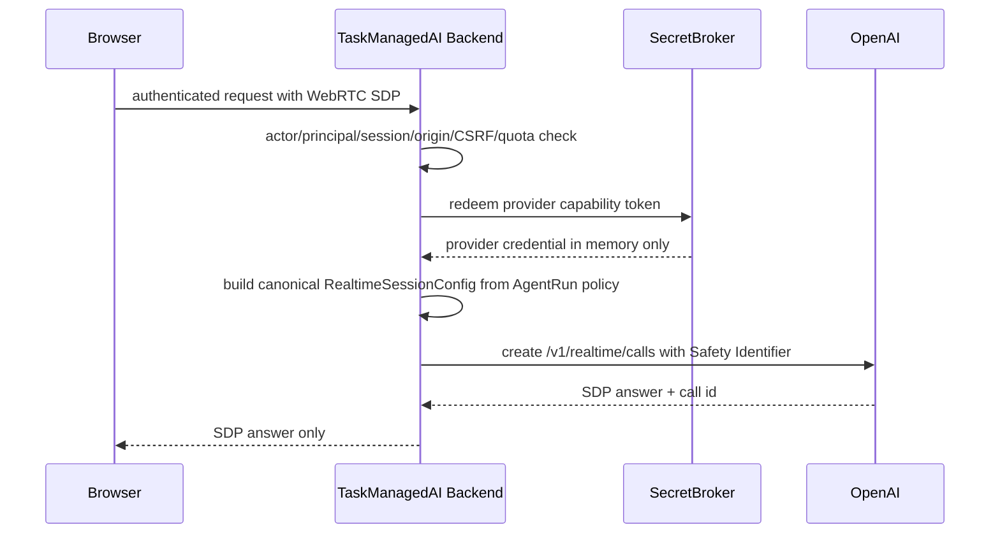
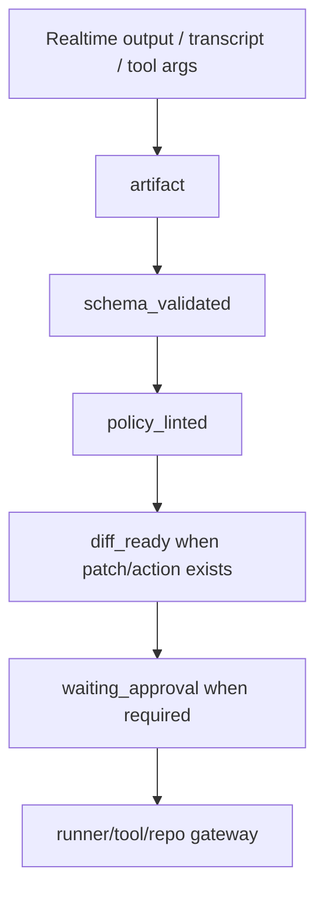

# 02. Invariant Traceability

最終更新: 2026-05-14

## 1. 前提

Realtime Agents を TaskManagedAI に取り込む場合、最初に守るべきことは「声で動く agent を作る」ことではなく、TaskManagedAI の既存 invariant を壊さないことです。

本書では、採用前に満たすべき gate と、Realtime event を AgentRun / artifact pipeline にどう写像するべきかを整理します。

## 2. 必須 gate

| Gate | 必須条件 | 未達時の判断 |
|---|---|---|
| Provider Compliance Matrix | `openai/realtime_calls_unified`, `openai/realtime_client_secrets`, transcription, Responses supervisor, guardrail, sideband, tracing, data retention, region/ZDR, pricing unit を feature 行として確認 | `defer` |
| SecretBroker | standard OpenAI key は server-only。unified `/v1/realtime/calls` 作成または ephemeral client secret minting は SecretBroker-mediated operation。raw key は artifact/log/snapshot/approval/audit に出さない | `reject` |
| Canonical session config | browser から model/tools/instructions/output_modalities/retention/tracing を受け取らず、backend が AgentRun policy から `RealtimeSessionConfig` を構築 | `reject` |
| Sideband server control | tool execution、business logic、session update、policy decision、audit、MCP approval は backend sideband が担当 | `reject` |
| Browser event allowlist | browser event は media transport と bridge-approved user input のみ。`session.update` / `response.tools` / tool result / MCP approval response は server-only | `reject` |
| Output Validator | Realtime output、supervisor response、tool args、tool result は schema/policy で fail-closed | `reject` |
| Input Trust Layer | audio transcript、browser event、tool output、remote MCP output は `untrusted_content` | `reject` |
| Approval Workflow | DB/GitHub/repo/external notification/billing/permission/production data mutation は human approval 前に実行しない | `reject` |
| AgentRun 16 status | Realtime session state のために status enum を増やさない。`blocked_reason` で subcategory を表現 | `reject` |
| ContextSnapshot 10 columns | transcript/audio/raw provider session を ContextSnapshot 本体に混ぜない。hash/ref/redacted summary に留める | `reject` |
| Network boundary | Tailscale/admin path、Origin allowlist、CSRF/WS hijack protection、authenticated session、rate limit | `reject` |
| Data retention/consent | audio/transcript/metadata の送信範囲、保持期間、ZDR/MAM、削除、録音同意、download 権限を文書化 | `defer` |
| BudgetGuard / modality cap | model allowlist、reasoning cap、text/audio only、image/screen input disabled、session seconds、audio/text/image token cap、supervisor/guardrail call cap、parallel sessions、kill switch | `defer` |
| Alternative ROI gate | text-only baseline と STT -> ProviderAdapter -> TTS を先に比較し、Realtime の優位が測れない場合は prototype しない | `defer` |
| Dependency/version | Agents SDK / OpenAI SDK / model / endpoint の current docs と version drift を再確認 | `defer` |

## 3. Provider Matrix への影響

現状の `config/provider_compliance.toml` には `openai/responses` はありますが、Realtime 関連 feature はありません。

将来追加が必要な候補:

| Candidate row | 目的 | 最低 resume condition |
|---|---|---|
| `openai/realtime_calls_unified_no_content` | backend が browser SDP と canonical session config を組み合わせて `/v1/realtime/calls` を作成 | browser は SDP のみ送る。customer content、model/tools/instructions/retention/tracing は browser から受け取らない。actor/run/origin/fingerprint/max_duration/modality/tool policy binding を audit する |
| `openai/realtime_client_secrets_no_content` | browser 用 short-lived secret mint | request body に customer content を含めない。actor/run/origin/fingerprint/max_duration/modality/tool policy binding を audit する |
| `openai/realtime_session_audio` | WebRTC realtime session | audio data class、ZDR/MAM、region、retention、consent、audio output 要否、pricing unit を確定 |
| `openai/realtime_transcription` | transcript generation | transcript retention、redaction、deletion、payload data class、abuse monitoring retention を確定 |
| `openai/realtime_sideband` | backend control channel | sideband availability、server-only tool/session update、origin/session binding を確認 |
| `openai/realtime_mcp_direct` | Realtime API による remote MCP 実行 | 原則 `reject`。Tool/MCP gateway が auth/audit/retention/prompt-injection/approval を仲介できるまで product 不可 |
| `openai/realtime_tracing` | tracing / debug visibility | default disabled。EU/Japan residency、ZDR/MAM、trace payload redaction、trace retention を確認するまで confidential/PII は不可 |
| `openai/responses_supervisor_text_store_false` | structured supervisor | `store=false`、background mode disabled、hosted tool/MCP usage 条件、ZDR/MAM、region、pricing unit を確認 |
| `openai/responses_guardrail_store_false` | classifier / guardrail | `store=false`、fail-closed、payload data class、retention、pricing unit を確認 |

Matrix に必要な項目:

- ZDR eligibility
- application state retention
- abuse monitoring retention
- training use
- region / data residency
- allowed payload data class
- model family / endpoint
- `store` policy
- audio / transcript / metadata の扱い
- pricing unit: text token, audio token, audio seconds, session count, tool call, transcription
- background mode disabled where unsupported or unnecessary
- hosted tool / MCP connector usage and connector-side retention
- `store=false` が必要な Responses 系 request と、それを強制する operation-specific endpoint

採用判断:

- Matrix 未登録の間は `defer`。
- payload data class が未算出なら `policy_blocked`。
- confidential / pii を送る場合は ZDR/MAM と data handling policy を満たすまで `policy_blocked`。
- 既存の `openai/responses` row は、同じ `store=false`、ZDR/MAM、data handling、hosted tool/MCP 条件が検証できる場合だけ reuse できる。Realtime / audio / sideband / tracing / MCP direct は separate row とする。

## 4. SecretBroker と Realtime session initialization

公式 docs では、browser WebRTC の接続方法として unified interface と ephemeral token flow が説明されています。unified interface では browser が SDP を developer-controlled backend に送り、backend が standard API key で `/v1/realtime/calls` を作成します。ephemeral token flow では backend が `/v1/realtime/client_secrets` で short-lived key を作り、browser がその token で `/v1/realtime/calls` に接続します。TaskManagedAI では canonical session config、Safety Identifier、policy/audit binding を backend で固定しやすい unified interface を第一候補にします。

TaskManagedAI での必要境界:

Session initialization endpoint の条件:

- browser-supplied `model` / `tools` / `instructions` / `output_modalities` / `retention` / `tracing` / `tool_choice` / `mcp` config は受け取らない。
- backend が AgentRun policy、Provider Matrix row、BudgetGuard、role/capability、human approval state から canonical `RealtimeSessionConfig` を構築する。
- session / call id は `actor_id`、`principal_id`、`run_id`、origin、CSRF/session id、provider request fingerprint、max duration、modality allowlist、tool policy に bind する。
- ephemeral client secret flow を使う場合も、minted client secret は同じ binding を持ち、raw value は保存しない。
- browser-originated forbidden config は拒否し、将来の許可対象も backend sideband policy で上書きする。

禁止:

- browser に standard OpenAI API key を渡す。
- `.env` 直読み実装を TaskManagedAI の正規経路にする。
- ephemeral secret を exportable artifact / log / ContextSnapshot / approval body / audit body に残す。
- sample のように token response body を debug/event log/UI に残す。保存できるのは redacted fingerprint のみ。
- user/session/auth/rate limit なしに mint endpoint を公開する。

## 5. Sideband / topology 比較

| Topology | 内容 | TaskManagedAI 判断 |
|---|---|---|
| Browser direct WebRTC only | browser が OpenAI Realtime と接続し、client-side tool handling も担う | product では `reject` |
| Browser WebRTC unified `/v1/realtime/calls` + backend sideband | browser は SDP/audio I/O、backend が session creation/control/tool/policy/audit | 将来の第一候補 |
| Browser WebRTC ephemeral client secret + backend sideband | browser は short-lived token で接続、backend が sideband control | 代替候補。token exposure と config binding を追加検証 |
| Backend WebSocket only | backend が Realtime と server-to-server 接続し、browser は app protocol だけ | control は強いが audio UX 実装が重い。prototype 候補 |
| Chained voice pipeline | STT -> text ProviderAdapter -> TTS を明示的に接続 | predictable workflow には有力。Realtime より TaskManagedAI に合わせやすい |

P0 では Realtime WebRTC の product 実装は defer が妥当です。Sprint 9 UI では transcript/event log pattern のみ取り込み、P0.1 以降に sideband 前提で prototype します。

Browser data channel の許可/禁止:

- 許可: WebRTC media transport、push-to-talk/VAD など UI 操作、bridge-approved user input event。
- 禁止: `function_call_output`、`mcp_approval_response`、`session.update`、`response.tools`、tool result、raw provider config、retention/tracing/model/tool config。
- 例外: 将来 ADR で個別許可された read-only UI event のみ。ただし server-side sideband が再検証し、audit event を残す。

## 5.5 InteractionGateway と ADR-00013 crosswalk

Realtime は `ProviderAdapter` の拡張ではなく、P0.1 以降の **InteractionGateway** で扱います。

正名:

- domain boundary: `InteractionGateway`
- OpenAI Realtime 向け adapter: `RealtimeInteractionAdapter`
- WebRTC / sideband transport 実装: `RealtimeSessionBridge`

ADR destination:

- P0.1 で `ADR-00023 Interaction Gateway / Realtime Intake` を起票する。
- ADR-00023 は ADR-00013 Remote Agent Extension の派生として、canonical pipeline、capability-class deny、SecretBroker redaction、Approval Workflow binding を再利用する。
- ADR-00023 が accepted になるまで、Realtime runtime 実装は `defer` のままにする。

| Realtime / Interaction event | ADR-00013 / TaskManagedAI invariant | 必須 mapping |
|---|---|---|
| browser requests session | remote-agent preflight / actor binding | actor、principal、AgentRun、origin、CSRF/session、BudgetGuard、Provider Matrix row を binding |
| backend creates `/v1/realtime/calls` | SecretBroker + Provider Compliance | standard key は SecretBroker redeem のみ。Safety Identifier は trusted backend が付与 |
| call id / ephemeral token | Secret redaction invariant | raw value は provider payload / artifact / ContextSnapshot / approval / audit / UI に残さず fingerprint だけ保存 |
| browser data-channel event | capability-class deny | media / bridge-approved user input 以外は deny。method 名ではなく effect で判定 |
| transcript / user utterance | Input Trust Layer | transcript は `untrusted_content`。ContextSnapshot には raw audio を入れず hash/ref/redacted summary |
| realtime function call request | Tool/MCP gateway | tool request artifact として保存し、schema/policy/approval を通すまで実行しない |
| Realtime MCP approval request | Approval Workflow | browser は `mcp_approval_response` を送らない。TaskManagedAI approval artifact に変換し human-only decision |
| `session.update` / `response.tools` | server-only capability | backend sideband only。browser supplied config は reject または canonical policy で上書き |
| candidate task draft | artifact pipeline | Realtime output を正本にせず、structured ProviderAdapter supervisor が canonical artifact を作る |
| approval action | four-binding approval | `artifact_hash`、`policy_version`、`provider_request_fingerprint`、`action_class` を binding |

## 6. AgentRun event mapping

Realtime session state は TaskManagedAI の AgentRun status に直接追加しません。AgentRunEvent と artifact pipeline に写像します。

| Realtime / sample event | TaskManagedAI mapping | status impact |
|---|---|---|
| client requests realtime session | `run_queued` / auth preflight event | `queued` |
| backend mints ephemeral client secret | SecretBroker audit event + provider request fingerprint | `gathering_context` |
| WebRTC connected | `provider_requested` / `context_gathered` | `running` |
| user audio transcription completed | transcript artifact as `untrusted_content` | no direct status change |
| assistant text/audio delta | streaming event, redacted summary only | no direct status change |
| response done | candidate artifact generated | `generated_artifact` only after canonical artifact creation |
| output guardrail pass | validator/policy event | `schema_validated` / `policy_linted` if canonical artifact |
| output guardrail trip | validation/policy failure event | `validation_failed` or `blocked + policy_blocked` |
| guardrail classifier failure | fail-closed validator error | `validation_failed` |
| function tool call requested | tool call artifact + gateway preflight | no direct execution |
| tool call args valid | schema/policy lint event | `schema_validated` / `policy_linted` |
| mutating tool requested | approval request artifact | `waiting_approval` |
| tool denied by gateway | policy/runtime block event | `blocked + policy_blocked/runtime_blocked` |
| budget exceeded | BudgetGuard event | `blocked + budget_blocked` |
| transport error / disconnect | provider incomplete or runtime failure event | `provider_incomplete` or `failed` |
| user disconnect/cancel | cancellation event | `cancelled` |

## 7. Output Validator traceability

Realtime guardrails are not enough for TaskManagedAI.

Required pipeline:

Rules:

- Raw Realtime output cannot become a domain object directly.
- Markdown-only output cannot become a task/plan/review object.
- Tool args must validate against operation-specific schema.
- Validator error is fail-closed.
- Repair retry follows existing AgentRun rules.

## 8. ContextSnapshot traceability

Do not store raw audio or full transcript as ContextSnapshot columns.

Mapping:

- `prompt_pack_version`: realtime prompt pack version.
- `prompt_pack_lock`: voice/intake/supervisor prompt lock.
- `policy_version`: policy pack at session start or turn boundary.
- `policy_pack_lock`: policy lock hash.
- `repo_state`: current repo state for the AgentRun.
- `tool_manifest`: allowed realtime-visible tool summaries, not raw mutating capability.
- `evidence_set_hash`: transcript/artifact evidence hash.
- `provider_continuation_ref`: non-exportable reference to realtime session/call id, no raw secret.
- `provider_request_fingerprint`: model, endpoint, sdk version, safety settings, payload hash.
- `snapshot_kind`: `input`, `pre_tool`, `post_tool`, `resume`, or `final`.

## 9. Data retention and consent

OpenAI data controls docs list `/v1/realtime` as ZDR eligible with no application state retention, while abuse monitoring retention remains 30 days. `/v1/responses` can have 30-day application state retention by default or when `store=true`. 同 docs では `/v1/realtime` tracing が EU data residency compliant ではない制約もあるため、tracing は separate Provider Matrix row で default disabled にします。

「transcript only」は、TaskManagedAI が永続保存するのは redacted transcript のみという意味です。Realtime session 中に live audio が OpenAI に送信される可能性は残るため、音声送信そのものに対する明示同意、Provider Matrix allowance、retention/deletion policy が必要です。

TaskManagedAI needs a separate data handling decision before implementation:

- Is audio sent at all, or only transcript?
- Is transcript stored as task evidence?
- Is raw audio recording disabled by default?
- Who can replay or download audio?
- What retention TTL applies to transcript and audio?
- Is ZDR/MAM enabled for the organization/project?
- How are PII and secret-like values redacted?
- What is the deletion path?

Until this is answered, Realtime voice implementation remains `defer`.

## 10. Realtime ADR / Sprint Pack Gate Matrix

| Gate | 接続先 | Stop trigger | Rollback verification |
|---|---|---|---|
| Provider Compliance | F-012 / Provider Compliance Matrix | ZDR/MAM 未確認、payload_data_class 未算出、Realtime tracing residency 未確認 | feature flag disabled、Provider Matrix row remains blocked |
| SecretBroker / client secret | F-010 / SecretBroker | browser supplied forbidden session config、origin/CSRF check failure、mint binding 不足 | mint endpoint denies、secret fingerprint only in audit |
| Sideband server control | Network boundary / Tool gateway | sideband unavailable、server-only event を browser が送信、tool result が client 由来 | sideband route deny、forbidden event audit recorded |
| Output Validator / Policy | F-013 / Output Validator | schema/policy fail-open、guardrail classifier failure を pass 扱い | candidate artifact blocked、repair/retry event recorded |
| Retention / consent | ADR Gate Criteria / data handling | retention policy 未承認、audio consent 未取得、download/replay 権限未定義 | non-retained audio/transcript deleted per policy |
| BudgetGuard | Budget / cost guard | cost cap 超過、max session seconds 超過、parallel session cap 超過 | realtime cap zero、kill switch event recorded |
| Modality allowlist | Provider Matrix / privacy review | audio/image modality outside allowlist、screen/image input requested | session config denies modality、audit records rejected request |
| Realtime MCP direct | Tool/MCP gateway | direct Realtime MCP requested for tenant/repo/credential data | request blocked、no connector token minted |

## 11. Modality and Budget Caps

Initial prototype modality allowlist:

- input: text + microphone audio only after consent.
- output: text only by default; audio output requires separate user value and cost review.
- disabled: image input, screen input, file upload, camera, automatic recording, audio download.

BudgetGuard minimum fields:

- model allowlist and per-model pricing unit.
- reasoning / response effort cap where applicable.
- audio input token cap and audio output token cap.
- image token cap set to zero until a separate review enables image/screen.
- max session seconds and idle timeout.
- max parallel sessions per actor and per project.
- supervisor / guardrail / transcription call cap.
- per-AgentRun attribution and global kill switch.
