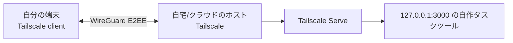
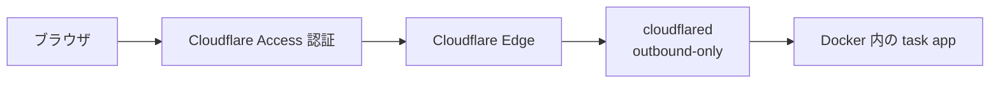

# 自作タスクツールを無料で安全に自分専用運用するための最適構成

## エグゼクティブサマリ

本件の結論は明確です。**「自分専用」「外部公開しない」「無料」を最優先するなら、第一候補は Tailscale + Serve です。** 理由は、Tailscale Personal が無料・非商用向けで、最大 6 ユーザー、無制限のユーザーデバイス、50 個までの tagged resources を使え、Serve は**tailnet 内だけ**にローカルサービスを出せるためです。Tailscale はデータ通信を end-to-end で暗号化し、Serve は tailnet のアクセス制御にも従います。 citeturn16view1turn16view3turn17view0turn14search0turn14search11

ただし、**Tailscale を入れられない端末からも使いたい**なら結論は変わります。その場合の実務上の最有力は **Cloudflare Tunnel + Access** です。Tunnel は公開 IP を開けずに outbound-only 接続で Cloudflare 側へ出せ、Access でメール OTP を含む認証をかけられるため、**ブラウザだけで使える**構成にしやすいからです。代わりに、安定運用には自分のドメインが実質必要で、トラフィック経路に Cloudflare が入るため、匿名性・プライバシーは Tailscale より不利です。 citeturn18view0turn18view1turn18view3turn31search8

**一時検証**なら ngrok や TryCloudflare Quick Tunnel は非常に速いですが、恒久運用の「無料・自分専用・非公開」の最適解ではありません。ngrok Free は one-time の使用クレジットと通信量・リクエスト上限に縛られ、Quick Tunnel は Cloudflare 公式に「testing and development only」とされています。 citeturn23view0turn23view1turn20view0

**完全な主権と将来拡張性**まで見据えるなら、FRP / SSH トンネル / 自前 VPN が最もコントロールしやすいです。ただし、これらは「ソフト自体は無料」でも、**到達可能なサーバー、固定到達性、証明書、鍵管理、障害対応**の責任が自分に乗るため、導入難易度と保守負荷が跳ね上がります。無料で済むかどうかも、VPS が不要なネットワーク条件かどうかに強く依存します。 citeturn7view0turn34search0turn35view0turn11view0turn25view0

## 前提と評価軸

本レポートで扱う前提は次の通りです。ここで未指定の点は、未指定のまま複数シナリオで評価します。

| 項目 | 状態 |
|---|---|
| 目的 | **自分専用**、**外部公開しない** |
| 利用端末 | **未指定**（自分所有端末のみ / 他人端末も含む、の両ケースを評価） |
| Tailscale 導入可否 | **未指定** |
| アプリ種別 | **未指定**（ブラウザで使う Web UI を主対象にしつつ、SSH/RDP 的代替も評価） |
| 既存ドメイン保有 | **未指定** |
| 自宅回線の公開可否・CGNAT 有無 | **未指定** |

評価軸は、ユーザー指定どおり **セキュリティ、無料での実現可能性、導入難易度、可用性、メンテナンス負荷、匿名性/プライバシー、将来の拡張性** です。私の総合判断では、**「公開 URL を使わず、閉域オーバーレイ上で自分の端末だけに見せる」方式が最も目的に合致**します。そのため、クライアント導入が許されるなら Tailscale / ZeroTier 型、許されないなら Access + browser 型、さらに強い主権を求めるなら自前 VPN / FRP / SSH の順で考えるのが筋です。 citeturn17view0turn18view0turn30view0turn7view0turn35view0turn11view0

## 脅威モデルと設計原則

この用途で現実的な脅威は、**端末盗難、認証情報漏えい、依存ライブラリ脆弱性、MITM、DNS/プロバイダ依存、公開 URL の露出、借り物端末の信用不能性**です。認証漏えいに対しては多要素認証が重要で、entity["organization","情報処理推進機構","japan it agency"] は不正ログイン対策として多要素認証設定を推奨し、entity["organization","CISA","us cyber agency"] も MFA とフィッシング耐性の高い方式を勧めています。依存ライブラリ脆弱性については、entity["organization","OWASP","appsec nonprofit"] が依存関係の継続監視、脆弱性検出、更新運用を推奨しています。バックアップについては CISA が**オフラインまたは到達不能な別媒体に置き、定期的に復元テストする**ことを推奨しています。 citeturn37search0turn37search9turn37search2turn38search0

MITM に対しては、方式ごとの差が大きいです。Tailscale は tailnet 間通信を end-to-end 暗号化し、コントロールプレーンとは分離された coordination server を使います。さらに Tailnet Lock は、コントロールプレーンが悪意あるノードキーを差し込むリスクを抑えるため、ユーザー管理の署名を要求します。SSH は安全な暗号化通信を前提にしつつ、`StrictHostKeyChecking` や `CheckHostIP` を使わないと DNS spoofing や MITM に弱くなります。FRP は TLS 有効化が既定でも、**既定では frps 証明書を検証しない**ため、CA を用いた相互確認まで進めないと不十分です。 citeturn14search0turn14search6turn17view5turn35view0turn36view0turn7view1turn34search9

DNS/プロバイダ面のリスクも見落としやすい論点です。Tailscale Serve は HTTPS を使うため、Tailscale 公式ドキュメントで**マシン名と tailnet DNS 名が public ledger に載る**ことが明記されています。Cloudflare private web app は**既存ドメイン上の public URL** を前提にするため、ホスト名の公開性と DNS 依存が上がります。逆に、FRP / SSH / WireGuard を自前で張る構成は第三者 SaaS 依存を減らせますが、ISP・VPS・DNS 事業者に対するメタデータ露出は残ります。ここは「誰に何を見せてもよいか」の設計問題です。 citeturn28view0turn18view1turn11view0turn7view0turn35view0

この目的に合う設計原則は四つです。**第一に、可能なら public URL を作らない。第二に、アプリは localhost のみで待ち受ける。第三に、認証をアプリ外側にも置く。第四に、失効・復元・更新の手順を先に作る。** Tailscale Serve も、identity headers を使う場合は backend を localhost のみにすべきだと明記しています。Cloudflare / ngrok / remote desktop でも、**借り物端末の安全性は別問題**なので、借り物端末から使う前提なら「アプリを見せる」より「自分のホスト画面だけを一時接続で見る」ほうが安全な場面があります。これは後述のシナリオ別推奨で分けます。 citeturn27view0turn18view1turn13view0

## 候補技術の詳細比較

### 無料条件の比較

| 候補 | 2026年時点の無料条件 | 無料運用の実務上の制約 | 総評 | 公式根拠 |
|---|---|---|---|---|
| Tailscale + Serve | Personal は **$0 free forever**、非商用向け、**最大 6 users**、**unlimited user devices**、**50 tagged resources**。Serve は tailnet 内公開で、HTTPS 有効化が必要。 | 使う端末すべてに Tailscale が必要。HTTPS を有効にすると machine 名 / tailnet DNS 名が public ledger に出る。 | **自分の端末だけで使うなら最有力** | citeturn16view1turn16view3turn17view0turn28view0 |
| Cloudflare Tunnel + Access | Access Free は **$0 forever**。Cloudflare の公式資料では多くの Zero Trust 機能を**up to 50 users**で無料利用可能。Tunnel は outbound-only。Access は email OTP も利用可能。 | 安定した browser 利用には実質、自分のドメインが必要。公開 URL を持つ。Quick Tunnel は testing/dev only。 | **クライアントなしで使う最有力** | citeturn18view0turn18view1turn18view2turn18view3turn20view0turn31search8 |
| ZeroTier | Personal は **Free Forever**。価格表の並びでは **10 devices / 1 network / 1 network admin**。free plan は community support。 | 単純な「アプリ単位の private web publishing」より「L2/L3 仮想ネットワーク」に向く。利用端末にクライアントが必要。 | Tailscale の代替候補だが、単一アプリ公開体験はやや重い | citeturn21view0turn30view0turn32view0 |
| ngrok | Free は **$5 の one-time included usage**、**3 endpoints**、**1GB**, **20k HTTP/S requests**。OAuth identities は **3 MAU** まで。 | 長期の恒久運用を「無料」で保ちにくい。HTTP/S に interstitial page が入る。 | **一時検証向け**。恒久・非公開運用の本命ではない | citeturn23view0turn23view1 |
| FRP | OSS。GitHub 上で Apache-2.0。HTTP/HTTPS/TCP/UDP/STCP/XTCP をサポート。token/OIDC 認証あり。 | 自前の frps 公開点が必要。TLS は既定有効でも証明書検証は別設定が必要。 | **主権重視**だが運用責任が重い | citeturn7view0turn34search0turn7view1turn7view2 |
| SSHトンネル | OpenSSH の port forwarding を使えばソフト追加費用は実質 0。暗号化通信が前提。remote forward は既定で loopback bind。 | 到達可能な SSH サーバーが必要。Web アプリの URL 体験は作りにくい。 | **緊急避難・管理用途**として強い | citeturn35view0turn35view1turn36view0 |
| VPN自前構築 | WireGuard は free software で簡潔。OpenVPN Access Server は **2 simultaneous connections を free forever**。 | 公開できる VPN endpoint が必要。CGNAT / 共有回線だと無料化が難しい。 | **主権と拡張性は高い**が手間も高い | citeturn11view0turn24search0turn25view0 |
| ローカル-only + リモートデスクトップ | Chrome Remote Desktop は Web から利用でき、PIN / one-time code、全セッション fully encrypted。 | アプリではなく**デスクトップ全体**を触る方式。借り物端末の安全性には依存。Google は匿名化された遅延・セッション長データを収集。 | **クライアントを入れたくない他人端末**では実用的 | citeturn13view0turn13view1 |

### 方式ごとの評価

Tailscale + Serve は、**「自分専用・非公開・無料」の要件への一致度が最も高い**です。Serve はローカルの `127.0.0.1` な backend を tailnet 内だけへ見せられ、アクセス制御も通常の tailnet policy に従います。加えて identity headers を backend に渡せるため、自作ツール側で「誰が来たか」を二段で判定できます。弱点は、**アクセス端末に Tailscale を入れる必要があること**と、HTTPS の enable に伴う CT 公開ログです。 citeturn17view0turn27view0turn28view0

Cloudflare Tunnel + Access は、**「他人の端末から browser だけで使う」シナリオで最も現実的**です。Tunnel は inbound を開けずに outbound-only で張れ、private web app 作成時に public domain を割り当て、Access policy でメール OTP をかけられます。つまり、借り物 PC にクライアントを入れずに使える一方、public hostname と Cloudflare の中継レイヤーを受け入れる必要があります。このため、**可用性と導入容易性は高いが、匿名性/プライバシーは Tailscale より劣る**、というのが実務上の位置づけです。 citeturn18view0turn18view1turn18view3turn31search8

ZeroTier は「仮想ネットワークを作る」道具としては強く、無料 Personal でも一定範囲の端末数をカバーできます。さらに self-hosted controller も可能なので将来拡張性は高いです。ただし、**“単一の Web UI を最小手数で private に出したい”** という今回の要件に対しては、Tailscale Serve のほうが app-layer の体験が洗練されています。ZeroTier はむしろ「自宅 LAN をそのまま持ち歩く」発想に近いです。 citeturn21view0turn30view0turn33search1

ngrok は Free の仕様が 2026 年時点で**one-time credit**ベースになっており、長期無料運用には向きません。OAuth で endpoint 保護はできますが、無料の traffic identities も 3 MAU です。個人一人なら理屈上は使えますが、「長く無料で閉じた自分専用」を求めると、設計の軸がずれます。 citeturn23view0turn23view1

FRP、SSH トンネル、自前 VPN は、**第三者 SaaS 依存を下げて主権を上げる**選択肢です。特に FRP の STCP は authorized users 向け private exposure ができ、SSH remote forward は既定で loopback bind なので不用意に全世界へ開きにくいです。一方で、ホスト公開点、証明書、鍵、ログ、障害切り分け、バックアップが全部自分持ちになります。**セキュリティ headroom は高いが、最適化できるのは “自分で運用できる人” に限る**と考えるべきです。 citeturn7view2turn35view1turn36view0turn11view0

ローカル-only + リモートデスクトップは、見落とされがちですが今回かなり有力です。**アプリ自体を公開しない**ので攻撃面積が最小化しやすく、借り物端末からでも browser でホスト画面へ入れます。Chrome Remote Desktop は fully encrypted で、persistent PIN と one-time support code の両方があります。ただし、これは「安全な remote app access」というより「安全な remote desktop access」です。よって、閲覧内容の秘匿性は**借り物端末の画面・キーボード・ブラウザ信頼性に依存する**、という点を理解した上で使うべきです。これは公開 URL 型よりは安全な場面が多い一方で、ゼロにはなりません。 citeturn13view0turn13view1

### コスト比較表

| 方式 | 追加のサービス料金 | 追加のドメイン費 | 追加の公開サーバ費 | 本当に無料になりやすい条件 | コメント |
|---|---:|---:|---:|---|---|
| Tailscale + Serve | $0 | 不要 | 不要 | 自分の端末群に client を入れられる | **最も無料化しやすい** |
| Cloudflare Tunnel + Access | $0 | **安定運用では必要になりやすい** | 不要 | 既に自分のドメインがある | browser-only だが host 名は public |
| ZeroTier | $0 | 不要 | 不要 | 10 devices / 1 network で足りる | 単一 app より LAN 化向き |
| ngrok | 初期は $0 だが one-time credit 制 | 不要 | 不要 | 一時検証のみ | 恒久無料には不向き |
| FRP | ソフトは $0 | 任意 | **必要になりやすい** | 自宅回線公開可 or 既存 VPS あり | 主権は高い |
| SSHトンネル | ソフトはほぼ $0 | 任意 | **必要** | 既に SSH server がある | 管理用途向き |
| VPN自前構築 | WireGuard は $0 / OpenVPN AS は 2 接続まで $0 | 不要 | **必要になりやすい** | routable endpoint を持てる | 拡張性は高い |
| ローカル-only + remote desktop | $0 | 不要 | 不要 | desktop ホストを常時つけられる | app 非公開で強い |

この表は、各社の無料条件に加えて、**未指定**の「既存ドメインの有無」「CGNAT の有無」「既存 VPS の有無」を織り込んだ実務上のコスト評価です。特に FRP / SSH / 自前 VPN は、**ソフト費用は無料でも到達性のために結局 VPS を払う**ケースがよくあります。逆に Tailscale と ZeroTier は既存インターネット接続だけで成立しやすく、今回の要件に対する「真に無料」の再現性が高いです。 citeturn16view1turn18view1turn21view0turn23view0turn7view0turn35view0turn25view0turn13view0

### 導入難易度表

| 方式 | 初期導入 | 日常運用 | 可用性 | メンテ負荷 | 匿名性/プライバシー | 将来拡張性 |
|---|---|---|---|---|---|---|
| Tailscale + Serve | 低 | 低 | 中〜高 | 低 | 高いが CT ログ注意 | 高 |
| Cloudflare Tunnel + Access | 中 | 低〜中 | 高 | 低〜中 | 中 | 高 |
| ZeroTier | 中 | 中 | 中 | 中 | 高 | 高 |
| ngrok | 低 | 低 | 低〜中 | 低 | 低〜中 | 低 |
| FRP | 高 | 高 | 中 | 高 | 高 | 高 |
| SSHトンネル | 中 | 中〜高 | 中 | 中〜高 | 高 | 中 |
| VPN自前構築 | 高 | 中〜高 | 中〜高 | 高 | 高 | 最高 |
| ローカル-only + remote desktop | 低 | 低 | 中 | 低 | 中 | 中 |

この難易度表は、公式セットアップの複雑さ、クライアント要件、公開点の有無、失効/更新/障害対応の運用量をもとにした**相対評価**です。最小構成を一番速く作れるのは ngrok や remote desktop ですが、**今回の最適化関数は「速さ」ではなく「自分専用・非公開・無料」**なので、総合点では Tailscale + Serve が上回ります。 citeturn17view0turn18view1turn30view0turn23view1turn7view0turn35view0turn24search0turn13view0

## 推奨構成と具体手順

### 最小推奨構成

クライアント導入が許されるなら、最小推奨構成は次です。



この構成の要点は、**アプリを 127.0.0.1 のみに束縛し、外向きは Tailscale Serve にだけ任せる**ことです。Serve は tailnet 内だけで使え、通常の access control が適用されます。さらに backend を localhost のみにすることで、identity headers を前提にした認証でも spoofing の余地を狭められます。 citeturn17view0turn27view0

最小手順は以下です。

```bash
# ホストへ Tailscale 導入後
sudo tailscale up

# ローカルの 127.0.0.1:3000 で自作タスクツールを起動
# その後、tailnet 内だけへ公開
tailscale serve 3000
```

Serve は tailnet 名ベースの HTTPS URL を自動で使い、アクセス制御は tailnet policy に従います。なお、Serve を使うには HTTPS 有効化が必要で、その過程で machine 名と tailnet DNS 名が public ledger に載る点に注意してください。**機密語を含む machine 名は使わない**のが必須です。 citeturn17view0turn28view0

Docker 側は、少なくとも **localhost bind** を守るべきです。自作ツールの最小例は次のようにできます。

```yaml
services:
  app:
    build: .
    container_name: taskapp
    restart: unless-stopped
    ports:
      - "127.0.0.1:3000:3000"
    environment:
      - PORT=3000
    volumes:
      - ./data:/app/data
```

この例自体は生成例ですが、意図は明確で、**コンテナを LAN に直接さらさず、ホスト localhost にだけ出す**ことにあります。Tailscale Serve は `http://127.0.0.1:3000` を proxy できるため、この置き方がもっとも素直です。 citeturn17view1turn27view0

Tailscale 側の推奨設定は、deny-by-default に近づけることです。たとえば、自分のメールアドレスだけが `tag:taskapp` に TCP/443 で入れるようにします。

```json
{
  "tagOwners": {
    "tag:taskapp": ["me@example.com"]
  },
  "grants": [
    {
      "src": ["me@example.com"],
      "dst": ["tag:taskapp"],
      "ip": ["tcp:443"]
    }
  ]
}
```

Tailscale grants は deny-by-default で、`src`、`dst`、`ip` を明示して必要最小限にできます。今回の用途なら、**自分の identity から taskapp タグ付きホストだけへ 443 を許可**するのが基本線です。 citeturn26view1turn26view0

### Tailscale 案をさらに強化する施策

既提案の Tailscale 案を本当に強くするなら、強化点は五つです。第一に、HTTPS を有効にする前に **tailnet DNS 名をランダム系へ切り替え、machine 名を無害な別名へ変更**します。第二に、**Serve は使っても Funnel は使わない**。Tailscale 公式は同一ポートで Serve と Funnel を同時利用できず、最後に `serve` を設定したポートは private だと明記しています。第三に、backend は常に localhost bind にします。第四に、**Tailnet Lock か device approval のどちらかを選ぶ**。この二つは相互排他です。第五に、Tailnet Lock を使うなら**少なくとも 2 台の signing node**を持ち、disablement secrets を安全保管します。失うと tailnet を recover できません。 citeturn28view0turn27view0turn17view4turn17view5

ここでの実務判断は次の通りです。**自分の安定した複数端末を持っていて、高い信頼境界を作りたいなら Tailnet Lock。運用を軽くしたいなら device approval** が向いています。Tailnet Lock は control plane compromise への耐性を上げますが、署名鍵管理を自分で背負うため、運用事故のリスクも増やします。個人利用では「管理できるかどうか」で選ぶべきです。 citeturn17view4turn17view5

### クライアント導入なしで使う代替構成

Tailscale を入れられない端末から browser で使う必要があるなら、推奨代替は Cloudflare Tunnel + Access です。



Cloudflare Tunnel は `cloudflared` が **outbound-only connection** を張るため、家の回線や NAT 配下でも公開 IP を開けずに済みます。private web app の作成フローでは public domain を選び、Access policy として email one-time PIN を設定できます。つまり、**ブラウザだけで使える**のが最大の利点です。 citeturn18view0turn18view1turn18view3

Docker の最小構成例は次のようになります。

```yaml
services:
  app:
    build: .
    container_name: taskapp
    restart: unless-stopped
    expose:
      - "3000"

  cloudflared:
    image: cloudflare/cloudflared:latest
    container_name: cloudflared
    restart: unless-stopped
    command: tunnel run --token ${CF_TUNNEL_TOKEN}
    depends_on:
      - app
```

または `config.yml` を使うなら次です。

```yaml
tunnel: <YOUR_TUNNEL_ID>
credentials-file: /etc/cloudflared/credentials.json

ingress:
  - hostname: task.example.com
    service: http://app:3000
  - service: http_status:404
```

この構成では、Tunnel 自体は到達性を作るだけで、**本当の入口制御は Access policy** にあります。最低でも「許可メールアドレス限定 + OTP」を入れ、可能なら後で IdP に切り替えるのがよいです。なお、ドメインを使わない Quick Tunnel は**testing/dev only**なので、常用前提には置かないでください。 citeturn18view1turn18view3turn20view0

### 主権重視の代替構成

自前志向なら、WireGuard / SSH / FRP を組み合わせるとよいです。最も orthodox なのは WireGuard で、構成は非常に単純です。

```ini
# server: /etc/wireguard/wg0.conf
[Interface]
Address = 10.8.0.1/24
ListenPort = 51820
PrivateKey = <SERVER_PRIVATE_KEY>

[Peer]
PublicKey = <CLIENT_PUBLIC_KEY>
AllowedIPs = 10.8.0.2/32
```

```ini
# client
[Interface]
Address = 10.8.0.2/24
PrivateKey = <CLIENT_PRIVATE_KEY>

[Peer]
PublicKey = <SERVER_PUBLIC_KEY>
Endpoint = vpn.example.net:51820
AllowedIPs = 10.8.0.1/32
PersistentKeepalive = 25
```

WireGuard は公開鍵交換ベースで非常に単純ですが、**鍵配布や到達性は別レイヤーで面倒を見る**思想です。したがって、実装が簡単でも「endpoint をどこに作るか」が未指定だと無料性は変動します。自宅回線に公開性がなければ、VPS が要るからです。 citeturn11view0turn24search0

SSH なら、一時的な reverse tunnel で十分なことも多いです。

```bash
# ローカルの 127.0.0.1:3000 を、VPS 側の 127.0.0.1:18080 に逆向き転送
ssh -N -R 127.0.0.1:18080:127.0.0.1:3000 user@your-vps
```

OpenSSH は secure encrypted communications を前提にしますが、**`StrictHostKeyChecking yes` と known_hosts 管理を真面目にやる**ことが重要です。また、remote forwarding が loopback bind なのは安全側ですが、逆に言えば browser から見せるには VPS 側でさらに reverse proxy を足す必要があります。 citeturn35view0turn35view1turn36view0

FRP は、より reverse-proxy 指向です。たとえば STCP なら、secretKey を知る visitor だけが入れます。

```toml
# frps.toml
bindPort = 7000
auth.token = "replace-me"
transport.tls.force = true
transport.tls.trustedCaFile = "/etc/frp/ca.crt"
```

```toml
# frpc.toml on app host
serverAddr = "YOUR_SERVER_IP"
serverPort = 7000
auth.token = "replace-me"

[[proxies]]
name = "secret_taskapp"
type = "stcp"
secretKey = "replace-this-too"
localIP = "127.0.0.1"
localPort = 3000
```

```toml
# frpc.toml on client side
serverAddr = "YOUR_SERVER_IP"
serverPort = 7000
auth.token = "replace-me"

[[visitors]]
name = "secret_taskapp_visitor"
type = "stcp"
serverName = "secret_taskapp"
secretKey = "replace-this-too"
bindAddr = "127.0.0.1"
bindPort = 13000
```

FRP は非常に強力ですが、**既定の TLS だけでは“誰と話しているか”の保証が弱い**ので、trusted CA を設定した証明書検証までやってください。ここを抜くと MITM 緩和が不十分です。 citeturn7view2turn34search0turn34search1turn34search9

### ローカル-only + remote desktop

アプリ公開ではなく、**ホストの画面を見る**という割り切りも有効です。Chrome Remote Desktop は Web からアクセスでき、persistent remote access は PIN、support モードは one-time code を使い、セッションは fully encrypted です。外出先で借り物 PC しかないが、Tailscale client も入れたくない、というときの妥当解になりやすいです。さらに「アプリそのものの URL を作らない」ので、攻撃面積が小さくなります。 citeturn13view0turn13view1

ただしこれは万能ではありません。Google は匿名化されたネットワーク遅延とセッション時間を収集すると明記しており、さらに借り物端末の OS・ブラウザ・物理環境自体は信頼できません。したがって、**高機密データを扱うときは “クラウド越しの browser app” よりマシな場面はあっても、“安全そのもの” ではない**という認識が必要です。 citeturn13view0turn13view1

## シナリオ別推奨と運用チェックリスト

### シナリオ別ベストプラン

| シナリオ | ベストプラン | 理由 |
|---|---|---|
| 自分の端末のみで使う | **Tailscale + Serve** | 非公開・無料・導入容易・運用軽量のバランスが最良 |
| 他人の端末からも使う | **Cloudflare Tunnel + Access** | browser-only で認証を前段に置ける |
| 他人の端末から使うがアプリ露出を避けたい | **ローカル-only + remote desktop** | アプリ URL を作らずに済む |
| 一時的検証 | **TryCloudflare Quick Tunnel** または **ngrok Free** | 最短で到達性を検証できるが恒久化には不向き |
| 恒久運用 | **Tailscale + Serve**、主権重視なら **WireGuard/FRP/SSH** | 恒久運用は Tailscale が楽、主権は自前方式が勝つ |
| Tailscale 不可 | **Cloudflare Tunnel + Access** または **ZeroTier** | browser-only なら前者、LAN 化なら後者 |

この表の通り、**端末に client を入れられるか**が最初の分岐です。入れられるなら Tailscale が最適、入れられないなら Cloudflare / remote desktop、主権を最優先するなら自前方式へ進む、という整理が最も事故が少ないです。 citeturn17view0turn18view1turn20view0turn21view0turn23view0turn13view0

### 実用的なチェックリスト

導入直後は、**アプリを localhost bind に固定、不要な public 機能を無効化、認証を 2 層化、アクセス対象を自分だけへ絞る**、この四点を最優先にしてください。Tailscale なら grants を最小化し、Serve を使い、Funnel は使わない。Cloudflare なら OTP または IdP 制限を必ず付ける。FRP / SSH / WireGuard なら host key / CA / token を検証つきで運用する、が最低線です。 citeturn27view0turn26view1turn18view3turn36view0turn34search9

定常運用では、**MFA の維持、OS と依存ライブラリ更新、脆弱性監視、不要端末の削除、ログ確認**を回してください。CISA は MFA を強く推奨し、OWASP は vulnerable dependencies の継続管理を推奨しています。タスクツールが自作である以上、公開部分より**依存関係の更新遅延**のほうが事故要因になりやすいです。 citeturn37search9turn37search2

バックアップは、**データだけでなく“復旧に必要な設定”も一緒に持つ**のが重要です。CISA は offline / separated backup と定期復元テストを推奨しています。ZeroTier self-hosted controller を使うなら controller ディレクトリと identity secret の退避が重要で、Tailscale Tailnet Lock を使うなら disablement secrets の保管が必須です。 citeturn38search0turn33search1turn17view4

事故時対応は、**即時遮断 → 認証情報失効 → 既知正常版へ再配置 → 復元 → 原因確認**の順で動くのが合理的です。具体的には、怪しい端末を tailnet / network / Access policy から切り離し、token・secret・鍵を回転し、依存関係を更新した known-good image に入れ替え、テスト済みバックアップから戻します。これは ransomware や侵害後復旧の一般原則とも整合します。 citeturn38search0turn37search2

### 未指定事項とこの結論への影響

本件で残る open questions は三つです。**自分以外の端末に client を入れてよいか、既存ドメインを持っているか、自宅回線に公開到達性があるか**です。これが分かると最終提案はさらに絞れます。ただし、未指定のままでも結論はあまり変わりません。**client 導入可なら Tailscale、不可なら Cloudflare、主権優先なら自前方式**という骨格は安定です。 citeturn17view0turn18view1turn11view0turn35view0

## 参考リンク

Tailscale 系では、Pricing、Serve、Grants syntax / examples、HTTPS certificates、Tailnet Lock、Encryption が一次資料として重要です。 citeturn16view1turn16view3turn17view0turn26view1turn26view0turn28view0turn17view4turn14search0

Cloudflare 系では、Cloudflare Tunnel overview、private web application、One-time PIN login、Access pricing / free plan、Quick Tunnels が一次資料です。 citeturn18view0turn18view1turn18view3turn18view2turn20view0turn31search8

ZeroTier 系では、Pricing、Client Configuration、Network Controller、Support が一次資料です。 citeturn21view0turn30view0turn33search1turn32view0

ngrok 系では、Pricing、Free Plan Limits、OAuth Action、TLS Termination が一次資料です。 citeturn23view0turn23view1turn23view2turn23view3turn23view4

FRP 系では、GitHub README、Authentication、Custom TLS Protocol Encryption、Securely Expose Intranet Services が一次資料です。 citeturn7view0turn34search0turn7view1turn7view2

SSH / VPN / リモートデスクトップ系では、OpenBSD の `ssh(1)` / `ssh_config(5)` / `sshd_config(5)`、WireGuard overview / quick start、OpenVPN Access Server free tier、Chrome Remote Desktop help が一次資料です。 citeturn35view0turn36view0turn35view1turn11view0turn24search0turn25view0turn13view0turn13view1

日本語の補助資料としては、entity["organization","情報処理推進機構","japan it agency"] の不正ログイン対策ページが MFA 運用の確認に有用です。加えて、entity["organization","CISA","us cyber agency"] の MFA / Stop Ransomware、entity["organization","OWASP","appsec nonprofit"] の Vulnerable Dependency Management Cheat Sheet は、認証漏えい対策・依存脆弱性管理・バックアップ設計の一般原則として非常に使いやすいです。 citeturn37search0turn37search9turn38search0turn37search2